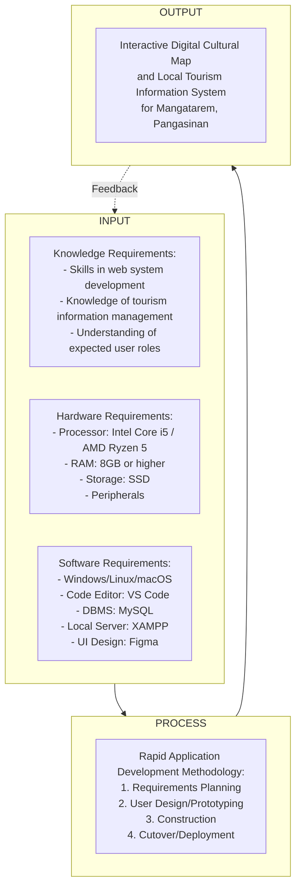

# Chapter 1: Introduction

## Background of the Study

The integration of computing solutions in local governance and tourism has become increasingly vital in modernizing public services and promoting cultural heritage. System software and web applications serve as powerful tools to centralize information, streamline processes, and enhance the overall experience for both administrators and end-users. By digitizing cultural data and tourism information, municipalities can ensure wider accessibility, preserve historical records, and promote local attractions more effectively to a broader audience. Embracing such IT infrastructure plans allows organizations to overcome traditional, manual challenges and transition towards a more efficient, interconnected, and dynamic approach to managing local resources.

This study will be conducted for the Local Government Unit (LGU) of Mangatarem, Pangasinan, the main beneficiary and decision-maker for tourism promotion and cultural data management in the municipality. The LGU of Mangatarem plays a central role in driving economic growth through tourism while preserving the rich cultural identity and heritage of the community. As the primary governing body, the LGU is responsible for curating and disseminating accurate information about local landmarks, events, and traditions, ensuring that both residents and visitors have access to reliable resources that reflect the town's historical significance.

Currently, the LGU of Mangatarem encounters significant difficulties in managing and promoting tourism information. The existing process is fragmented and largely manual, which results in irregularly updated online content. The lack of standardized tourism materials leads to inconsistent data across different platforms, causing confusion for tourists. Furthermore, slow coordination with stakeholders relying on traditional communication methods delays the sharing of accurate information. This traditional approach also presents limited accessibility for students and researchers who seek reliable cultural and historical information. These challenges establish the need for a centralized platform that can unify and streamline tourism data management.

To address these challenges, the "Interactive Digital Cultural Map and Local Tourism Information System for Mangatarem, Pangasinan" will be developed. This computing solution is introduced as an improved approach to enhancing the organization's existing system by replacing fragmented manual processes with a centralized, interactive web-based platform. By digitizing cultural mapping and tourism information, the proposed system aims to provide standardized, easily accessible, and consistently updated data, thereby improving the efficiency of the LGU's tourism promotion and enriching the experience of tourists, residents, and researchers alike.

## Purpose and Description

This Capstone Project was conducted in order to centralize and digitize the tourism and cultural information of Mangatarem, Pangasinan, providing an accessible and interactive platform that streamlines information management and promotes local heritage.

Once the proposed Interactive Digital Cultural Map and Local Tourism Information System for Mangatarem, Pangasinan is implemented to the Local Government Unit (LGU) of Mangatarem, it will hold particular significance for the following beneficiaries:

1. **Local Government Unit (LGU) of Mangatarem** – The main beneficiary and decision-maker will benefit from a robust platform for tourism promotion and cultural data management, enabling them to verify and publish accurate information efficiently.
2. **System Administrators (Tourism Office Staff / IT Staff)** – They will benefit from an administrative dashboard that simplifies the management of user accounts, access permissions, and the approval/rejection of content submissions from contributors.
3. **Barangay Representatives (Contributors)** – They will benefit from a dedicated portal to submit and update local content, photos, and videos, empowering them to showcase the attractions and events within their respective jurisdictions.
4. **Public Users (Tourists / Visitors)** – They will benefit from an interactive map that helps them easily locate attractions, search and filter points of interest, and view suggested routes and cultural information for a better travel experience.
5. **Students and Researchers** – They will benefit from reliable access to historical data, cultural profiles, and community practices, facilitating their academic research and data gathering easily.
6. **Residents of Mangatarem** – They will gain cultural pride and benefit from the preservation of their heritage through a secure, digital platform that documents their traditions.

The rationale of the project is to resolve the inconsistencies, slow communication, and limited accessibility prevalent in the current manual tourism management processes. By standardizing information and leveraging digital mapping technology, the project creates a unified resource for all stakeholders. It is assumed that the proposed computing solution will effectively address the existing problems by providing real-time, accurate updates, fostering better coordination among barangay representatives and the LGU, and offering an engaging, user-friendly interface for public exploration.

## Objectives of the Study

The main objective of the study is to design and develop an Interactive Digital Cultural Map and Local Tourism Information System for the Local Government Unit (LGU) of Mangatarem, Pangasinan.

Furthermore, the developers aim to achieve the following specific objectives:

1. To analyze the existing process of managing and disseminating tourism and cultural information in the municipality to identify inefficiencies, challenges, and opportunities for improvement in information centralization.
2. To identify the features of the system for the following users:
   * System Administrator (Tourism/IT Staff)
   * Barangay Representative (Contributor)
   * Public User (Tourists / Visitors)
   * Students and Researchers
3. To test and evaluate the system’s functionality, performance, security, usability, and acceptability to ensure it meets user requirements and standards.
4. To prepare an implementation plan for the deployment of the system.

## Conceptual Framework

The Input-Process-Output (IPO) model is utilized to provide a clear and structured representation of the system’s development lifecycle. The **Input** phase defines the foundational prerequisites, encompassing the knowledge, hardware, and software requirements necessary to build the system. The **Process** phase outlines the systematic Software Development Methodology chosen to transform these inputs into a functional product, detailing the specific stages of development. The **Output** phase represents the final deliverable, which is the operational computing solution that addresses the needs identified during the analysis. Feedback mechanisms continuously refine the inputs and processes to ensure the output meets the desired standards.

**Input** includes **knowledge requirements** (technical skills in web system development using HTML, CSS, JavaScript, PHP, MySQL, and an understanding of tourism mapping and user roles such as admins, contributors, and tourists), **hardware requirements** (components needed for both development and deployment, such as an Intel Core i5/AMD Ryzen 5, 8GB-16GB RAM, SSD storage, and standard peripherals), and **software** requirements (software tools such as Visual Studio Code, MySQL, XAMPP/LAMP server, and UI design tools like Figma).

**Process** refers to the Rapid Application Development (RAD) Methodology to be used, involving Requirements Planning, User Design, Construction, and Cutover.

**Output** is the expected computing solution: the Interactive Digital Cultural Map and Local Tourism Information System for Mangatarem, Pangasinan.

The conceptual framework illustrated above delineates the systematic flow of the project. The Inputs specify the technical and physical resources, along with the domain knowledge required by the developers. These resources feed into the Process, which employs the Rapid Application Development (RAD) methodology to iteratively design, prototype, and build the platform. This structured process guarantees that the final Output—the Interactive Digital Cultural Map—is developed efficiently and aligns with the requirements of the Mangatarem LGU and its stakeholders. The feedback loop ensures that any issues identified post-deployment can be addressed to refine and maintain the system.

## Scope and Limitations

### Scope
The project focuses on the development of a web-based Interactive Digital Cultural Map and Local Tourism Information System for the LGU of Mangatarem. The system will be built utilizing web technologies including HTML, CSS, JavaScript, PHP, and MySQL as the primary database management system, with Figma utilized for interface design. The key functionalities provided by the software include a public interactive map for tourists to locate attractions, filter points of interest, and view cultural information. It features a decentralized content contribution portal allowing authorized Barangay Representatives to upload photos, update local history, and add events. Furthermore, the system includes a centralized Admin Dashboard for LGU/Tourism staff to moderate content submissions (approve/reject), manage user accounts, and oversee platform operations. Students and researchers are provided structured access to historical data and cultural profiles to support academic data gathering.

### Limitations
While the system aims to comprehensive tourism management, it will not include an online booking or payment gateway for local accommodations or tour guides. The system is highly dependent on internet connectivity; thus, full offline capabilities for the interactive map are restricted. Performance and scalability are designed to accommodate the current reasonable volume of tourist traffic and barangay contributions, but extreme surges beyond typical municipal capacity may require future server upgrades. Access to the content contribution and moderation modules is strictly restricted to authorized LGU personnel and registered Barangay Representatives, meaning the general public cannot directly alter map data without LGU approval.

## Definition of terms

- **Admin/System Administrator:** Refers to the LGU Tourism Office Staff or IT personnel responsible for reviewing content, managing users, and overseeing the technical maintenance of the system.
- **Barangay Representative:** An authorized contributor who submits, updates, and uploads local tourism and cultural information to the system on behalf of their specific jurisdiction.
- **Contributor:** A user role (typically a Barangay Representative) with permissions to propose new content such as photos, history, and events to the platform.
- **Interactive Digital Cultural Map:** The core feature of the system that provides a visual, geographical representation of tourist spots, landmarks, and cultural heritage sites within Mangatarem.
- **Local Government Unit (LGU):** In this study, it refers to the municipal government of Mangatarem, Pangasinan, serving as the main beneficiary and authoritative body over the tourism system.
- **Public User:** Refers to tourists, visitors, or general users who navigate the interactive map and view the published cultural information without the need for administrative access.
- **Rapid Application Development (RAD):** The selected software development methodology characterized by rapid prototyping, iterative feedback, and flexible requirements gathering to speed up system construction.

## Review of Related Literature

*(Note for implementation: This section requires sourcing 5 local and 5 foreign literature from 2020-2025 aligned with the objectives. Temporary placeholders are provided here to adhere to the formatting structure until formal literature review research is conducted and injected).*

**Existing Tourism and Cultural Information Management Processes**

Smith (2022) highlights the inefficiencies in traditional municipal tourism management, stating that reliance on fragmented physical records and isolated social media announcements significantly limits the reach and accuracy of cultural promotion. A critical evaluation of Smith's work underscores the necessity for municipalities to shift from manual archiving to centralized digital repositories to ensure consistent data availability. 

Dela Cruz et al. (2021) observed similar challenges in local Philippine contexts, where LGUs struggle with inconsistent tourism data across various barangays due to the lack of a unified reporting system. The study suggests that empowering local grassroots (barangays) with direct contribution access to a centralized pool can drastically reduce data dissemination delays.

**Key Features of Web-Based Tourism Systems**

Johnson and White (2023) examined the impact of interactive mapping on tourist engagement, finding that digital maps equipped with filtering capabilities and rich multimedia pop-ups increase visitor retention and exploration confidence by 40%. The research emphasizes that an intuitive UI is a critical feature for public-facing tourism platforms to effectively guide tourists.

Reyes (2024) evaluated the role of decentralized content management in e-governance systems. The study determined that creating specific user roles, such as local contributors and central moderators, improves content accuracy and accountability. This points directly to the necessity of the proposed Admin and Barangay Representative roles to ensure the integrity of the published cultural data.

**Usability and Acceptability of Information Systems**

Anderson (2021) provides a comprehensive review of usability testing methodologies for public sector web applications. The author emphasizes that utilizing standardized Likert-scale surveys to measure navigation ease and interface clarity is essential for systems targeting diverse demographics, such as both tech-savvy students and general tourists.

Bautista (2022) explores user acceptance testing (UAT) frameworks in Philippine LGUs adopting new IT infrastructure. The findings suggest that early and iterative involvement of stakeholders (e.g., tourism officers) during the prototyping phase drastically improves the final acceptance score of the system, supporting the use of the RAD methodology for this project.

**System Implementation and Deployment Strategies**

Chen (2023) discusses deployment strategies for cloud-based municipal systems, identifying that a phased rollout paired with comprehensive user training for administrative staff significantly reduces early-stage operational friction. The review points out that a clear implementation timeline and resource allocation plan are crucial for minimizing downtime during the cutover phase.

Gomez et al. (2025) analyzed recent case studies of digital tourism map deployments in rural areas. They highlight that ensuring reliable web hosting and defining clear data governance policies prior to the launch are critical steps. This supports the objective of preparing a detailed and robust implementation plan tailored specifically to the technological readiness of the target LGU.
