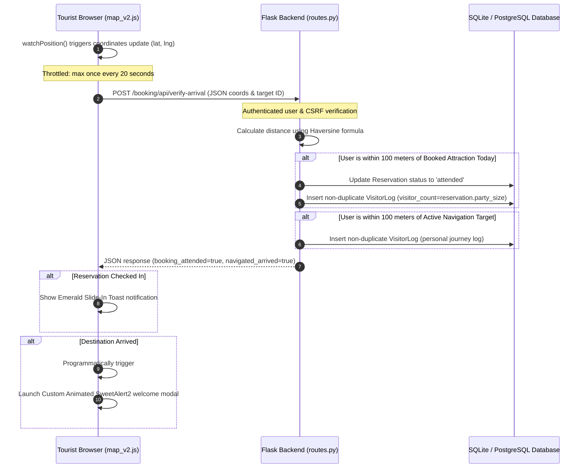

# Physical Arrival Verification & Automatic Check-In System

This document outlines the architecture, logic, and design standards of the **Real-Time Physical Arrival Verification and Automatic Check-In System** built for the Mangatarem Interactive Digital Cultural Map.

---

## 🗺️ Architectural Overview

The arrival verification feature utilizes the device's physical hardware (via the browser's **HTML5 Geolocation API**) on the client side, and performs highly secure, mathematical distance validation on the server side using the **Haversine formula**.

### 🔄 System Flow



---

## 🛠️ Backend Implementation

### 1. Haversine Proximity Calculation
To calculate the physical distance between two spherical points (Earth coordinates), the backend implements the **Haversine formula** directly in Python:

$$\text{distance} = 2 R \arcsin\left(\sqrt{\sin^2\left(\frac{\Delta \phi}{2}\right) + \cos(\phi_1)\cos(\phi_2)\sin^2\left(\frac{\Delta \lambda}{2}\right)}\right)$$

Where:
* $R$ = Earth's radius (6,371,000 meters).
* $\phi_1, \phi_2$ = Latitudes in radians.
* $\Delta \phi, \Delta \lambda$ = Coordinate differences in radians.

### 2. Proximity Buffer (100 Meters)
We enforce a **100-meter buffer zone** (`PROXIMITY_THRESHOLD_METERS = 100`). This compensates for:
* Standard civilian GPS triangulation margins (typically 5 to 15 meters).
* Signal degradations near buildings, forest cover, or remote eco-tourism spots in Mangatarem.
* Dynamic mobile network triangulation shifts.

### 3. Transactional SQL Integrity
* **Path**: `modules/booking/routes.py`
* **Safe Check-ins**: Only checks in reservations where `BookingSlot.date == today` and `Reservation.status == 'confirmed'`.
* **Visitor Log Mapping**: Uses the reservation's `party_size` to accurately record the exact tourist footprint in the analytics log.
* **Non-Duplicate Guarantee**: Before logging a visit, the backend queries `VisitorLog` to assert that no log already exists for that user, target, and date, maintaining database clean state.
* **Input Validation**: Uses `request.get_json(silent=True)` to gracefully handle malformed body requests and return clean HTTP 400 JSON errors.

---

## 📱 Client-Side Watcher & Map Hooks

### 1. Performance Throttling
To prevent continuous battery drain on tourist devices:
* Location updates are throttled inside `map_v2.js` to run a server verification request **at most once every 20 seconds**.
* Session tracking (`state.arrivedPlaceIds`) maintains a listing of places checked in during the current map load. If a place has already been validated, the backend check is bypassed.

### 2. Cleaning Active Routes
Upon landmark arrival, the client programmatically clicks `#close-nav`. This triggers existing map engine cleanups:
* Clears active routing layers on Mapbox GL JS/Leaflet.
* Resets state variables and closes active path instructions panels.

---

## 🎨 UI Aesthetic & Purple Ban Compliance

In compliance with the workspace **Purple Ban**, all visual elements use Mangatarem’s signature **Eco & Agricultural color scheme**—accented in **Emerald Green** (representing growth/nature) and **Golden Amber** (representing local heritage/harvest).

### 🟢 Checked-In Slide Toast (Emerald Theme)
Fires when a scheduled booking is checked in:
* **Background**: `#f0fdf4` (ultra light emerald)
* **Title/Text**: `#166534` (deep emerald)
* **Icon Color**: `#15803d`

### 🟡 Welcome Modal (Gold & Emerald Theme)
Fires when the tourist arrives at their navigated destination:
* Custom CSS classes are passed to SweetAlert2 for premium curved borders (`rounded-3xl`) and crisp shadows.
* A top bounce-animated icon (`bg-emerald-100` and `text-emerald-600` SVG).
* **ActionButton 1 (✍️ Log Journey & Leave Review)**: Large Emerald button (`bg-emerald-700 hover:bg-emerald-800`). Clicking it programmatically opens the review modal from `user-actions.js`, populates coordinates, place types, and targets automatically.
* **ActionButton 2 (🏛️ Explore Heritage Details)**: Amber button (`bg-amber-500 hover:bg-amber-600`). Redirects users directly to the historical asset page.

---

## 🧪 Verification and Testing

### Automated Test Suite
A robust integration test suite is located in `tests/test_booking_arrival.py`. It uses `pytest` within the Venv environment:

```bash
# Run tests via the uv tool suite
uv run pytest tests/test_booking_arrival.py
```

Covered test paths:
1. `test_unauthenticated_request_fails`: Redirects unauthenticated users.
2. `test_invalid_payload_fails`: Returns 400 Bad Request on empty or non-numeric input parameters.
3. `test_arrival_check_in_within_proximity`: Verifies standard check-in updates and log creations under 100 meters.
4. `test_arrival_check_in_outside_proximity`: Asserts coordinates beyond 100m bypass any updates.
5. `test_navigated_landmark_arrival`: Asserts personal travel logs are created for navigated arrivals.
6. `test_duplicate_arrival_prevention`: Guarantees only one visitor log gets created per user, place, and date.

### Manual Verification
1. Open the interactive map inside Chrome or Microsoft Edge.
2. Press `F12` to open DevTools, select **Three Dots -> More Tools -> Sensors**.
3. Under the **Geolocation** option, select "Custom location...".
4. Enter coordinates matching a seeded landmark (e.g., Mangatarem Holy Family Parish: `15.7905, 120.2934`).
5. Observe the map tracking your position, clearing the navigation lines, and launching the premium **Welcome to Mangatarem!** dialog.
