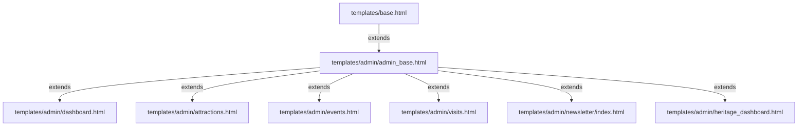

# Unified Premium Admin Dashboard Redesign Plan

This document outlines the detailed architectural and styling plan to implement a global, high-fidelity redesign of the admin dashboard and all administrative modules under the Mangatarem Interactive Digital Cultural Map system.

The redesign is inspired by the modern, premium card-based layout, bold typography, rich micro-interactions, and visual data representations shown in the "Donezo" and "Coursue" dashboard layouts, customized for Mangatarem's natural forest-green and gold theme.

---

## 🏛️ Design System & Aesthetic Archetype

We will fuse the best aspects of the provided designs into a curated, cohesive system for GoMangatarem:

*   **Color Palette**:
    *   **Primary/Accent Dominant**: Emerald/Forest Green (`#14532d`, `#166534`, and `#22c55e` tailwind shades) representing Mangatarem's agricultural, mountain, and natural heritage.
    *   **Accent Color**: Luxurious Warm Gold (`#EAB308` or `#eab308` tailwind shades) for highlights, success trends, and golden-hour indicators.
    *   **Canvas Background**: High-end light cream-gray (`#f8fafc` or custom `#f3f4f6`) to provide a clean, spacious backdrop.
    *   **Dark Contrast**: Slate/Forest Black (`#001e2b`) for sidebar text, dark cards, and deep contrast panels.
*   **Card Design**: Soft bento-style cards (`glass-card`) with generous rounded corners (`rounded-3xl` / `32px` radius), border-lines of `1px solid rgba(0, 30, 43, 0.05)` or thin gold highlights, and extra-deep, diffused shadows (`shadow-forest` token).
*   **Typography**: Premium, sleek sans-serif typography (`font-body` using `Plus Jakarta Sans` or `Euclid Circular A` fonts) and high-contrast bold titles.
*   **Interactions**: Micro-interactions on sidebars, list hovering (`hover:scale-[1.01] hover:bg-emerald-50/50 hover:shadow-lg transition-all duration-300`), and smooth charts with custom green gradients.

---

## 🏛️ Proposed Architecture & System Layout

To execute a **global redesign** cleanly without breaking existing logic or duplicating front-facing templates, we will introduce a new base layout for admin pages.

### 1. New Custom Base: [admin_base.html](file:///d:/porjects/capstone_system/templates/admin/admin_base.html) [NEW]
A dedicated layout that extends `base.html` but overrides `navbar` and `footer` blocks to introduce a full-screen application split pane:
*   **Left Sidebar (Fixed & Sticky)**:
    *   **Logo/Branding**: Clean, high-end "GoMangatarem Admin Hub" brand with a spinning logo vector.
    *   **User Information Card**: Round profile avatar, username, and role badge (e.g., `Admin` in dark emerald pill, `Brgy. Representative` in a gold pill).
    *   **Navigation Menu**: Interactive vertical links with customized modern vector SVGs:
        *   `Dashboard`
        *   `Landmarks` (Attractions)
        *   `Cultural Events`
        *   `Heritage Registry` (Forms 01-07)
        *   `Visits & Analytics`
        *   `Visitor Registry`
        *   `Public Reviews`
        *   `Newsletters`
        *   `Businesses`
        *   `Content Documents`
    *   **Sidebar Footer**: Minimal app version metadata and a beautifully integrated "Logout" button.
*   **Right Workspace Panel (Scrollable)**:
    *   **Utility Top Bar**:
        *   Interactive Search Input (combines filters).
        *   Quick Activity Icons: Notification bell with glowing red dot, Compose quick link.
        *   Profile Menu trigger.
    *   **Central Content Workspace**: Where the page-specific content grids compile.

### 2. Main Stylesheet: [admin_base.css](file:///d:/porjects/capstone_system/static/css/admin/admin_base.css) [NEW]
Defines customized aesthetic properties to avoid bloating standard files:
*   Sidebar width, transition delays, and active indicators.
*   Bento layouts (`bento-grid`, `bento-card`).
*   Custom glassmorphism settings tailored for light-mode canvas.
*   Custom styled scrollbars for sidebar and content grids.

---

## 🏛️ Template Redesigns

### 1. [dashboard.html](file:///d:/porjects/capstone_system/templates/admin/dashboard.html) [MODIFY]
Reconstructed using the "Donezo" layout:
*   **Quick Analytics Bento**:
    *   *Card 1 (Landmarks)*: Bold green card featuring giant white total, gold trend indicator, and small "Total Landmarks" title.
    *   *Card 2 (Events)*: Elegant white card featuring black totals, dark border, and blue metrics.
    *   *Card 3 (Archive)*: Purple-tinted stat block or gray-emerald gradient.
    *   *Card 4 (Reviews)*: Alert card featuring a pulsing pending-reviews count badge.
*   **Visual Data Panels**:
    *   *Engagement Momentum*: Sleek Line/Area chart using Chart.js, rendering custom semi-transparent green gradient area fills and thick forest-green lines.
    *   *Circular Progress Ring*: Custom SVGs or canvas displaying percentage of heritage catalog completeness (e.g., "78% Forms Completed").
*   **Engagement Grid**:
    *   *Pending Validations Queue*: Replaced heavy tables with user profile lists (Avatar, name, role/barangay status, action tick/cross buttons) side-by-side with reviews queue.
    *   *Popular Peaks List*: Compact vertical list of most-viewed attractions with rounded indexing badges.
    *   *Reminders / Live Activity Feed*: Sleek logging list of recent representative activities.

### 2. [attractions.html](file:///d:/porjects/capstone_system/templates/admin/attractions.html) [MODIFY]
*   Redesigned using the unified `admin_base.html` structure.
*   Modern, high-contrast search & filters toolbar (rounded input, search icon, action blue buttons).
*   Visual library grid with large landmark photos, status badges, and action buttons layered inside interactive hover overlays.
*   Elegant table view underneath for batch editing.

### 3. [events.html](file:///d:/porjects/capstone_system/templates/admin/events.html) [MODIFY]
*   Grid of upcoming/past local festivals and events in high-contrast card forms.
*   Displays event dates as prominent colored pill-badges.

### 4. [visitor_registry.html](file:///d:/porjects/capstone_system/templates/admin/visitor_registry.html) & [visits.html](file:///d:/porjects/capstone_system/templates/admin/visits.html) [MODIFY]
*   Redesigned visitor registries to show real-time visitor streams as a timeline feed.
*   Visits page features redesigned bento grids for analytics, utilizing large visual charts and bar graphs.

### 5. [newsletter/index.html](file:///d:/porjects/capstone_system/templates/admin/newsletter/index.html) & [compose.html](file:///d:/porjects/capstone_system/templates/admin/newsletter/compose.html) & [history.html](file:///d:/porjects/capstone_system/templates/admin/newsletter/history.html) [MODIFY]
*   Redesigned the email compose editor with an ultra-clean email composition sheet.
*   Campaign history list designed as interactive cards showing delivery rate, recipient counts, and action view logs.

---

## ❓ Open Questions / Socratic Gate (User Review Required)

Before proceeding with writing the code, please review these key design decisions:

> [!IMPORTANT]
> **1. Multi-Role Adaptation in Left Sidebar**
> The admin hub is used by both the master **Admin** and local **Barangay Representatives (Contributors)**.
> Should the left sidebar dynamically adjust its links based on user permissions? (e.g., hiding Analytics/Newsletters and showing a simplified "Barangay Registry" logo for Barangay Representatives to prevent interface clutter?)

> [!TIP]
> **2. Interactive Chart Widget Preferences**
> The "Donezo" layout uses tall rounded bar charts and progress rings. The "Coursue" layout features smooth line area graphs.
> For Mangatarem's analytics, do you prefer:
> *   **Option A**: Smooth line area charts with forest-green fills for page views, plus clean circular progress indicators for database statistics.
> *   **Option B**: Vertical rounded bar charts with gold and emerald color blocks.

> [!WARNING]
> **3. Mobile View Design**
> On mobile devices (phones/tablets), how should the left sidebar respond:
> *   **Option A (Drawer)**: Collapses into an off-canvas drawer toggled by a hamburger menu in the top header (recommended for maximum screen space).
> *   **Option B (Bottom Dock)**: Transforms into a floating bottom tab-bar for the primary links, similar to a mobile application.

> [!IMPORTANT]
> **4. Custom Widgets Replications**
> Are there specific elements from the screenshots you'd like replicated in our layout? E.g., the **Time Tracker** digital clock card (great for session duration / system time), the **Reminders Panel**, or the **Team Collaboration List**?

---

## 🏁 Verification & Testing Plan

### Automated / Diagnostic Checks
1.  **Tailwind Compilation**: Execute the tailwind windows compiler:
    `.\tailwindcss-windows-x64.exe -i static/css/input.css -o static/css/main.css`
    Ensure all newly added dashboard classes compile without warnings.
2.  **Lint Check**: Run `lint_runner.py` or inspect python files to ensure no formatting failures.

### Manual Verification
1.  **Layout Responsiveness**: Test rendering on desktop, tablet, and mobile viewports. Check sidebar collapse states.
2.  **Dynamic Highlight Tests**: Navigate between Dashboard, Landmarks, and Newsletters. Confirm the active link styles highlight correctly based on current endpoints.
3.  **Role Simulation**: Log in as a Master Admin and as a Barangay Representative. Check if sidebars render appropriate panels.
