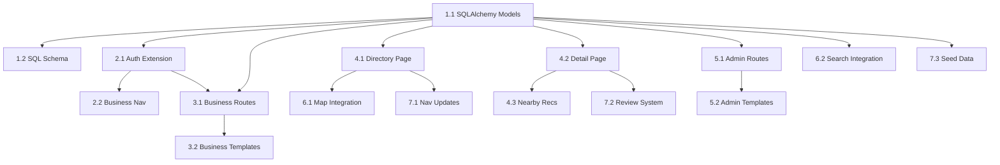

# PLAN: Business Portal — Accommodations & Dining

> **Slug:** `business-portal`
> **Project Type:** WEB (Flask + Jinja2 + Tailwind)
> **Created:** 2026-04-10
> **Status:** ⏳ Awaiting Approval

---

## Overview

Implement a full **Business Portal** feature for the GoMangatarem tourism system, enabling:

1. **Accommodation Listings** — Inns, lodges, and hotels can register, showcase rooms with photos/pricing/amenities
2. **Dining Listings** — Restaurants, coffee shops, and fast food can register, showcase menu highlights
3. **Self-Registration** — Business owners register via a new `business_owner` role, manage their own listings
4. **Nearby Recommendations** — Attraction detail pages show nearby places to stay and eat (haversine distance)

### Why This Matters

- Panelist recommendation: tourists need to find accommodations and dining near cultural sites
- Business owners gain self-service capability, reducing admin workload
- Completes the tourism information ecosystem (heritage → attractions → where to stay/eat)

---

## Success Criteria

| # | Criterion | Measurable |
|---|-----------|------------|
| 1 | Business owner can self-register and create establishment listing | Registration → Pending → Admin Approval → Live |
| 2 | Inn owners can add rooms with photos, prices, amenities | At least 1 room per inn visible on detail page |
| 3 | Restaurant owners can add menu highlights | At least 3 menu items visible on detail page |
| 4 | Establishments appear on the main interactive map | Visible with distinct icons per type |
| 5 | Attraction detail pages show nearby establishments | "Where to Stay" and "Where to Eat" sections |
| 6 | Admin can approve/reject business registrations | Admin dashboard shows pending businesses |
| 7 | Business owner dashboard lets them manage their listing | CRUD for establishment, rooms, menu items |
| 8 | Search integrates establishments | Searching "restaurant" or "inn" returns results |

---

## Tech Stack

| Layer | Technology | Rationale |
|-------|-----------|-----------|
| Backend | Flask + SQLAlchemy | Existing stack, no new dependencies |
| Database | PostgreSQL (Supabase) / SQLite (local) | Existing setup |
| Frontend | Jinja2 + Tailwind CSS | Consistent with existing templates |
| Map | Mapbox GL JS | Already in use for attractions |
| Auth | Flask-Login + existing role system | Extend with `business_owner` role |
| Images | Existing image upload flow | Reuse Supabase Storage or static uploads |

---

## File Structure

```
models.py                          [MODIFY] — Add Establishment, EstablishmentRoom, 
                                              EstablishmentMenuItem, EstablishmentReview models
schema.sql                         [MODIFY] — Add SQL tables for new models
routes/
├── __init__.py                    [MODIFY] — Register new blueprints
├── business.py                    [NEW]    — Business owner dashboard routes
├── public.py                      [MODIFY] — Add establishment public routes + nearby logic
├── admin/
│   └── __init__.py                [MODIFY] — Add establishment admin routes
auth.py                            [MODIFY] — Handle business_owner role in login/register flows

templates/
├── includes/
│   └── business_nav.html          [NEW]    — Navigation for business_owner role
│   └── guest_nav.html             [MODIFY] — Add "Register Business" link
│   └── admin_nav.html             [MODIFY] — Add "Establishments" link
├── auth/
│   └── register_business.html     [NEW]    — Business registration form
├── pagez/
│   ├── establishments.html        [NEW]    — Public directory listing
│   ├── establishment_detail.html  [NEW]    — Public detail page (rooms/menu/reviews/map)
│   └── detail.html                [MODIFY] — Add "Nearby Stay & Eat" section
├── business/
│   ├── dashboard.html             [NEW]    — Business owner dashboard
│   ├── edit_establishment.html    [NEW]    — Edit establishment form
│   ├── manage_rooms.html          [NEW]    — Room CRUD for inns
│   ├── manage_menu.html           [NEW]    — Menu item CRUD for restaurants
│   └── profile.html               [NEW]    — Business owner profile
├── admin/
│   └── establishments.html        [NEW]    — Admin establishment management

static/
├── css/
│   └── components/
│       └── establishments.css     [NEW]    — Establishment-specific styles
├── js/
│   └── components/
│       └── nearby-places.js       [NEW]    — Nearby recommendations widget JS

base.html                          [MODIFY] — Add nav link for Establishments
```

---

## Database Schema (New Models)

### ESTABLISHMENT

```sql
CREATE TABLE IF NOT EXISTS ESTABLISHMENT (
    id INT GENERATED BY DEFAULT AS IDENTITY PRIMARY KEY,
    name VARCHAR(200) NOT NULL,
    type VARCHAR(30) NOT NULL,           -- 'inn', 'restaurant', 'cafe', 'fastfood'
    description TEXT,
    address VARCHAR(500),
    latitude DOUBLE PRECISION NOT NULL,
    longitude DOUBLE PRECISION NOT NULL,
    barangay_id INTEGER,
    contact_number VARCHAR(50),
    email VARCHAR(120),
    website VARCHAR(300),
    operating_hours JSONB,               -- {"mon": "8:00-22:00", "tue": "8:00-22:00", ...}
    price_range VARCHAR(20),             -- 'budget', 'moderate', 'premium'
    amenities JSONB,                     -- ["wifi", "parking", "aircon", "pool"]
    cover_image_url VARCHAR(500),
    logo_url VARCHAR(500),
    owner_id INTEGER NOT NULL,
    status VARCHAR(20) DEFAULT 'pending', -- 'pending', 'approved', 'rejected'
    is_featured BOOLEAN DEFAULT FALSE,
    rating_avg DOUBLE PRECISION DEFAULT 0,
    review_count INTEGER DEFAULT 0,
    created_at TIMESTAMP WITH TIME ZONE DEFAULT CURRENT_TIMESTAMP,
    FOREIGN KEY (barangay_id) REFERENCES BARANGAY_INFO(id),
    FOREIGN KEY (owner_id) REFERENCES "USER"(id)
);

CREATE INDEX idx_establishment_type ON ESTABLISHMENT(type);
CREATE INDEX idx_establishment_status ON ESTABLISHMENT(status);
CREATE INDEX idx_establishment_owner ON ESTABLISHMENT(owner_id);
CREATE INDEX idx_establishment_coords ON ESTABLISHMENT(latitude, longitude);
```

### ESTABLISHMENT_ROOM

```sql
CREATE TABLE IF NOT EXISTS ESTABLISHMENT_ROOM (
    id INT GENERATED BY DEFAULT AS IDENTITY PRIMARY KEY,
    establishment_id INTEGER NOT NULL,
    name VARCHAR(100) NOT NULL,          -- "Deluxe Room", "Standard Twin"
    description TEXT,
    price_per_night DECIMAL(10,2),
    capacity INTEGER DEFAULT 2,
    amenities JSONB,                     -- ["wifi", "aircon", "tv", "hot_water"]
    image_urls JSONB,                    -- ["url1", "url2", "url3"]
    is_available BOOLEAN DEFAULT TRUE,
    created_at TIMESTAMP WITH TIME ZONE DEFAULT CURRENT_TIMESTAMP,
    FOREIGN KEY (establishment_id) REFERENCES ESTABLISHMENT(id) ON DELETE CASCADE
);
```

### ESTABLISHMENT_MENU_ITEM

```sql
CREATE TABLE IF NOT EXISTS ESTABLISHMENT_MENU_ITEM (
    id INT GENERATED BY DEFAULT AS IDENTITY PRIMARY KEY,
    establishment_id INTEGER NOT NULL,
    name VARCHAR(200) NOT NULL,
    description TEXT,
    price DECIMAL(10,2),
    category VARCHAR(50),               -- 'appetizer', 'main', 'dessert', 'drinks', 'snacks'
    image_url VARCHAR(500),
    is_available BOOLEAN DEFAULT TRUE,
    is_bestseller BOOLEAN DEFAULT FALSE,
    created_at TIMESTAMP WITH TIME ZONE DEFAULT CURRENT_TIMESTAMP,
    FOREIGN KEY (establishment_id) REFERENCES ESTABLISHMENT(id) ON DELETE CASCADE
);
```

### ESTABLISHMENT_REVIEW

```sql
CREATE TABLE IF NOT EXISTS ESTABLISHMENT_REVIEW (
    id INT GENERATED BY DEFAULT AS IDENTITY PRIMARY KEY,
    user_id INTEGER NOT NULL,
    establishment_id INTEGER NOT NULL,
    rating INTEGER NOT NULL CHECK (rating >= 1 AND rating <= 5),
    comment TEXT,
    status VARCHAR(20) DEFAULT 'pending',
    created_at TIMESTAMP WITH TIME ZONE DEFAULT CURRENT_TIMESTAMP,
    FOREIGN KEY (user_id) REFERENCES "USER"(id),
    FOREIGN KEY (establishment_id) REFERENCES ESTABLISHMENT(id) ON DELETE CASCADE
);
```

---

## Task Breakdown

### Phase 1: Foundation (Database + Models)

#### Task 1.1: Create SQLAlchemy Models
- **Agent:** `backend-specialist`
- **Skills:** `clean-code`, `database-design`
- **Priority:** P0
- **Dependencies:** None
- **INPUT:** Current `models.py`
- **OUTPUT:** Added `Establishment`, `EstablishmentRoom`, `EstablishmentMenuItem`, `EstablishmentReview` models
- **VERIFY:** `flask db migrate` and `flask db upgrade` run without errors; models register in SQLAlchemy
- [ ] Add Establishment model with all fields
- [ ] Add EstablishmentRoom model
- [ ] Add EstablishmentMenuItem model
- [ ] Add EstablishmentReview model
- [ ] Add relationships (owner → User, barangay → BarangayInfo)

#### Task 1.2: Update SQL Schema
- **Agent:** `backend-specialist`
- **Skills:** `database-design`
- **Priority:** P0
- **Dependencies:** Task 1.1
- **INPUT:** Current `schema.sql`
- **OUTPUT:** Added CREATE TABLE statements for new tables
- **VERIFY:** Schema runs cleanly on fresh PostgreSQL database
- [ ] Add ESTABLISHMENT table
- [ ] Add ESTABLISHMENT_ROOM table
- [ ] Add ESTABLISHMENT_MENU_ITEM table
- [ ] Add ESTABLISHMENT_REVIEW table
- [ ] Add indexes

---

### Phase 2: Auth & Business Owner Role

#### Task 2.1: Extend Auth for Business Owner Role
- **Agent:** `backend-specialist`
- **Skills:** `clean-code`
- **Priority:** P1
- **Dependencies:** Task 1.1
- **INPUT:** Current `routes/auth.py`, login/register flows
- **OUTPUT:** `business_owner` role integrated in login redirect, register flow handles business registration
- **VERIFY:** Business owner can register → lands on pending page → admin approves → can login → redirects to business dashboard
- [ ] Add `business_owner` to role routing in `login()`
- [ ] Create business registration route `/register/business`
- [ ] Create `register_business.html` template
- [ ] Update `_check_approval_status()` to handle business_owner

#### Task 2.2: Business Owner Navigation
- **Agent:** `frontend-specialist`
- **Skills:** `frontend-design`
- **Priority:** P1
- **Dependencies:** Task 2.1
- **INPUT:** Existing nav includes pattern (`includes/admin_nav.html`, etc.)
- **OUTPUT:** New `includes/business_nav.html` with dashboard, establishment, profile links
- **VERIFY:** Nav renders correctly for business_owner role; active states work
- [ ] Create `business_nav.html` with appropriate links
- [ ] Update `base.html` navbar to include business_owner role check
- [ ] Add "Register Your Business" link to `guest_nav.html`

---

### Phase 3: Business Owner Dashboard (CRUD)

#### Task 3.1: Business Dashboard Routes
- **Agent:** `backend-specialist`
- **Skills:** `clean-code`
- **Priority:** P1
- **Dependencies:** Task 1.1, Task 2.1
- **INPUT:** Pattern from existing `routes/barangay/` blueprint
- **OUTPUT:** New `routes/business.py` with full CRUD for establishments, rooms, menu items
- **VERIFY:** All routes return 200; CRUD operations persist to database
- [ ] Create `/business/dashboard` — overview page
- [ ] Create `/business/establishment/edit` — create/edit establishment
- [ ] Create `/business/rooms` — list/add/edit/delete rooms (inn only)
- [ ] Create `/business/menu` — list/add/edit/delete menu items (restaurant/cafe only)
- [ ] Create `/business/reviews` — view reviews for their establishment
- [ ] Create `/business/profile` — edit business owner profile
- [ ] Register blueprint in `routes/__init__.py`

#### Task 3.2: Business Dashboard Templates
- **Agent:** `frontend-specialist`
- **Skills:** `frontend-design`, `clean-code`
- **Priority:** P2
- **Dependencies:** Task 3.1
- **INPUT:** Existing template design patterns (barangay dashboard as reference)
- **OUTPUT:** Full set of business dashboard templates matching existing design language
- **VERIFY:** Templates render correctly; forms submit data; design matches existing system aesthetic
- [ ] `business/dashboard.html` — stats overview (views, reviews, rating)
- [ ] `business/edit_establishment.html` — establishment form (name, type, location, hours, amenities, images)
- [ ] `business/manage_rooms.html` — room list with add/edit/delete modals
- [ ] `business/manage_menu.html` — menu item list with add/edit/delete
- [ ] `business/profile.html` — business owner profile edit

---

### Phase 4: Public Pages

#### Task 4.1: Establishment Directory Page
- **Agent:** `frontend-specialist`
- **Skills:** `frontend-design`, `clean-code`
- **Priority:** P2
- **Dependencies:** Task 1.1
- **INPUT:** Public route patterns from `routes/public.py`
- **OUTPUT:** `/establishments` route + template showing all approved establishments with filters
- **VERIFY:** Page loads with approved establishments; filters work (type, barangay, price range)
- [ ] Add route `GET /establishments` in `routes/public.py`
- [ ] Create `pagez/establishments.html` — card grid with filter sidebar
- [ ] Add type filter (Inn, Restaurant, Cafe, Fast Food)
- [ ] Add barangay filter
- [ ] Add price range filter
- [ ] Add search by name

#### Task 4.2: Establishment Detail Page
- **Agent:** `frontend-specialist`
- **Skills:** `frontend-design`
- **Priority:** P2
- **Dependencies:** Task 1.1
- **INPUT:** Existing `pagez/detail.html` as design reference
- **OUTPUT:** `/establishment/<id>` route + template showing full establishment info
- **VERIFY:** Detail page renders rooms (for inns), menu items (for restaurants), reviews, map location
- [ ] Add route `GET /establishment/<id>` in `routes/public.py`
- [ ] Create `pagez/establishment_detail.html`
- [ ] Room gallery section (for inns) with price, capacity, amenities, photos
- [ ] Menu section (for restaurants/cafes) with categories, prices, photos
- [ ] Reviews section with rating breakdown
- [ ] Map section showing location
- [ ] Operating hours display
- [ ] Contact info and amenities badges

#### Task 4.3: Nearby Recommendations on Attraction Pages
- **Agent:** `backend-specialist` + `frontend-specialist`
- **Skills:** `clean-code`, `frontend-design`
- **Priority:** P2
- **Dependencies:** Task 1.1, Task 4.2
- **INPUT:** Current `routes/public.py` → `attraction_detail()`, `pagez/detail.html`
- **OUTPUT:** "Where to Stay" and "Where to Eat" sections on attraction detail pages
- **VERIFY:** Attraction pages show nearest establishments sorted by distance; links work
- [ ] Add haversine distance utility function in `utils/geo.py`
- [ ] Modify `attraction_detail()` to query nearby establishments (within ~3km radius)
- [ ] Add "Where to Stay" section to `pagez/detail.html`
- [ ] Add "Where to Eat" section to `pagez/detail.html`
- [ ] Show establishment cards with distance, rating, price range

---

### Phase 5: Admin Management

#### Task 5.1: Admin Establishment Management
- **Agent:** `backend-specialist`
- **Skills:** `clean-code`
- **Priority:** P2
- **Dependencies:** Task 1.1
- **INPUT:** Existing admin routes pattern (`routes/admin/`)
- **OUTPUT:** Admin can view, approve, reject, and delete establishments
- **VERIFY:** Admin dashboard shows pending count; approve/reject changes status; establishment goes live after approval
- [ ] Add establishment routes to admin blueprint
- [ ] `GET /admin/establishments` — list all with status filter
- [ ] `POST /admin/establishments/<id>/approve` — approve establishment
- [ ] `POST /admin/establishments/<id>/reject` — reject establishment
- [ ] `DELETE /admin/establishments/<id>` — delete establishment
- [ ] Show pending establishment count on admin dashboard

#### Task 5.2: Admin Establishment Templates
- **Agent:** `frontend-specialist`
- **Skills:** `frontend-design`
- **Priority:** P2
- **Dependencies:** Task 5.1
- **INPUT:** Existing admin template design patterns
- **OUTPUT:** Admin establishment management page
- **VERIFY:** Page shows all establishments with status badges; approve/reject buttons work
- [ ] Create `admin/establishments.html` — table/card list with status filters
- [ ] Add pending establishments card to `admin/dashboard.html`

---

### Phase 6: Map & Search Integration

#### Task 6.1: Map Integration
- **Agent:** `frontend-specialist`
- **Skills:** `frontend-design`
- **Priority:** P3
- **Dependencies:** Task 4.1
- **INPUT:** Current map implementation (`pagez/map.html`, `routes/map_routes.py`)
- **OUTPUT:** Establishments appear on the interactive map with distinct icons by type
- **VERIFY:** Map shows establishment markers; clicking opens popup with name, type, rating; markers can be toggled on/off
- [ ] Add establishment data to map API endpoint
- [ ] Create distinct markers for each type (🏨 inn, 🍽️ restaurant, ☕ cafe, 🍔 fast food)
- [ ] Add toggle layer for "Places to Stay" and "Places to Eat"
- [ ] Popup shows name, type, rating, price range, link to detail

#### Task 6.2: Search Integration
- **Agent:** `backend-specialist`
- **Skills:** `clean-code`
- **Priority:** P3
- **Dependencies:** Task 1.1
- **INPUT:** Current search function in `routes/public.py`
- **OUTPUT:** Search results include establishments
- **VERIFY:** Searching "restaurant" or "inn" returns matching establishments
- [ ] Extend `search()` route to query Establishment model
- [ ] Add establishment results section to `pagez/search_results.html`

---

### Phase 7: Navigation & Polish

#### Task 7.1: Navigation Updates
- **Agent:** `frontend-specialist`
- **Skills:** `frontend-design`
- **Priority:** P3
- **Dependencies:** Task 4.1
- **INPUT:** All nav includes, base.html, footer
- **OUTPUT:** "Stay & Eat" link added to all navigation variants
- **VERIFY:** New nav link visible in guest, user, admin, contributor, and business_owner navs
- [ ] Add "Stay & Eat" link to `guest_nav.html`
- [ ] Add "Stay & Eat" link to `user_nav.html`
- [ ] Add "Stay & Eat" link to `admin_nav.html`
- [ ] Add "Stay & Eat" link to `barangay_nav.html`
- [ ] Update footer links in `base.html`
- [ ] Update mobile menu

#### Task 7.2: Establishment Review System
- **Agent:** `backend-specialist`
- **Skills:** `clean-code`
- **Priority:** P3
- **Dependencies:** Task 4.2
- **INPUT:** Existing `AttractionReview` pattern
- **OUTPUT:** Users can submit reviews for establishments; rating_avg auto-updates
- **VERIFY:** Logged-in user can submit review; review appears after admin approval; rating_avg recalculates
- [ ] Add review submission route `POST /establishment/<id>/review`
- [ ] Add review form to establishment detail page
- [ ] Update `rating_avg` and `review_count` on Establishment after review approval
- [ ] Admin approve/reject reviews (reuse existing pattern)

#### Task 7.3: Seed Data
- **Agent:** `backend-specialist`
- **Skills:** `clean-code`
- **Priority:** P3
- **Dependencies:** Task 1.1
- **INPUT:** Knowledge of Mangatarem establishments
- **OUTPUT:** `data/establishments.json` with 5-10 sample establishments
- **VERIFY:** Seed data loads on fresh database; establishments appear on public pages
- [ ] Create sample data file with inns and restaurants
- [ ] Add seed logic to `app.py` → `_seed_database()`

---

## Dependency Graph



---

## Phase X: Verification Checklist

- [ ] All new models migrate without errors
- [ ] Business owner registration → approval → login flow works end-to-end
- [ ] Business dashboard CRUD: create, edit, delete establishment
- [ ] Room management: add, edit, delete rooms with image upload
- [ ] Menu management: add, edit, delete items
- [ ] Public directory page loads with filters
- [ ] Detail page shows rooms/menu based on type
- [ ] Nearby recommendations appear on attraction detail pages
- [ ] Map shows establishment markers with toggle
- [ ] Search includes establishments
- [ ] Admin can approve/reject establishments
- [ ] Reviews work with rating calculation
- [ ] Navigation links present in all nav variants
- [ ] Mobile responsive on all new pages
- [ ] No purple/violet hex codes used
- [ ] No template layouts reused — original designs
- [ ] Lint/type checks pass
- [ ] Build succeeds without errors

---

## Risk Register

| Risk | Impact | Mitigation |
|------|--------|------------|
| Image upload complexity (rooms, menu items) | High | Reuse existing Supabase Storage pattern; limit to URL-based for now |
| Map performance with many markers | Medium | Cluster markers; lazy-load establishment data |
| Business owner spam registrations | Medium | Admin approval gate + rate limiting on registration |
| Haversine distance query performance | Low | Add location indexes; consider PostGIS if needed (already in project) |
| Scope creep (booking, payments) | High | Explicitly out-of-scope for this phase; contact info only |

---

## Out of Scope (Future)

- ❌ Online booking / reservation system
- ❌ Payment processing
- ❌ WhatsApp / messaging integration
- ❌ Business analytics dashboard (advanced)
- ❌ Multi-establishment per owner
- ❌ Establishment categories beyond 4 core types

---

## Estimated Timeline

| Phase | Tasks | Duration |
|-------|-------|----------|
| Phase 1: Foundation | 1.1–1.2 | 2–3 hours |
| Phase 2: Auth | 2.1–2.2 | 2–3 hours |
| Phase 3: Business Dashboard | 3.1–3.2 | 4–6 hours |
| Phase 4: Public Pages | 4.1–4.3 | 4–6 hours |
| Phase 5: Admin | 5.1–5.2 | 2–3 hours |
| Phase 6: Map & Search | 6.1–6.2 | 2–3 hours |
| Phase 7: Polish | 7.1–7.3 | 2–3 hours |
| **Total** | | **~18–27 hours** |
