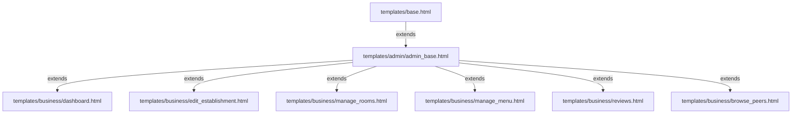

# Premium Business Owner Workspace Redesign Plan

This document outlines the detailed architectural and styling plan to implement a global, high-fidelity redesign of the **Local Tourism & Business Owner Workspace** under the Mangatarem Interactive Digital Cultural Map system.

The redesign integrates the `business_owner` user role into our premium unified vertical sidebar system, styled beautifully using customized **Mangatarem Forest Green & Gold Palette** for Hospitality (Inns), and **Culinary Burnt Orange & Amber Highlights** for Dining (Restaurants, Cafés, Fast Food).

---

## 🏛️ Design System & Aesthetic Archetype

We will extend the premium backoffice design system to establish a premium, cohesive aesthetic:

*   **Color Palette Integration**:
    *   **Shared Base Canvas**: Clean, spacious light cream-gray (`#f8fafc` or custom `#f3f4f6`) canvas with a dark sidebar navigation block.
    *   **Hospitality Mode (`inn`)**: Emerald/Forest Green accent details (`#00684a` and `#00ed64`) reflecting premium accommodations.
    *   **Dining Mode (`restaurant`/`cafe`/`fastfood`)**: Warm Culinary Burnt Orange and Amber details (`#ea580c`, `#f97316`, and `#f59e0b`) to evoke dining and cafe vibes.
*   **Card Design**: Soft bento-style glass cards (`glass-card`) with rounded-3xl corners (`rounded-3xl` / `32px` radius) and diffused shadows (`shadow-forest`).
*   **Typography**: Sleek typography with bold headers and custom category tags.
*   **Interactions**: Micro-animations on list hovels, status pill glow rings, and responsive overlay controls.

---

## 🏛️ Proposed Architecture & System Layout

To unify all backoffice portals, we will adapt the main base layout:

### 1. Sidebar Adaptation: templates/admin/admin_base.html [MODIFY]
Add dynamic detection for the `business_owner` role. When a business owner logs in:
1.  **Sidebar Branding Header**: Custom dynamic "GoMangatarem Business Hub" or "Stewardship Portal" indicator.
2.  **Role Badge**: Renders a custom badge: `🏨 Hospitality Partner` or `🍽️ Culinary Partner` based on the business type.
3.  **Navigation Links**: Displays dedicated, context-aware links:
    *   **Dashboard Overview**: Directing to `business.dashboard`.
    *   **Listing Profile Settings**: Directing to `business.edit_establishment`.
    *   **Manage Rooms**: Directing to `business.manage_rooms` (only displayed if the establishment is type `inn`).
    *   **Manage Menu**: Directing to `business.manage_menu` (only displayed if the establishment is dining type).
    *   **Visitor Registry / Walk-in**: Directing to `analytics_module.log_visitor` with target mapping.
    *   **Customer Reviews**: Directing to `business.view_reviews`.
    *   **Browse Local Peers**: Directing to `business.browse_peers`.

---

## 🏛️ Proposed Template Overhauls

We will completely rebuild all six business templates:

### 1. dashboard.html [MODIFY]
*   **Hero Listing Banner**: Sleek wide card showcasing the business cover photo, address, operating hours status (e.g. open/closed), and direct settings quick access.
*   **Sleek Stats Bento Grid**:
    *   *Status Card*: Displays approval status (Pending/Approved) with custom glowing indicator rings (Amber for pending, Green for approved).
    *   *Rating Card*: Mapped average rating stars with active total reviews tracker.
    *   *Asset Counts*: Mapped totals of rooms or menu items using custom vector backgrounds.
*   **Quick Operations Dashboard**: Bento-style link tiles to add new assets or log physical guest walk-ins.

### 2. edit_establishment.html [MODIFY]
*   **Sleek Multi-Section Form**: Divided into logical sections using premium cards:
    *   *Basic Profile*: Business name, category/type selection, price tiers, and rich description fields.
    *   *Interactive Coordinates Picker*: Integrated Leaflet map wrapper with drag-and-drop marker support to input exact latitude/longitude coordinates.
    *   *Contact & Hours*: Operating hours grid with simple hour dropdowns for each day of the week, plus custom phone/email inputs.
    *   *Cover & Logo Media Uploads*: Modern input fields showing dynamic image URL previews.

### 3. manage_rooms.html [MODIFY]
*   **Accommodations Grid**: Beautiful grid lists displaying rooms, prices per night, guest capacity, and amenities.
*   **Availability Toggle Switch**: Premium switches to toggle availability on the fly.
*   **Sleek Drawer Form Modals**: Premium modals to add or edit rooms without leaving the listing table.

### 4. manage_menu.html [MODIFY]
*   **Category-Grouped Bento Grid**: Grouped cleanly into horizontal sections (Appetizers, Main Dishes, Desserts, Drinks) with beautiful grid layouts.
*   **Item Cards**: Grid lists showing food item previews, prices, bestseller gold stars, and edit/delete overlay triggers.

### 5. reviews.html [MODIFY]
*   **Customer Testimonials Feed**: Chronological list of user reviews styled with premium round avatar tags, star-rating displays, and custom glass comment boxes.

### 6. browse_peers.html [MODIFY]
*   **Peer Insights Grid**: Let business owners browse other local businesses of the same category, offering sleek cards to explore pricing options, average reviews, and featured tags to encourage competitive excellence.

---

## ❓ Open Questions / Socratic Gate (User Review Required)

Before proceeding with writing the code, please review these key design decisions:

> [!IMPORTANT]
> **1. Color-Scheme Transition Based on Business Types**
> Do you approve of dynamically toggling the color accent details (e.g. glowing border outlines, action buttons, and dashboard indicators) based on the business type?
> *   **Accommodations (`inn`)**: Mangatarem forest-green theme (`#00684a` / `#00ed64`).
> *   **Dining (`restaurant`/`cafe`/`fastfood`)**: Premium culinary burnt orange theme (`#ea580c` / `#f97316`).

> [!TIP]
> **2. Operating Hours Management Format**
> Operating hours are stored as a JSON object (e.g. `{"mon": "08:00-22:00"}`). We will provide a clean weekly grid input where the user can pick times or mark specific days as **"Closed"**. Do you want a bulk option (e.g. "Apply Monday hours to all weekdays") to speed up entry?

> [!WARNING]
> **3. Empty Listing State Support**
> If a business owner logs in and has **no establishment listing registered yet**, we will show a beautiful full-screen empty state card prompting them to "Create their first listing". Do you want us to pre-populate mock fields based on their registration details to make this fast and easy?

---

## 🏁 Verification & Testing Plan

### Automated / Diagnostic Checks
1.  **Tailwind Compilation**: Run compilation pipeline to build styles:
    `.\tailwindcss-windows-x64.exe -i static/css/input.css -o static/css/main.css`
2.  **Lint Check**: Run `lint_runner.py` to ensure pristine python files.

### Manual Verification
1.  **Steward vs. Owner Sidebar Separation**: Log in as a Barangay Steward (`steward`) and a Business Owner (`tourist` / upgraded accounts). Confirm that each role sees only its respective sidebar options.
2.  **Dynamic Culinary Orange vs. Forest Green**: Log in to a Dining business and an Accommodation business. Confirm that color modes transition perfectly.
3.  **Map Marker Coordinate Test**: Open the Edit Listing page, drag the Leaflet map coordinate selector, and verify the latitude/longitude inputs update automatically.
4.  **Menu & Room Manipulations**: Verify that adding, editing, and deleting menu items or room lists executes correctly and updates the dashboard counts.
