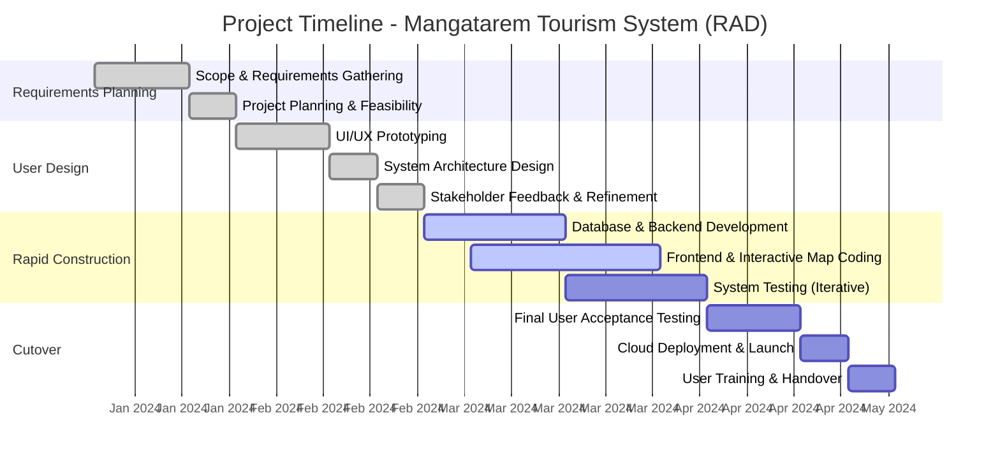

# Implementation Plan

This section outlines the strategic approach for the development and deployment of the Interactive Digital Cultural Map and Local Tourism Information System for Mangatarem, Pangasinan. It details the project timeline, deployment procedures, and the specific resources required to ensure successful implementation.

## Project Timeline

The development schedule follows the Rapid Application Development (RAD) methodology, divided into four distinct phases: Requirements Planning, User Design, Rapid Construction, and Cutover. The timeline below highlights key milestones and expected completion durations for each project phase, emphasizing rapid prototyping and iterative feedback to ensure a timely delivery of the system.

## Deployment Plan

The deployment plan dictates the transition of the tourism information system from the development environment to a live, production-ready state accessible to the municipality and tourists.

1. **System Installation and Environment Setup**: The system utilizes a cloud-native architecture. The backend services and PostgreSQL database will be provisioned using Supabase, ensuring high availability and secure data storage. The frontend application will be hosted on a scalable cloud platform (e.g., Vercel or Render) optimized for fast content delivery.
2. **Testing Phase (Staging)**: Before final launch, the system will be deployed to a staging environment that mirrors the production setup. This phase includes final end-to-end testing, security vulnerability scans, and performance load testing to ensure the system can handle concurrent user traffic.
3. **Deployment Strategy**: A phased rollout strategy will be employed. The administrative and contributor portals will be deployed first to allow the Local Government Unit (LGU) and business owners to populate the system with initial data (cultural landmarks, business profiles). Subsequently, the public-facing interactive map and customer portal will be launched.
4. **User Integration and Training**: Upon successful deployment, comprehensive training sessions will be conducted for the municipal tourism staff (Admins) and local business owners (Contributors/Staff). User manuals and technical documentation will be provided to ensure smooth onboarding and sustainable system management.

## Resource Requirements

The successful implementation and sustained operation of the system require specific hardware, software, and human resources.

### Hardware Requirements
*   **Development Phase**:
    *   Processor: Intel Core i5 / AMD Ryzen 5 or higher.
    *   Memory (RAM): 8GB minimum (16GB recommended for concurrent development tasks).
    *   Storage: 512GB SSD for optimal compilation and software execution speeds.
    *   Peripherals: Standard monitor, keyboard, and mouse.
*   **Deployment Phase**:
    *   Cloud Infrastructure: Scalable cloud servers managed via Supabase (Database/Auth) and Vercel/Render (Frontend Hosting), negating the need for on-premise physical servers for the LGU.
    *   End-User Devices: Standard internet-connected smartphones, tablets, or desktop computers for Admins, Staff, and Customers.

### Software Requirements
*   **Operating System**: Windows 10/11, macOS, or Linux (Ubuntu) for development environments.
*   **Development Tools**: Visual Studio Code (Integrated Development Environment), Git (Version Control).
*   **Technology Stack**:
    *   Backend Framework: Python with Flask.
    *   Database Management System: PostgreSQL (via Supabase).
    *   Frontend Technologies: HTML5, CSS3, JavaScript (React/Next.js).
    *   Mapping Service: Mapbox API for the interactive digital cultural map.
*   **Design Tools**: Figma for UI/UX prototyping.

### Human Resources
*   **Project Manager**: Oversees the development timeline, ensures milestones are met, and facilitates communication between developers and stakeholders.
*   **Backend Developer**: Responsible for server-side logic, API development, and database architecture using Python and PostgreSQL.
*   **Frontend Developer**: Focuses on the user interface, responsive web design, and Mapbox API integration for the interactive map.
*   **Quality Assurance (QA) Tester**: Executes the testing plans (functional, security, usability) to identify and document system defects prior to launch.
*   **System Administrator (Post-Deployment)**: Appointed from the municipal staff to manage user roles, approve contributor submissions, and maintain system data.
