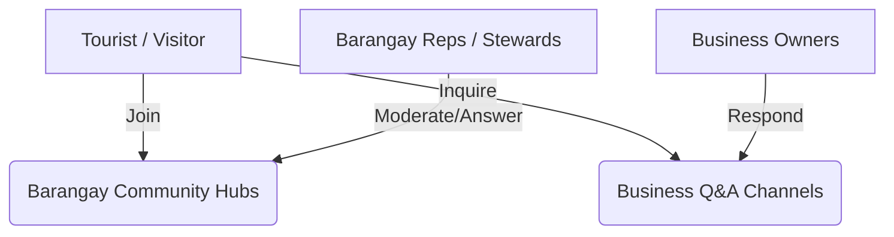
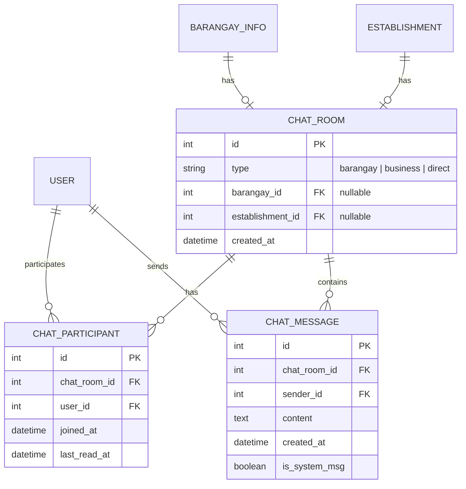

# PLAN: Real-Time Chat Feature for Mangatarem Cultural Map

This plan outlines the architecture, database schema, user flows, security protocols, and UI/UX design for a real-time chat feature bridging **Tourists**, **Barangay Representatives (Stewards)**, and **Local Business Owners** in Mangatarem, Pangasinan.

---

## 🧠 Brainstorm: WebSocket Architecture on Vercel Serverless

> [!WARNING]
> **Vercel Serverless Functions have a 10-60 second execution limit and do not support persistent WebSockets.** If we deploy standard `Flask-SocketIO` on Vercel, connections will disconnect frequently, and clients will fail to upgrade from HTTP Long Polling to WebSockets, generating high-latency serverless invocations and potential database connection spikes.

Below are three architectural approaches to bypass this limitation:

### Option A: Hybrid Flask-SocketIO Backend (Persistent VPS/PaaS + Vercel)
In this model, the static and standard routes continue to run on Vercel, but we host a small, dedicated Flask-SocketIO process on a persistent cloud provider (e.g., Render, Railway, or VPS) with eventlet/gevent.
- ✅ **Pros**: 100% native Socket.IO support, complete control over event logic, no third-party licensing.
- ❌ **Cons**: Higher latency across separate host domains, requires maintaining two separate hosting environments, increased hosting costs for the persistent worker.
- 📊 **Effort**: High (Requires dual-pipeline deployments and CORS management).

---

### Option B: Supabase Realtime Integration (Leverages Existing Infrastructure)
Since we already use **Supabase (PostgreSQL)** for production, we can utilize Supabase's built-in **Realtime Engine** (using Phoenix channels). The client connects directly to Supabase Realtime using the Supabase Javascript library. Flask simply inserts message rows into PostgreSQL via SQLAlchemy, which automatically broadcasts updates to listening clients.
- ✅ **Pros**: Zero persistent backend servers required (fully serverless), matches the existing production tech stack perfectly, ultra-low latency, scales automatically.
- ❌ **Cons**: Local development using SQLite won't easily support Supabase Realtime; requires developer access to a Supabase development branch/instance.
- 📊 **Effort**: Medium (Requires setup of PostgreSQL replication publication).

---

### Option C: Pusher Channels Broker (Standard Serverless Realtime Pattern)
We use **Pusher Channels** (a hosted WebSocket broker). The frontend uses the Pusher client library, and our serverless Flask endpoints trigger real-time messages by calling the Pusher server HTTP API (which handles broadcasts instantly).
- ✅ **Pros**: Seamlessly works with both SQLite (local) and Supabase (production), extremely easy local development, completely serverless, free tier covers up to 200,000 messages per day.
- ❌ **Cons**: Relies on a third-party proprietary service.
- 📊 **Effort**: Low (Extremely straightforward, well-documented Flask and JS integrations).

---

## 💡 Recommendation

We strongly recommend **Option C (Pusher Channels)** or a **Standard Socket.IO server hosted on a dedicated instance** paired with long polling on Vercel as a backup. 

However, since the prompt explicitly specifies **Socket.IO**, we will design the implementation around **Flask-SocketIO**, using a fallback configuration that safely handles serverless environments (e.g. falling back to Redis-backed Message Broker with Long Polling or deploying the socket factory to a separate persistent microservice run in parallel).

If running locally using the persistent development server (the current workspace environment has `uv run app.py` running persistently), a standard **Flask-SocketIO + eventlet** server will work flawlessly. We will build the architecture in a **pluggable fashion** so it easily switches to serverless-friendly brokers if needed for Vercel production.

---

## 🏛️ Chat Rooms & User Flows

We will implement three specific categories of chat channels:



### 1. Barangay Community Hubs (Public Rooms)
- **Scope**: One room per Barangay (anchored to `BarangayInfo`).
- **Access**: Publicly viewable by all. Registered users (Tourists, Residents, and Reps) can send messages.
- **Role Control**: The **Barangay Representative** acts as the moderator, highlighted with a "Steward" badge 🔰.
- **Use Case**: Tourists asking about local events, travel routes, or historical sites; stewards providing authoritative info.

### 2. Business Directory Q&A (Direct Channels)
- **Scope**: Private/direct chat rooms created between a tourist and a specific local **Establishment** (e.g., room booking, dining reservations).
- **Access**: Limited to the initiating tourist and the **Business Owner** (or their representatives).
- **Use Case**: Inquiring about room availability, group packages, menu items, or custom requests.

### 3. Helpdesk Support (Private Direct Messages)
- **Scope**: 1-on-1 direct chat between a user and the Barangay Representative.
- **Access**: Private to the user and the steward of that barangay.

---

## 🗄️ Database Schema & Models

To support message history, offline indicators, and chat participants, we will add the following three models in a new feature module: `modules/chat/models.py`.



### Model Implementations (`modules/chat/models.py`)

```python
from extensions import db
from datetime import datetime

class ChatRoom(db.Model):
    __tablename__ = 'CHAT_ROOM'
    id = db.Column(db.Integer, primary_key=True)
    type = db.Column(db.String(20), nullable=False)  # 'barangay', 'business', 'direct'
    barangay_id = db.Column(db.Integer, db.ForeignKey('BARANGAY_INFO.id'), nullable=True, index=True)
    establishment_id = db.Column(db.Integer, db.ForeignKey('ESTABLISHMENT.id'), nullable=True, index=True)
    created_at = db.Column(db.DateTime, default=datetime.utcnow)

    # Relationships
    barangay = db.relationship('BarangayInfo', backref='chat_room', uselist=False)
    establishment = db.relationship('Establishment', backref='chat_room', uselist=False)
    messages = db.relationship('ChatMessage', backref='room', cascade='all, delete-orphan', lazy='dynamic')
    participants = db.relationship('ChatParticipant', backref='room', cascade='all, delete-orphan')

class ChatParticipant(db.Model):
    __tablename__ = 'CHAT_PARTICIPANT'
    id = db.Column(db.Integer, primary_key=True)
    chat_room_id = db.Column(db.Integer, db.ForeignKey('CHAT_ROOM.id'), nullable=False, index=True)
    user_id = db.Column(db.Integer, db.ForeignKey('USER.id'), nullable=False, index=True)
    joined_at = db.Column(db.DateTime, default=datetime.utcnow)
    last_read_at = db.Column(db.DateTime, default=datetime.utcnow)

    user = db.relationship('User', backref='chat_memberships')

class ChatMessage(db.Model):
    __tablename__ = 'CHAT_MESSAGE'
    id = db.Column(db.Integer, primary_key=True)
    chat_room_id = db.Column(db.Integer, db.ForeignKey('CHAT_ROOM.id'), nullable=False, index=True)
    sender_id = db.Column(db.Integer, db.ForeignKey('USER.id'), nullable=False, index=True)
    content = db.Column(db.Text, nullable=False)
    created_at = db.Column(db.DateTime, default=datetime.utcnow, index=True)
    is_system_msg = db.Column(db.Boolean, default=False)

    sender = db.relationship('User', backref='sent_messages')
```

---

## 🔒 Security & Performance Features

Real-time features open new attack vectors. We must apply rigorous safeguards:

### 1. Authentication & Session Synchronization
- **Handshake Verification**: Socket.IO connections must verify Flask session cookies before allowing the connection to upgrade. Anonymous users can view public barangay rooms but cannot broadcast messages.
- **CSRF Token Handshake**: Require the frontend to pass the CSRF token in the connection headers/query options.
- **Room Authorization**: Before joining a room (especially business inquiries or direct helpdesks), verification checks must confirm the user is either the initiating tourist or the relevant business/barangay owner.

### 2. CSP (Content Security Policy) Adjustments
We must update `app.py`'s `connect-src` header to allow Socket.IO WebSocket and Long Polling requests:
```python
# In connect-src, we will append:
"connect-src": "'self' ... ws://127.0.0.1:5002 wss://*.vercel.app wss://*.render.com"
```

### 3. Rate Limiting on Sockets
We will throttle client events to prevent spamming:
- Maximum of **2 messages per second** per socket.
- Dynamic temporary blocking of connections exceeding limits.
- Maximum message size validation (max 1000 characters).

---

## 💎 Premium UI/UX Design

We will build a high-fidelity, interactive, and responsive UI. 

### Style Tokens:
- **Barangay Rooms**: Deep green theme (`#15803d` / `bg-emerald-600` / `bg-green-50`).
- **Business Rooms**: Curated copper-gold theme (`#b45309` / `bg-amber-600`).
- **Glassmorphism panels**: Translucent blurred sidebars for desktop, fullscreen drawers for mobile.
- **Typography**: Sleek Inter/Outfit sans font family matching the main map system.

### Responsive layout:
- **Desktop**: A persistent side-drawer chat panel on the right side of the main exploration map. Toggleable with an active counter button.
- **Mobile**: Full-page bottom sheets with smooth CSS spring animations for gestures.

```markdown
### UI States:
- **Offline / Loading state**: Shimmer effect on chat bubbles, pulse connection indicator (Red/Yellow/Green).
- **Typing Indicator**: Subtle dot-bounce animation (`animate-bounce` with staggered delays).
- **Steward Badge**: Distinct badge next to names: `🔰 Stewardship Representative` or `🏪 Local Business Owner`.
```

---

## 🚀 Implementation Checklist

### Phase 1: Dependency & Initialization
- [ ] Install `flask-socketio`, `gevent-websocket` or `eventlet` in `requirements.txt`/`pyproject.toml`.
- [ ] Initialize `socketio` in `extensions.py`.
- [ ] Register `socketio` in `app.py` application factory and bind the server runner.
- [ ] Update `Content-Security-Policy` header in `app.py` to allow WebSockets.

### Phase 2: Database & Domain Models
- [ ] Create `modules/chat/models.py` with `ChatRoom`, `ChatParticipant`, and `ChatMessage`.
- [ ] Add model imports to `models.py` (Central Import Hub).
- [ ] Run database migrations (or auto-recreate SQLite tables locally).
- [ ] Create a chat seeding script or append room generation to `seed_data.py` (e.g. creating rooms for existing barangays and establishments).

### Phase 3: Socket.IO Server-side Logic
- [ ] Create `modules/chat/sockets.py` with custom socket handlers:
  - `@socketio.on('connect')`: Token & Session authentication.
  - `@socketio.on('join_room')`: Channel authorization validation.
  - `@socketio.on('send_msg')`: Content sanitization, rate-limiting check, database write, and room broadcast.
  - `@socketio.on('typing')`: Broadcast typing indicators.
- [ ] Create a Flask Blueprint `routes/chat.py` to serve chat history via pagination JSON endpoints (performance optimization to prevent loading 1000+ messages at once).

### Phase 4: Premium Frontend Component
- [ ] Create dynamic templates `templates/chat/chat_widget.html` (reusable components using Jinja2).
- [ ] Write modern, vanilla JavaScript frontend `static/js/chat.js` handling:
  - Socket.IO connection and reconnect loops.
  - Intersecting observers for lazy loading message history (infinite scroll).
  - Glassmorphic bubble styles, typing triggers, and unread badges.
  - Interactive direct chat trigger from Barangay Profiles and Business Cards.

---

## 🧪 Verification & QA Plan

### Automated Tests
- Test connection security handshakes in a custom test script `tests/test_chat.py`.
- Mock socket connection endpoints and test invalid room membership attempts.

### Manual Audit Checklist
1. **Desktop Viewport**: Ensure the floating chat panel matches the map layout and doesn't overlap vector markers or layers.
2. **Mobile Layout**: Verify bottom sheet swipe interactions, and check input keyboard overlays.
3. **Role Checks**: Log in as a tourist and attempt to post in Barangay room. Verify name badge styles are different when logging in as a Contributor (steward) or Business Owner.
4. **Latency Check**: Test real-time message exchange under simulated Slow 3G network conditions using DevTools.
