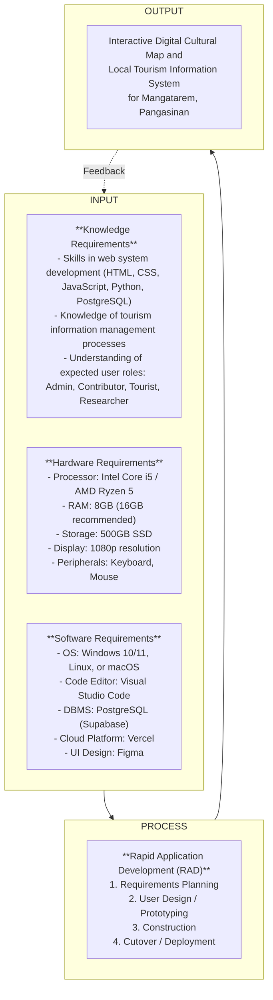

# Chapter 1: Introduction

## Background of the Study

The integration of computing solutions in local governance and tourism has become increasingly vital in modernizing public services and promoting cultural heritage, aligned with national mandates from the National Commission for Culture and the Arts (NCCA) and the Department of Tourism (DOT) to leverage technology for cultural documentation and sustainable local development. System software and web applications serve as powerful tools to centralize information, streamline processes, and enhance the overall experience for both administrators and end-users. By digitizing cultural data and tourism information, municipalities can ensure wider accessibility, preserve historical records, and promote local attractions more effectively to a broader audience. Embracing such IT infrastructure plans allows organizations to overcome traditional, manual challenges and transition towards a more efficient, interconnected, and dynamic approach to managing local resources.

### Research Locale

This study will be conducted for the Local Government Unit (LGU) of Mangatarem, Pangasinan, the main beneficiary and decision-maker for tourism promotion and cultural data management in the municipality. Mangatarem is a first-class municipality in the province of Pangasinan, known for its rich cultural heritage, natural attractions such as Manleluag Spring National Park, and vibrant local traditions. The LGU of Mangatarem plays a central role in driving economic growth through tourism while preserving the cultural identity of the community. As the primary governing body, the LGU is responsible for curating and disseminating accurate information about local landmarks, events, and traditions, ensuring that both residents and visitors have access to reliable resources that reflect the town's historical significance. The municipal tourism office, in coordination with barangay officials, manages the collection, verification, and distribution of tourism-related data across the municipality's numerous barangays, each with its own unique cultural assets and attractions.

### Encountered Problems

Currently, the LGU of Mangatarem encounters significant difficulties in managing and promoting tourism information. The existing process is fragmented and largely manual, which results in irregularly updated online content. Tourism data collected from individual barangays is submitted through informal communication channels such as text messages, phone calls, or physical documents, causing delays in consolidation and verification by the tourism office. The lack of standardized tourism materials leads to inconsistent data across different platforms, causing confusion for tourists who rely on outdated or conflicting information. Furthermore, slow coordination with stakeholders relying on traditional communication methods delays the sharing of accurate information, especially during community events or seasonal tourism campaigns. This traditional approach also presents limited accessibility for students and researchers who seek reliable cultural and historical information, as there is no centralized digital repository they can access remotely. These challenges establish the need for a centralized platform that can unify and streamline tourism data management.

To address these challenges, the "Interactive Digital Cultural Map and Local Tourism Information System for Mangatarem, Pangasinan" will be developed. This computing solution is introduced as an improved approach to enhancing the organization's existing system by replacing fragmented manual processes with a centralized, interactive web-based platform. By digitizing cultural mapping and tourism information, the proposed system aims to provide standardized, easily accessible, and consistently updated data, thereby improving the efficiency of the LGU's tourism promotion and enriching the experience of tourists, residents, and researchers alike.

## Purpose and Description

This Capstone Project was conducted in order to centralize and digitize the tourism and cultural information of Mangatarem, Pangasinan, providing an accessible and interactive platform that streamlines information management and promotes local heritage.

Once the proposed Interactive Digital Cultural Map and Local Tourism Information System for Mangatarem, Pangasinan is implemented to the Local Government Unit (LGU) of Mangatarem, it will hold particular significance for the following beneficiaries:

1. **Local Government Unit (LGU) of Mangatarem** – As the main beneficiary and decision-maker, the LGU will benefit from a robust platform for tourism promotion and cultural data management, enabling them to verify, consolidate, and publish accurate tourism information efficiently across all barangays.
2. **System Administrators (Tourism Office Staff / IT Staff)** – They will benefit from an administrative dashboard that simplifies the management of user accounts, access permissions, and the approval or rejection of content submissions from barangay contributors, reducing the time spent on manual data collation.
3. **Barangay Representatives (Contributors)** – They will benefit from a dedicated portal to submit and update local content, photos, and events directly to the municipal database, empowering them to showcase the attractions and cultural practices within their respective jurisdictions without relying on informal communication channels.
4. **Public Users (Tourists / Visitors)** – They will benefit from an interactive map that helps them easily locate attractions, search and filter points of interest by category, and view detailed cultural information with suggested routes for a better travel experience.
5. **Students and Researchers** – They will benefit from reliable, centralized access to historical data, barangay cultural profiles, and documented community practices, facilitating their academic research and data gathering without the need to physically visit the tourism office.
6. **Residents of Mangatarem** – They will gain a sense of cultural pride and benefit from the preservation of their heritage through a secure, digital platform that documents and celebrates their local traditions, festivals, and historical landmarks for future generations.

The rationale of the project is to resolve the inconsistencies, slow communication, and limited accessibility prevalent in the current manual tourism management processes of the Mangatarem LGU. By standardizing information formats and leveraging digital mapping technology, the project creates a unified, authoritative resource for all stakeholders involved in local tourism. It is assumed that the proposed computing solution will effectively address or resolve the existing problems by providing a structured channel for barangay-level data submission, a centralized moderation workflow for the tourism office, and an engaging, user-friendly interface for public exploration of Mangatarem's cultural and tourism assets.

## Objectives of the Study

The main objective of the study is to design and develop an Interactive Digital Cultural Map and Local Tourism Information System for the Local Government Unit (LGU) of Mangatarem, Pangasinan.

Furthermore, the developers aim to achieve the following specific objectives:

1. To analyze the existing process of managing and disseminating tourism and cultural information in the municipality to identify inefficiencies, challenges, and opportunities for improvement in information centralization.
2. To identify the features of the system for the following users:
   - System Administrator (Tourism/IT Staff)
   - Barangay Representative (Contributor)
   - Public User (Tourists / Visitors)
   - Students and Researchers
3. To test and evaluate the system's functionality, performance, security, usability, and acceptability to ensure it meets user requirements and standards.
4. To prepare an implementation plan for the deployment of the system.

## Conceptual Framework

The Input-Process-Output (IPO) model is a foundational framework in systems analysis and software development that provides a clear, structured representation of how a computing solution is conceived, built, and delivered. The model divides the development lifecycle into three interconnected components. The **Input** phase defines the foundational prerequisites, encompassing the knowledge, hardware, and software requirements necessary to build the system. The **Process** phase outlines the systematic Software Development Methodology chosen to transform these inputs into a functional product, detailing the specific stages of development from planning through deployment. The **Output** phase represents the final deliverable, which is the operational computing solution that addresses the needs identified during the analysis. A feedback loop connects the output back to the input, allowing developers and stakeholders to refine requirements and improve the system based on real-world usage and evaluation. This iterative process is supported by the Participatory Geographic Information Systems (PGIS) approach, which emphasizes community engagement by empowering local stakeholders to become active participants in the mapping process, and the Community-Based Information System (CBIS) philosophy, where the community acts as both co-creators and stewards of the documented information.

For this study, the IPO model is applied as follows:

**Input** encompasses three categories. **Knowledge requirements** include technical skills in web system development using HTML, CSS, JavaScript, Python, and PostgreSQL, as well as an understanding of tourism information management processes and the expected user roles (administrators, barangay contributors, tourists, and researchers). **Hardware requirements** include the components needed for both development and deployment: a processor of at least Intel Core i5 or AMD Ryzen 5, 8GB to 16GB of RAM, SSD storage for faster data access, and standard peripherals such as a keyboard, mouse, and monitor. **Software requirements** include the operating system (Windows 10/11, Linux, or macOS), development tools (Visual Studio Code), database management system (PostgreSQL via Supabase), cloud deployment environment (Vercel), and UI/UX design tools (Figma for interface prototyping).

**Process** refers to the Rapid Application Development (RAD) methodology, which consists of four phases: (1) Requirements Planning — gathering and analyzing stakeholder needs; (2) User Design — creating and iterating on prototypes with user feedback; (3) Construction — building the functional system modules through iterative coding and testing; and (4) Cutover — conducting final testing, deploying the system to the production environment, and providing user training.

**Output** is the expected computing solution: the Interactive Digital Cultural Map and Local Tourism Information System for Mangatarem, Pangasinan.

The conceptual framework illustrated above delineates the systematic flow of the project. The Inputs specify the technical and physical resources, along with the domain knowledge required by the developers to undertake the project. These resources feed into the Process, which employs the Rapid Application Development (RAD) methodology to iteratively design, prototype, and build the platform through structured phases. This structured process ensures that the final Output — the Interactive Digital Cultural Map and Local Tourism Information System — is developed efficiently and aligns with the functional and operational requirements of the Mangatarem LGU and its stakeholders. The feedback loop ensures that any issues identified during testing or post-deployment can be communicated back to the development team to refine the system inputs and processes, resulting in continuous improvement.

## Scope and Limitations

### Scope

The project focuses on the development of a web-based Interactive Digital Cultural Map and Local Tourism Information System for the Local Government Unit (LGU) of Mangatarem, Pangasinan. The system will be built utilizing web technologies including HTML, CSS (Tailwind CSS), and JavaScript for the frontend interface, Python with the Flask framework for server-side application logic, and PostgreSQL as the primary relational database management system — managed via Supabase for cloud-native persistence and real-time features. Figma will be utilized for user interface and user experience design during the prototyping phase. The key functionalities provided by the software include a public-facing interactive map where tourists can browse, locate, and filter tourist attractions and cultural heritage sites by category such as historical landmarks, natural attractions, and local events. The system features a decentralized content contribution portal that allows authorized Barangay Representatives to submit, upload, and propose updates for local tourism content including photos, historical descriptions, and event announcements. A critical component of the system is the integrated cultural heritage documentation module, which allows for the structured profiling of tangible and intangible assets following national standards. Additionally, the system includes a centralized administrative dashboard for LGU Tourism Office staff to moderate all content submissions through an approve-or-reject workflow, manage user accounts and role-based access permissions, and publish municipal-wide tourism announcements. Students and researchers are provided with structured access to archived barangay cultural profiles and historical records to support academic data gathering and heritage research.

### Limitations

While the system aims to provide comprehensive tourism information management for Mangatarem, it will not include online booking, reservation, or payment gateway functionalities for local accommodations, tour guides, or event ticketing. The interactive map and all system features require an active internet connection; full offline capabilities such as cached map tiles or offline content browsing are not within the scope of this project. Performance and scalability are designed to accommodate the expected volume of tourist traffic and barangay-level content contributions typical of a municipal tourism platform, but the system is not engineered to handle extreme traffic surges beyond standard municipal usage without future server infrastructure upgrades. Access to the content contribution and moderation modules is strictly restricted to authenticated and authorized LGU personnel and registered Barangay Representatives, meaning the general public cannot directly create, edit, or publish map data without going through the LGU approval workflow. The system is also limited to the geographic and administrative boundaries of Mangatarem, Pangasinan, and does not cover tourism data from neighboring municipalities or provinces.

## Definition of Terms

For clarity and consistency, the following key terms are defined operationally as they are used in this study:

- **Admin / System Administrator** — Refers to the LGU Tourism Office staff or designated IT personnel who hold full access to the system's administrative dashboard. They are responsible for reviewing, approving, or rejecting content submissions, managing user accounts and role permissions, and overseeing the overall technical maintenance and operational integrity of the platform.

- **Barangay Representative** — An authorized user role assigned to designated individuals from each barangay who are responsible for submitting, updating, and uploading local tourism and cultural information (such as photos, historical descriptions, and event details) to the system on behalf of their specific jurisdiction.

- **Contributor** — A general term for any user role with permissions to propose new or updated content to the platform. In this study, contributors are specifically the Barangay Representatives who submit materials for administrative review before publication.

- **Interactive Digital Cultural Map** — The core feature of the system that provides a visual, geographical, and navigable representation of tourist spots, historical landmarks, natural attractions, and cultural heritage sites within the municipality of Mangatarem, Pangasinan. Users can interact with the map by clicking pins, filtering categories, and viewing detailed multimedia information for each location.

- **Local Government Unit (LGU)** — In this study, this refers specifically to the municipal government of Mangatarem, Pangasinan, serving as the main beneficiary, authoritative body, and decision-maker over the tourism information system and its content governance policies.

- **Public User** — Refers to tourists, visitors, or any general member of the public who accesses the system to navigate the interactive map, search for points of interest, and view published cultural and tourism information without requiring a registered account or administrative privileges.

- **Rapid Application Development (RAD)** — The software development methodology selected for this study, characterized by rapid prototyping, iterative feedback cycles, flexible requirements gathering, and continuous stakeholder involvement to accelerate system construction while maintaining alignment with user needs.

- **Content Moderation** — The process by which the System Administrator reviews content submissions from Barangay Representatives and decides whether to approve, reject, or request revisions before the content is published on the public-facing interactive map.

## Review of Related Literature

This section presents a review of related literature aligned with the specific objectives of the study. The literature covers four key parameters: (1) existing tourism and cultural information management processes (Objective 1), (2) key features of effective web-based tourism systems (Objective 2), (3) usability and acceptability of information systems (Objective 3), and (4) system implementation and deployment strategies (Objective 4). Sources are organized into Local Studies (Philippine-based research) and Foreign Studies (international research), all published between 2020 and 2025.

### Local Studies

**Existing Tourism Information Management Processes in Philippine LGUs**

**Soncuya (2020)** described the pivotal roles of the National Commission for Culture and the Arts (NCCA) and Local Government Units (LGUs) in cultural mapping projects, detailing the stages of implementation and the importance of establishing robust legal frameworks. The study found that many LGUs rely on fragmented methods but emphasized that formal collaboration between municipal governments and national bodies is necessary for sustainability. This research critically evaluates that a lack of structured reporting systems leads to data inconsistencies, providing a clear roadmap for institutional involvement in Mangatarem. This study directly supports Objective 1 of the present research by highlighting the jurisdictional and legal foundations for the proposed centralized system.

**Coro II et al. (2022)** detailed a case study of social innovation in Siargao (Del Carmen), a rural municipality that successfully implemented a stakeholder-driven digital transformation program. The researchers emphasized that local empowerment and bottom-up institutional coordination are critical for the sustainability of municipal information systems. This research found that involving community leaders in the data lifecycle significantly increased the accuracy and public acceptance of digitized records. This directly supports Objective 1 and Objective 4 by providing a verified model for social innovation through digital platforms in a rural Philippine context similar to Mangatarem.

**Zuniga (2023)** evaluated the development of culture maps at the provincial level, focusing on the integration of historical narratives with geographical data. The author demonstrated that assigning content creation roles to localized contributors while maintaining centralized validation significantly improved the accuracy of published information. The study concluded that a comprehensive chronology of events is essential for shaping a province's identity. This supports Objective 2 by validating the proposed decentralized content contribution model, where barangay representatives act as the primary sources of localized information for the Mangatarem system.

**Usability, Intangible Heritage, and System Acceptance**

**De Vera et al. (2022)** examined the economic and cultural significance of festivals, focusing on their role as intangible heritage that impacts local commerce. The researchers found that digital documentation of such events leads to higher engagement scores from both tech-savvy and non-technical stakeholders. The study emphasized that mapping intangible cultural heritage (ICH) is critical for tourism promotion and cultural pride. This literature supports Objective 2 and Objective 3 by providing a rationale for including interactive event features and multimedia galleries within the proposed system's functional scope.

**Mendoza (2021)** investigated the challenges faced in preserving cultural heritage, identifying specific barriers such as funding gaps and the need for sustainable maintenance. The author advocated for a community-based approach to bridge these gaps, highlighting that participatory involvement is critical for achieving long-term project viability. This research supports Objective 4 by providing actionable insights into the potential administrative and sustainability challenges that Mangatarem must anticipate, justifying the inclusion of a maintenance plan in the system's implementation strategy.

### Foreign Studies

**Digital Transformation and Technological Frameworks**

**Kumar and Singh (2022)** investigated the methodology for building Web-based GIS (WebGIS) platforms to visualize historical activities using archival photographs. The researchers found that overlaying historical images on current interactive maps significantly enhances the educational value of cultural heritage sites and increases temporal awareness. This research is relevant to Objective 1 and Objective 2 as it provides a technical model for an interactive feature that allows users to explore cultural changes over time, a key interest for the Mangatarem system.

**Chen et al. (2024)** conducted a systematic review of immersive technologies, emphasizing the potential of 3D reconstructions and virtual interpretations in heritage platforms. The researchers found that maps equipped with multimedia galleries and rich storytelling increased visitor exploration time and engagement by approximately 40%. The study emphasized that a visually engaging user interface is a critical success factor for public-facing tourism platforms. This supports Objective 2 by validating the inclusion of interactive map details and multimedia attachments as core features of the proposed system.

**User-Centric Design and Evaluation Standards**

**Wang (2023)** provided a comprehensive analysis of the interactive effects of intangible cultural heritage (ICH) and tourism development. The author emphasized that coordinated analysis of heritage data and tourism analytics is essential for optimized destination management, recommending that public systems should include structured repositories for both tangible and intangible assets. This literature supports Objective 2 and Objective 3 by providing a theoretical foundation for the system's content categories and justifying the need for structured cultural documentation.

**Tan (2023)** discussed the development of web-based tourism recommendation systems using WebGIS foundations to recommend destinations based on user preferences. The researchers identified that functional, user-centric systems focused on accessibility significantly reduce early-stage operational friction and user resistance. The study recommended that technical frameworks should be modular to allow for future integration with other municipal services. This supports Objective 2 and Objective 4 by providing a functional model for the Mangatarem system's recommendation and filtering capabilities.

**Petrovic (2022)** evaluated the role of long-term maintenance in heritage conservation within tropical contexts. The researchers found that software systems facilitating the monitoring and documentation of site conditions achieved higher data accuracy and sustainability compared to top-down approaches. The study recommended implementing clear data refresh protocols and regular updates to protect heritage integrity. This supports Objective 3 and Objective 4 by highlighting the significance of performance and security monitoring, reinforcing the need for the system's structured testing and maintenance plans.

### Synthesis

The reviewed literature collectively supports the four specific objectives of this study. Local and foreign researchers focusing on existing tourism information management processes, such as **Soncuya (2020)** and **Kumar and Singh (2022)**, confirm that manual, fragmented systems lead to data inconsistencies and justify the shift towards centralized WebGIS platforms, supporting Objective 1. Studies on key features of effective tourism systems conducted by **Chen et al. (2024)**, **Coro II et al. (2022)**, and **Wang (2023)** validate the proposed interactive map, role-based access, and the integration of intangible heritage (ICH), aligning with Objective 2. Technical evaluations and usability frameworks established by **Tan (2023)** and **Petrovic (2022)** provide validated models for testing and sustainability, supporting Objective 3. Finally, implementation and deployment strategies proposed by **Zuniga (2023)** and **Mendoza (2021)** emphasize the importance of community-based approaches, institutional coordination, and maintenance planning, supporting Objective 4. The adoption of the Participatory GIS (PGIS) methodology and Community-Based Information System (CBIS) philosophy addresses the gaps identified in current top-down solutions, ensuring that the Mangatarem project serves as a relevant, accurate, and enduring digital cultural resource.
