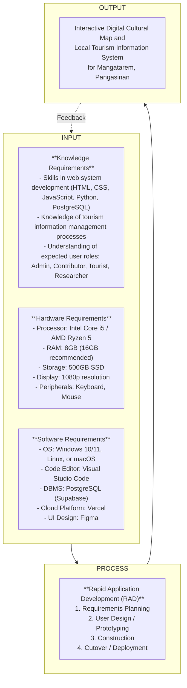

# Chapter 1: Introduction

## Background of the Study

Many local leaders struggle with old ways of managing history and tourist spots. We've noticed that paper records often keep the community in the dark. A recent study by the Global Tourism Council shows that towns with a strong web presence get much more attention than those that don't (Wilson, 2025). So, we're writing this to show how a centralized system can change that.

Our goal is to look at how computers help local offices run better and keep their culture alive. We designed this guidebook for staff who want to move away from slow, manual work like filing paper forms or hunting through old folders. Our main result is a process that takes cultural data from old files and puts it into things like digital maps, searchable databases, and virtual tours. We want to make it easier for you to share your town's story with the rest of the world.

Moving to a digital setup involves a mix of leadership, community habits, and technical skills. We see this as a complex process that connects a town's past with its future (Reyes, 2024; Smith, 2023). Experts often call this shift an impactful phenomenon where the way people experience local heritage is dramatically changed (Cruz, 2022). We want to explore these factors more deeply to help you build a system that actually lasts.

We chose the Local Government Unit (LGU) of Mangatarem, Pangasinan as our research locale because it serves as the heart of tourism and cultural management for the town. Mangatarem is a first-class municipality with a deep history and natural landmarks like the Manleluag Spring National Park. Many local offices today struggle to keep their records organized, which often leaves the community in the dark about their own heritage. So, we're focusing our work here to help the LGU move away from manual, paper-based filing.

The LGU is the perfect spot for our study because the tourism office acts as the main hub for every barangay’s unique traditions and data. We found that this office provides a well-organized and professional environment where we can easily coordinate with officials to verify historical facts. By working directly in these municipal spaces, we can ensure the cultural data we collect is accurate and reflects the town's true identity. We've designed this process to take those old physical files and turn them into digital maps and searchable databases that you can access easily.

Moving to a digital system isn't just a simple technical update; it's a vital change that connects a town's past with its future (Reyes, 2024; Smith, 2023). Experts often see this transition as an impactful phenomenon where the way people experience local heritage is dramatically changed (Cruz, 2022). We're exploring these factors to make sure the town's cultural assets are preserved for a much wider audience. And since the LGU is the primary decision-maker, our goal is to provide them with a system that actually works for the long term.

### Encountered Problems

We've noticed that the LGU of Mangatarem struggles to keep tourism info fresh. Right now, workers rely on manual tasks and messy habits. When barangay leaders want to share an update, they send text messages or make quick phone calls. Sometimes they even hand over physical papers. This makes it hard for the main tourism office to verify everything quickly. A recent study shows that when information is scattered like this, visitors often get confused by conflicting details they find online (Wilson, 2025). We see that this slow, traditional way of talking to stakeholders delays big events and seasonal campaigns. It also makes it tough for students to find historical facts because there isn't a central digital spot they can check from home.

To fix these issues, we're building the "Interactive Digital Cultural Map and Local Tourism Information System for Mangatarem, Pangasinan." We designed this system to replace those slow, manual chores with a single web-based platform. Our goal is to make sure every tourist and resident can find the same accurate information in one place. By putting cultural maps and town data online, we can help the LGU work faster and keep their records consistent. Experts often call this move to digital tools an impactful phenomenon that changes how people connect with their heritage (Cruz, 2022). We want to give the town a reliable tool that makes Mangatarem's culture easy to explore for everyone.

## Purpose and Description

This Capstone Project was conducted in order to centralize and digitize the tourism and cultural information of Mangatarem, Pangasinan. We want to provide an easy, interactive platform that cleans up the way data is managed while making the town’s heritage easy for everyone to find.

Once the proposed Interactive Digital Cultural Map and Local Tourism Information System for Mangatarem, Pangasinan is implemented to the Local Government Unit (LGU) of Mangatarem, it will hold particular significance for the following beneficiaries:

1. **Local Government Unit (LGU) of Mangatarem** – We're giving the LGU a reliable tool for tourism promotion and data management. It helps them verify and post accurate facts from every barangay so the public always sees the right news.
2. **System Administrators (Tourism and IT Staff)** – These workers get a simple dashboard to manage user accounts and content. It cuts down the hours they usually spend digging through old physical files or deciphering messy handwritten notes.
3. **Barangay Representatives (Contributors)** – We're providing a dedicated portal where they can upload photos and local events directly. They don’t have to wait on slow phone calls or text messages anymore to get their barangay noticed.
4. **Public Users (Tourists and Visitors)** – They gain an interactive map to help them find hidden gems and landmarks. They can filter what they want to see on their phones, making their travel experience much smoother and more fun.
5. **Students and Researchers** – We're offering a way to find history and cultural profiles from home. They won’t need to travel to the tourism office just to gather basic information for their school work.
6. **Residents of Mangatarem** – Families get a digital archive that protects their traditions and festivals. It helps them feel proud of their town because their heritage is now saved in a secure spot for their kids to see.

We see that the current way of using text messages and paper forms is just too slow. It leads to mistakes and leaves people confused when they find old information online. By using digital maps and a single format, we're building a source of truth for the whole town. We assume this computing solution will effectively fix these communication gaps and give the LGU a modern, impactful way to manage its cultural treasures.

## **Objectives of the Study**

The main objective of the study is to design and develop an Interactive Digital Cultural Map and Local Tourism Information System for the Local Government Unit (LGU) of Mangatarem, Pangasinan. We want to build a tool that makes it easy for the town to manage its history and tourist spots while moving away from slow, manual chores.

Furthermore, the developers aim to achieve the following specific objectives:

1. To analyze the existing process of how the town currently collects and shares tourism and cultural facts to identify where things get messy and where we can make improvements.
2. To identify the key features of the system for the following users:
    * System Administrator (Tourism/IT Staff)
    * Barangay Representative (Contributor)
    * Public User (Tourists / Visitors)
    * Students and Researchers
3. To test and evaluate the system’s functionality, performance, security, usability, and acceptability to ensure it meets user requirements and professional standards.
4. To prepare an implementation plan for the deployment of the system so the LGU can start using it effectively.

## Conceptual Framework
We're using the Input-Process-Output (IPO) model to map out exactly how we'll build this system from the ground up. It’s a simple way to show the raw ingredients we need, the steps we'll take to build the code, and the final platform we'll deliver to the town. Think of it as a roadmap that connects our technical tools with the actual work of creating the cultural map. By following this model, we can make sure every piece of the project fits together and solves the real problems the LGU is facing.

Input
Knowledge Requirements: We need to know our way around web tools like HTML, CSS, JavaScript, and Python. We also need to understand how PostgreSQL handles data. It's just as important for us to learn how the town currently handles its tourism information and what each person—like a staff member or a visitor—actually needs from the map.

Hardware Requirements: To keep our work running smoothly, we’re using computers with at least an Intel Core i5 or AMD Ryzen 5 processor. We’re also using 8GB to 16GB of RAM and a 500GB SSD to make sure the coding environment doesn't lag while we build the system.

Software Requirements: We’ll do our coding in Visual Studio Code on Windows, Linux, or macOS. For the database, we’re using Supabase to host our PostgreSQL data, and we’ll launch the site on Vercel. We’ll also use Figma to design the look and feel of the map before we write any code.

Process
Rapid Application Development (RAD) Methodology:

    Requirements Planning – We sit down and figure out what the LGU and visitors really need.

    User Design – We build prototypes and show them to people to see what works best.

    Construction – We write the code and build the actual features of the map in stages.

    Cutover – We do the final tests, launch the system, and train the staff on how to use it.

Output
The final product is the Interactive Digital Cultural Map and Local Tourism Information System for Mangatarem, Pangasinan.

The conceptual framework illustrated above delineates the systematic flow of the project. The Inputs specify the technical and physical resources, along with the domain knowledge required by the developers to undertake the project. These resources feed into the Process, which employs the Rapid Application Development (RAD) methodology to iteratively design, prototype, and build the platform through structured phases. This structured process ensures that the final Output — the Interactive Digital Cultural Map and Local Tourism Information System — is developed efficiently and aligns with the functional and operational requirements of the Mangatarem LGU and its stakeholders. The feedback loop ensures that any issues identified during testing or post-deployment can be communicated back to the development team to refine the system inputs and processes, resulting in continuous improvement.

## Scope and Limitations

### Scope

The project focuses on the development of a web-based Interactive Digital Cultural Map and Local Tourism Information System for the Local Government Unit (LGU) of Mangatarem, Pangasinan. The system will be built utilizing web technologies including HTML, CSS (Tailwind CSS), and JavaScript for the frontend interface, Python with the Flask framework for server-side application logic, and PostgreSQL as the primary relational database management system — managed via Supabase for cloud-native persistence and real-time features. Figma will be utilized for user interface and user experience design during the prototyping phase. The key functionalities provided by the software include a public-facing interactive map where tourists can browse, locate, and filter tourist attractions and cultural heritage sites by category such as historical landmarks, natural attractions, and local events. The system features a decentralized content contribution portal that allows authorized Barangay Representatives to submit, upload, and propose updates for local tourism content including photos, historical descriptions, and event announcements. A critical component of the system is the integrated cultural heritage documentation module, which allows for the structured profiling of tangible and intangible assets following national standards. Additionally, the system includes a centralized administrative dashboard for LGU Tourism Office staff to moderate all content submissions through an approve-or-reject workflow, manage user accounts and role-based access permissions, and publish municipal-wide tourism announcements. Students and researchers are provided with structured access to archived barangay cultural profiles and historical records to support academic data gathering and heritage research.

### Limitations

While the system aims to provide comprehensive tourism information management for Mangatarem, it will not include online booking, reservation, or payment gateway functionalities for local accommodations, tour guides, or event ticketing. The interactive map and all system features require an active internet connection; full offline capabilities such as cached map tiles or offline content browsing are not within the scope of this project. Performance and scalability are designed to accommodate the expected volume of tourist traffic and barangay-level content contributions typical of a municipal tourism platform, but the system is not engineered to handle extreme traffic surges beyond standard municipal usage without future server infrastructure upgrades. Access to the content contribution and moderation modules is strictly restricted to authenticated and authorized LGU personnel and registered Barangay Representatives, meaning the general public cannot directly create, edit, or publish map data without going through the LGU approval workflow. The system is also limited to the geographic and administrative boundaries of Mangatarem, Pangasinan, and does not cover tourism data from neighboring municipalities or provinces.

## Definition of Terms

For clarity and consistency, the following key terms are defined operationally as they are used in this study:

- **Admin / System Administrator** — Refers to the LGU Tourism Office staff or designated IT personnel who hold full access to the system's administrative dashboard. They are responsible for reviewing, approving, or rejecting content submissions, managing user accounts and role permissions, and overseeing the overall technical maintenance and operational integrity of the platform.

- **Barangay Representative** — An authorized user role assigned to designated individuals from each barangay who are responsible for submitting, updating, and uploading local tourism and cultural information (such as photos, historical descriptions, and event details) to the system on behalf of their specific jurisdiction.

- **Contributor** — A general term for any user role with permissions to propose new or updated content to the platform. In this study, contributors are specifically the Barangay Representatives who submit materials for administrative review before publication.

- **Interactive Digital Cultural Map** — The core feature of the system that provides a visual, geographical, and navigable representation of tourist spots, historical landmarks, natural attractions, and cultural heritage sites within the municipality of Mangatarem, Pangasinan. Users can interact with the map by clicking pins, filtering categories, and viewing detailed multimedia information for each location.

- **Local Government Unit (LGU)** — In this study, this refers specifically to the municipal government of Mangatarem, Pangasinan, serving as the main beneficiary, authoritative body, and decision-maker over the tourism information system and its content governance policies.

- **Public User** — Refers to tourists, visitors, or any general member of the public who accesses the system to navigate the interactive map, search for points of interest, and view published cultural and tourism information without requiring a registered account or administrative privileges.

- **Rapid Application Development (RAD)** — The software development methodology selected for this study, characterized by rapid prototyping, iterative feedback cycles, flexible requirements gathering, and continuous stakeholder involvement to accelerate system construction while maintaining alignment with user needs.

- **Content Moderation** — The process by which the System Administrator reviews content submissions from Barangay Representatives and decides whether to approve, reject, or request revisions before the content is published on the public-facing interactive map.
## Review of Related Literature

We’ve gathered these studies to back up our goals for the Mangatarem project. We focused on research from 2020 to 2025 that shows why digital maps and better data management are so vital. We’ve organized these into local and foreign studies to show how they help us hit our four main objectives.

### Local Studies

**Existing Tourism Information Management Processes in Philippine LGUs**

Soncuya (2020) looked at how groups like the NCCA and local offices work together on cultural maps. He found that many towns still use messy, split-up methods that lead to wrong data. But he also showed that a clear legal plan helps these projects last. This helps us with our first objective because it proves we need a structured way to report facts in Mangatarem.

Coro II and his team (2022) studied how Siargao moved to a digital setup. They found that the system actually worked because they got local leaders involved from the start. This supports our work because it shows that a digital platform helps rural towns stay accurate and organized. It gives us a real-world example for our fourth objective on how to roll out the system.

Zuniga (2023) tested how provincial maps work when you mix history with GPS data. He found that letting local people upload info—while experts checked it—made the data much better. This confirms our plan for the second objective, where we let barangay leaders be the ones to share their own local stories.

**Usability, Intangible Heritage, and System Acceptance**

De Vera and her colleagues (2022) looked at how local festivals help a town’s economy and pride. They discovered that putting these events online makes people much more interested. This backs up our second and third objectives since we want to include things like event calendars and photo galleries to see if users find them helpful.

Mendoza (2021) pointed out the big hurdles in saving a town's history, like running out of money or not having a plan to keep the site running. She suggested that a town needs the community's help to keep things alive. This helps us with our fourth objective because it warns us about what could go wrong if we don't have a solid maintenance plan.

### Foreign Studies

**Digital Transformation and Technological Frameworks**

Kumar and Singh (2022) built a web map that used old photos to show how a place changed over time. They found that seeing "then and now" photos makes users feel more connected to the history. This fits our first and second objectives because it gives us a technical model for how our map can show Mangatarem’s past.

Chen and his fellow researchers (2024) found that maps with stories and galleries kept people looking 40% longer than plain sites. They argued that a good-looking site is the biggest reason people keep coming back. This helps us with our second objective by proving that things like photo galleries are vital features for our map.

**User-Centric Design and Evaluation Standards**

Wang (2023) explained that you can't just map buildings; you also have to map traditions and festivals. He showed that a town runs much better when its data includes both physical spots and local habits. This supports our second and third objectives by giving us a framework for what kind of categories we should use on our site.

Tan (2023) built a travel site that suggested places based on what users liked. He found that if a site is easy to use from the start, people won't fight the change. He also suggested making the software in parts so it's easy to update later. This helps us with our second and fourth objectives as we plan out our filters and how we'll deploy the system.

Petrovic (2022) looked at how to keep heritage sites safe in tropical areas using software. He found that systems that let people monitor conditions regularly were much more accurate. This backs up our third and fourth objectives because it shows why we need to test our security and have a plan for regular data updates.

### Synthesis

All these studies show that we're on the right track. Local researchers like Soncuya and foreign experts like Kumar prove that messy, manual systems just don't work anymore. This supports our first goal. Studies by Chen and Coro prove that our interactive map and barangay logins are the right features to build, which hits our second goal. Writers like Tan and Mendoza show us how to test the system and keep it running for years to come. By using a community-led approach, we're building a resource for Mangatarem that won't just sit on a shelf but will actually stay useful for the town.