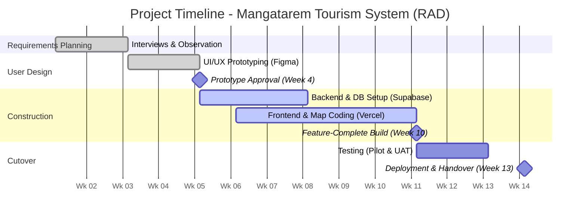

# Chapter 2: Methodology and Design

This chapter details the development methods and design strategies we used to create the Interactive Digital Cultural Map and Local Tourism Information System for Mangatarem, Pangasinan. We want to provide a clear record of our technical decisions and the specific steps we took to deliver a functional tool for the LGU.

## Software Development Methodology

In software engineering, a Software Development Methodology (SDM) is like a clear roadmap for a project. Without it, a team can easily lose focus, miss deadlines, or build features that nobody actually needs. For our project in Mangatarem, having this structure helps us stay organized while we plan, code, and test the digital map. It makes sure we're actually building a tool that fits the LGU’s workflow and that the final product is impactful for the whole community.

We chose **Rapid Application Development (RAD)** and combined it with a **Participatory GIS (PGIS)** framework. We picked this because it focuses on building prototypes and getting feedback quickly rather than spending months just planning on paper. Since tourism data and the needs of our barangay leaders can change as they see the site evolve, RAD lets us adapt fast. By using PGIS, we also make sure the community has a say in how we represent their local culture on the map, which makes the data much more accurate.

RAD is an agile way of working that prioritizes quick delivery and user feedback. Instead of trying to get every detail perfect at the start, we build small, working versions of the system and refine them over and over. It's known for keeping the people who will actually use the system involved every step of the way. This method is perfect for projects where the look and feel of the site are vital and where we expect to make changes as users interact with our early designs.

We've broken down our work into these four RAD phases:

1.  **Requirements Planning:** We started by meeting with the LGU Tourism Office staff to find the gaps in their current manual filing system. We identified the main goals and defined the two primary user categories: **Administrative and Stakeholder Users** (LGU staff and Barangay Contributors) and **General Public and Academic Users** (Tourists and Researchers). We used interviews and site visits to make sure we didn't miss any important cultural traditions or landmarks that the town wants to highlight.
2.  **User Design (Prototyping):** Once we knew what the system needed, we used **Figma** to create mockups and wireframes. We built designs for the interactive map (Public/Academic interface) and the data management portals (Administrative/Stakeholder interface). We showed these to the LGU staff and barangay reps to see if they found the buttons and menus easy to navigate. We used their feedback to change the layout until it felt just right.
3.  **Construction:** This is the phase where we did the actual coding. We used **HTML, Tailwind CSS, and JavaScript** for the parts you see on the screen, and **Python with Flask** for the logic and database work. We stored all the town's information in **Supabase**. We built the interactive map and created the "approve or reject" moderation workflow for the administrative users. We coded and tested in small cycles so we could catch and fix bugs early.
4.  **Cutover (Testing and Deployment):** In this final stage, we perform functional, security, and usability tests to make sure the site is safe and fast. Once we resolve any issues, we’ll launch the system for the LGU. We’ll also hold training sessions for the Administrative and Stakeholder category (LGU staff and barangay leaders) and give them user manuals so they feel comfortable running the site on their own.

## Sources of Data

The primary sources of data for this project are individuals, groups, and locations within the municipality of Mangatarem, Pangasinan that hold crucial tourism, cultural, and historical information relevant to the system. Key data sources include:

- **LGU Tourism Office Staff** — Municipal tourism officers who provide official tourism policies, existing manual records, promotional materials, and municipal-level tourism initiatives. They serve as the authoritative source for content moderation rules, user access policies, and platform governance requirements.
- **Barangay Officials and Representatives** — Designated individuals from each barangay who serve as vital sources for localized cultural data, specific landmark descriptions, community event schedules, and grassroots heritage information that is not centrally documented at the municipal level.
- **Manleluag Spring National Park and Other Tourist Sites** — Physical locations within Mangatarem that serve as points of reference for mapping coordinates, photographic documentation, and on-site observation of existing visitor information systems (e.g., signage, brochures).
- **Municipal Archives and Physical Records** — Existing physical tourism brochures, printed municipal profiles, historical documents, and past tourism reports maintained by the LGU, which serve as secondary data sources to establish the initial database content of the system.

## Data Gathering Techniques
To make sure we built a system that actually solves the town's problems, we used several different ways to collect information. We didn't want to just guess what the LGU needed, so we went straight to the people who handle Mangatarem’s tourism every day.

Interviews
We sat down for face-to-face talks with the staff at the Municipal Tourism Office to get their firsthand stories.

How: We used an interview guide with open-ended questions about their daily tasks, the problems they run into, and what features they wish they had. We met with them in person at the LGU office so they could show us exactly how they handle their current workload.

When: We did this during the Requirements Planning phase. It was the very first thing we did before we even started sketching designs or writing code.

Why: We used this technique to hear about the "pain points" that only a worker would know. It helped us understand their manual workflow so we could design a digital version that actually makes their lives easier.

Observation
We spent time at the office just watching how the staff handles their work in real-time.

How: We visited the LGU Tourism Office and took notes on how they answer tourist questions, how they organize their data, and where the "bottlenecks" are in their current system.

When: We did this at the same time as our interviews. This allowed us to see if the work they described matched what they actually did on a busy day.

Why: We applied this to catch small, confusing steps that people might forget to mention in an interview. It gave us an objective look at the gaps in their communication that our system needs to fill.

## System Design

### System Architecture

The System Architecture diagram provides a high-level structural overview of the Interactive Digital Cultural Map and Local Tourism Information System. It defines how the different technological components — from the user's device to the backend database — interact to deliver the system's services. A clear architecture is important because it establishes the blueprint for the system's technical structure, ensuring that all components are properly integrated, scalable, and secure.

<put the image here>

*(Figure 2: System Architecture Diagram. The diagram illustrates the client-server model with three logical layers.)*

The architecture follows a modern three-tier cloud-native model. At the **Client Layer**, users — categorized as either **Administrative and Stakeholder Users** or **General Public and Academic Users** — interact with the system through standard web browsers. The user interface is built with HTML, CSS (utilizing the Tailwind CSS framework), and JavaScript, with **Mapbox GL JS** integrated for high-performance spatial visualization. When a user performs an action, the client sends HTTPS requests to the **Cloud Platform Layer**, hosted on **Vercel**. The backend application logic is implemented in **Python** using the **Flask** framework, running as optimized serverless functions. This layer processes requests such as user authentication, cultural heritage form validation, and content moderation workflows. The **Data Persistence Layer** leverages **Supabase** for its primary PostgreSQL database and object storage, and **Upstash** for Redis-based caching. This layer stores all persistent data, including user accounts, detailed heritage profiles, business establishment records, and system-wide audit logs. This cloud-native architecture ensures a highly available, secure, and performant separation between the interactive interface and the central data repositories.

### Existing Process Flowchart

A flowchart is a graphical representation of a process that uses standardized symbols — such as rectangles for actions, diamonds for decisions, and arrows for flow direction — to illustrate the sequence of steps, decision points, and outcomes. Flowcharts are important in system analysis because they provide a clear, visual understanding of the current (as-is) process, making it easier to identify bottle

<put the image here>

*(Figure 3: Existing Process Flowchart — Manual Tourism Information Management. The red nodes indicate problem areas; the yellow node indicates a delay-prone step.)*

The flowchart illustrates the two primary manual processes currently used in Mangatarem, revealing significant gaps in information accessibility and data synchronization. The first process (Top Path) begins when a tourist seeks information. Currently, the tourist is forced to choose between searching unverified social media pages—which often harbor outdated or conflicting details leading to visitor confusion—or traveling physically to the Municipal Tourism Office. At the office, staff must manually browse through paper-bound records and physical files to answer inquiries. If the relevant file is missing or being used by another officer, the information remains unavailable, resulting in a poor visitor experience. 

The second process (Bottom Path) describes the current information reporting workflow from the grassroots level. When a Barangay Representative has a new cultural event or attraction update, they must either prepare a physical report for delivery or send informal messages via text or social media. This non-standardized communication forces LGU Tourism staff to manually consolidate disparate data formats. Any missing information necessitates a repetitive cycle of phone calls and follow-ups, causing significant time lags. By the time the LGU updates its printed brochures or social media posts, the information is often already weeks old. This flowchart demonstrates that the current reliance on manual, physical-first documentation is the root cause of the municipality's fragmented and delay-prone tourism information ecosystem.

### Dataflow Diagram (DFD)

A Dataflow Diagram (DFD) is a graphical tool used to visualize how data moves through a system. It identifies where data originates (external entities), how it is processed (processes), where it is stored (data stores), and the paths it follows (data flows). DFDs are important in system design because they provide a clear, logical representation of the system's data handling without getting into implementation details, making it easier for both developers and stakeholders to validate that all data requirements are covered.

<put the image here>

*(Figure 4: Dataflow Diagram (Level 1). External entities are shown as rectangles, processes as rounded squares, data stores as open-ended rectangles, and data flows as labeled arrows.)*

The DFD details the interactions between the main external entities and the system processes. **General Public and Academic Users (EE1)**, including tourists and researchers, send search queries and browse requests to Process 1.0 (Search & Browse), which forwards these to the Main System. Process 4.0 (Data Retrieval & Display) retrieves map data, points of interest details, and cultural profiles from the system and returns them to the user. **Administrative and Stakeholder Users (EE2)** submit new content and manage system data. This entity encompasses Barangay Representatives who submit content through Process 2.0 (Content Submission) and LGU Tourism Admins who interact with Process 3.0 (Content Moderation) to review and approve submissions. Process 3.0 either commits the approved data to Data Store D2 (Tourist Spots & Cultural Data) or sends a rejection notice. The system also maintains Data Store D1 (User Accounts & Roles) for authentication and access control across all categories.

### Entity-Relationship Diagram (ERD)

#### 1. Definition, Importance, and Purpose of the ERD

An Entity-Relationship Diagram (ERD) is a foundational database design tool that visually represents the logical and structural architecture of a relational database. It illustrates the system's data model by defining the key data objects (entities), the properties that characterize them (attributes), and the logical associations (relationships) that connect them.

In database design, the ERD serves several critical functions:
* **Conceptual Blueprint**: It acts as a clear visual mapping that bridges the gap between high-level business requirements and low-level physical database schemas, serving as a single source of truth for both developers and administrative stakeholders.
* **Data Integrity and Normalization**: By defining primary keys and foreign keys, the ERD ensures that data integrity constraints are systematically planned, eliminating data redundancy and minimizing structural anomalies.
* **Query Efficiency**: A well-structured ERD facilitates the writing of optimized SQL queries, as developers can easily trace foreign key paths and predict execution costs for multi-table joins.
* **Scalability**: It establishes a clean, modular foundation that allows the system to scale smoothly, accommodating new features and entities without disrupting existing relationships.

#### 2. ERD Illustration

<put the image here>

*(Figure 5: Entity-Relationship Diagram. The diagram reflects the integrated heritage and tourism ecosystem models.)*

#### 3. Comprehensive Discussion of ERD Content

The system's database schema consists of fifteen highly integrated tables. To understand the operational flow and data governance, these components are analyzed below through their **Entities**, **Attributes**, and **Relationships**:

##### A. Entities (Uppercase, Singular Form)

Each entity represents a distinct domain concept in the system. The 15 core entities are defined as follows:
1. `USER`: A singular authenticated account representing system users across distinct roles (Admin, Barangay Contributor, Business Owner, Guard).
2. `PASSWORD_RESET_TOKEN`: A short-lived, secure token used to facilitate self-service account recovery and security verification for a `USER`.
3. `BARANGAY_INFO`: The geographic, spatial, and administrative anchor representing a specific barangay in Mangatarem, Pangasinan.
4. `HERITAGE_PROFILE`: The official cultural heritage registry profile matching the national standards of documentation (Form 01-07) for tangible and intangible heritage.
5. `ATTRACTION`: A visitor-facing profile of a local tourist destination or significant cultural asset.
6. `EVENT`: A scheduled local cultural festival or calendar event.
7. `ESTABLISHMENT`: A local business directory entry representing a hospitality or dining vendor (hotels, restaurants, etc.).
8. `ESTABLISHMENT_ROOM`: A specific lodging unit or room type offered by an `ESTABLISHMENT`.
9. `ESTABLISHMENT_MENU_ITEM`: A food or beverage offering provided by a dining-focused `ESTABLISHMENT`.
10. `ESTABLISHMENT_REVIEW`: A customer-submitted rating and testimonial review for an `ESTABLISHMENT`.
11. `REVIEW_PHOTO`: A multimedia upload (image/photo) linked to a specific `ESTABLISHMENT_REVIEW` to provide visual validation.
12. `USER_FAVORITE_ESTABLISHMENT`: A joining entity managing the bookmarking/favoriting action of a `USER` for an `ESTABLISHMENT`.
13. `VISITOR_LOG`: A physical check-in security entry representing an individual guest's entry and exit logs at local checkpoints (managed by the Guard role).
14. `NEWSLETTER_SUBSCRIBER`: A visitor-submitted email subscription powering the public newsletter and tourism outreach system.
15. `DATABASE_AUDIT_LOG`: A strict, immutable security log capturing chronological records of administrative modifications to ensure data stewardship accountability.

##### B. Attributes (Characteristics, Primary Keys, and Foreign Keys)

Attributes define the specific characteristics or columns of each entity:
* **Characteristics of Entities**: Represented within the entity box, these characteristics represent the properties of the entities.
* **Primary Keys (PK)**: The unique identifier for each record in the entity. In this database schema, the Primary Key is represented first in the attribute box and is underlined (e.g., `id` or `uuid` fields) to enforce entity integrity.
* **Foreign Keys (FK)**: Attributes that reference the Primary Key of another entity, establishing referential integrity and linking the entities dynamically.

For example:
* In the `USER` entity, the primary key `id` is underlined and placed first in the attribute box. The attribute `barangay_id` acts as a Foreign Key (FK) referencing the `id` of the `BARANGAY_INFO` entity, establishing a direct connection between users and their administrative barangay jurisdiction.
* In the `HERITAGE_PROFILE` entity, the attribute `id` is the primary key (underlined and placed first). The attribute `attraction_id` acts as a Foreign Key referencing the `id` of `ATTRACTION`, allowing a cultural registry file to optionally point to its public tourism profile.
* In the `ESTABLISHMENT_ROOM` entity, the primary key `id` is underlined, and the attribute `establishment_id` acts as a Foreign Key linking the room back to its parent `ESTABLISHMENT`.

##### C. Relationships (Cardinality, Optionability, and Labels)

The connections between entities in this database are characterized primarily by **one-to-many (1:N)** relationships, which define how records in one table relate to multiple records in another. Each relationship has specific cardinality (mandatory or optional) and logical labels:
1. **`USER` to `PASSWORD_RESET_TOKEN`**: A **1-to-many (1:N)** relationship where one `USER` can request multiple password resets. The relationship is *optional* for `USER` (as users may never request a reset) but *mandatory* for `PASSWORD_RESET_TOKEN` (every token must link back to a valid, existing user). **Label**: "requests".
2. **`BARANGAY_INFO` to `USER`**: A **1-to-many (1:N)** relationship where one barangay can be associated with multiple administrative users. The relationship is *optional* (a barangay may not have a designated user registered yet). **Label**: "stewards".
3. **`BARANGAY_INFO` to `HERITAGE_PROFILE`**: A **1-to-many (1:N)** relationship representing the geographic boundaries of cultural preservation. The relationship is *mandatory* for `HERITAGE_PROFILE` (every heritage profile must belong to a specific barangay). **Label**: "contains".
4. **`BARANGAY_INFO` to `ESTABLISHMENT`**: A **1-to-many (1:N)** relationship where each local business must belong to a barangay. It is *mandatory* for `ESTABLISHMENT`. **Label**: "locates".
5. **`BARANGAY_INFO` to `EVENT`**: A **1-to-many (1:N)** relationship where multiple festivals or events are anchored to a specific barangay. It is *mandatory* for `EVENT`. **Label**: "hosts".
6. **`HERITAGE_PROFILE` to `ATTRACTION`**: A **1-to-1 or optional 1-to-many (1:N)** link. A registry profile can optionally associate with a public attraction entry. It is *optional* for `HERITAGE_PROFILE`. **Label**: "promotes".
7. **`ESTABLISHMENT` to `ESTABLISHMENT_ROOM`**: A **1-to-many (1:N)** relationship where one establishment (hotel/lodge) can have multiple room listings. The relationship is *mandatory* for `ESTABLISHMENT_ROOM` (every room must map to a parent business). **Label**: "offers".
8. **`ESTABLISHMENT` to `ESTABLISHMENT_MENU_ITEM`**: A **1-to-many (1:N)** relationship where a dining establishment features multiple dishes. It is *mandatory* for `ESTABLISHMENT_MENU_ITEM`. **Label**: "serves".
9. **`ESTABLISHMENT` to `ESTABLISHMENT_REVIEW`**: A **1-to-many (1:N)** relationship where a business accumulates multiple guest testimonials. It is *mandatory* for `ESTABLISHMENT_REVIEW`. **Label**: "receives".
10. **`ESTABLISHMENT_REVIEW` to `REVIEW_PHOTO`**: A **1-to-many (1:N)** relationship where a customer can upload multiple photos to validate their review. It is *optional* (a review doesn't require a photo) but *mandatory* for `REVIEW_PHOTO` to reference a valid review. **Label**: "includes".
11. **`USER` to `USER_FAVORITE_ESTABLISHMENT`**: A **1-to-many (1:N)** relationship representing the bookmarking link. It is *mandatory* for the favorite join record to reference the `USER`. **Label**: "favorites".
12. **`ESTABLISHMENT` to `USER_FAVORITE_ESTABLISHMENT`**: A **1-to-many (1:N)** relationship. It is *mandatory* for the favorite join record to point to a valid `ESTABLISHMENT`. **Label**: "is_favorited_by".
13. **`USER` to `VISITOR_LOG`**: A **1-to-many (1:N)** relationship where a guard (represented by `USER`) records multiple tourist check-ins. It is *mandatory* for `VISITOR_LOG` (every check-in must be logged by an authorized user). **Label**: "logs".
14. **`USER` to `DATABASE_AUDIT_LOG`**: A **1-to-many (1:N)** relationship where administrative actions taken by a `USER` are strictly audited. It is *mandatory* for `DATABASE_AUDIT_LOG` to link back to the responsible user. **Label**: "audits".

This cohesive, normalized database structure ensures complete referential integrity, strong access controls, detailed security monitoring, and active tourist/commercial integration for the municipality of Mangatarem.

### Implementation Plan

The successful deployment of the Interactive Digital Cultural Map and Local Tourism Information System requires a structured implementation plan encompassing a project timeline, a deployment strategy, and a clear definition of resource requirements.

#### Project Timeline

The development schedule is organized around the four phases of the RAD methodology, with key milestones and expected completion dates for each phase.

*(Figure 6: Gantt Chart — Project Timeline. Critical milestones include prototype approval at Week 4, feature-complete build at Week 10, and deployment at Week 13.)*

#### Deployment Plan

The deployment of the system will follow a phased approach to minimize risk and ensure a smooth transition for all stakeholders:

1. **Pilot Testing (Internal):** The system will first be deployed to a staging environment accessible only to the LGU Tourism Office staff and a select group of 3–5 Barangay Representatives. During this phase, the content moderation workflow will be validated end-to-end — from submission by a barangay representative, through admin review, to publication on the map. Feedback from pilot users will be collected and used to make final adjustments to the user interface, form fields, and notification messages.

2. **Production Deployment:** Following successful pilot testing and resolution of identified issues, the system will be migrated to a live production environment. The production setup utilizes **Vercel** for frontend and serverless backend execution, and **Supabase** for the managed PostgreSQL database and asset storage. The environment will be configured with automated SSL/TLS certification, production-grade security headers, and an optimized caching strategy using **Upstash Redis**. DNS records will be configured to point to the Vercel deployment.

3. **User Training and Launch:** A formal training session will be conducted for System Administrators, Barangay Representatives, and Business Owners. Training will cover account management, heritage profiling procedures, business listing updates, and moderation workflows. Printed and digital user manuals will be distributed. Following training, the system will be officially launched to the public via official municipal channels.

4. **Post-Launch Support:** After the public launch, the development team will provide a defined support period (e.g., 30 days) during which bugs, user-reported issues, and minor adjustments will be addressed. A maintenance schedule will be established for regular database backups, software updates, and monitoring of system performance.

#### Resource Requirements

The following resources are essential for the successful implementation and operation of the system:

**Hardware Resources:**
- Development machines: A minimum of an Intel Core i5 or equivalent processor with 8GB RAM (16GB recommended) and SSD storage for the development team.
- LGU operator workstation: A desktop or laptop with at least Intel Core i5, 8GB RAM, and a stable internet connection for the designated System Administrator at the Tourism Office.
- End-user devices: Standard smartphones, tablets, or personal computers with web browser access for Public Users, Barangay Representatives, and Students/Researchers.

**Software Resources:**
- Development environment: Visual Studio Code, Python 3.12+, Git for version control, and the `uv` package manager for dependency management.
- Design tools: Figma for UI/UX prototyping and wireframing.
- Production environment: Vercel for web hosting and serverless compute, Supabase for PostgreSQL database and object storage, and Upstash for Redis caching.
- End-user software: Updated standard web browsers (Google Chrome, Microsoft Edge, Mozilla Firefox, or Safari).

**Human Resources:**
- Development team: The capstone project developers responsible for system design, coding, testing, and deployment.
- **Category 1: Administrative and Stakeholder Users**: Designated LGU Tourism Office staff (System Administrators) and Barangay Representatives (Contributors) responsible for content moderation, technical oversight, and local data submission.
- **Category 2: General Public and Academic Users**: The intended end-users of the public map and digital atlas, including visitors and researchers.
- Project advisor: The capstone project faculty advisor providing academic guidance and validation throughout the development process.
