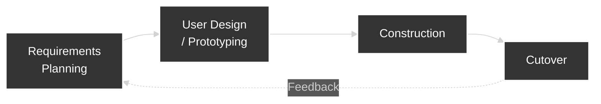
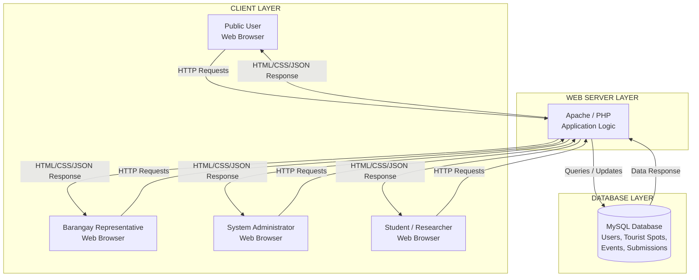
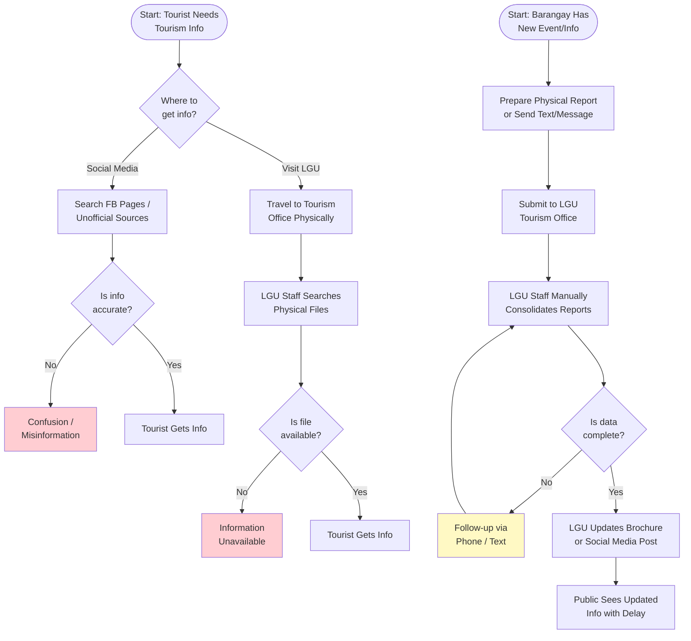
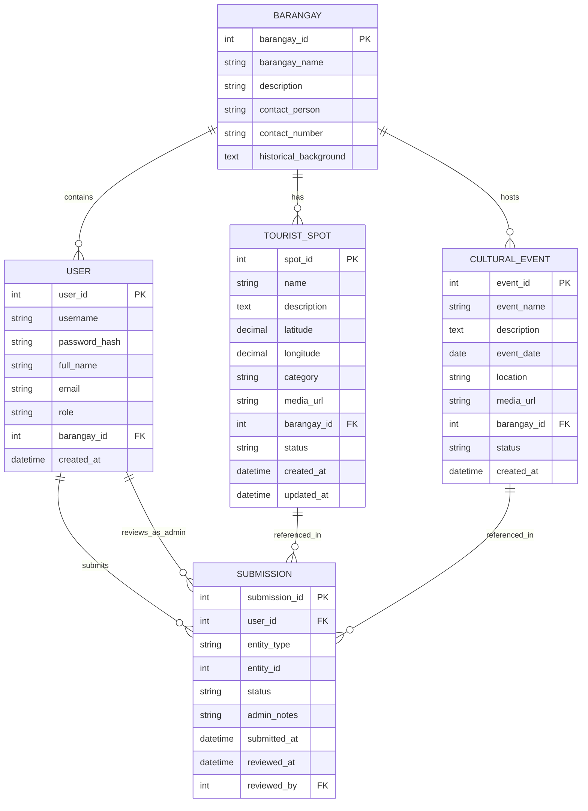

# Chapter 2: Methodology and Design

This chapter presents the methodology and design processes employed in developing the Interactive Digital Cultural Map and Local Tourism Information System for Mangatarem, Pangasinan. It discusses the software development methodology selected and its justification, identifies the sources of data used in the study, describes the data gathering techniques applied including how, when, and why each technique was used, and presents the structural design of the system through architectural diagrams, flowcharts, dataflow diagrams, and entity-relationship diagrams. The chapter concludes with a detailed implementation plan that outlines the project timeline, deployment strategy, and resource requirements.

## Software Development Methodology

The implementation of a robust Software Development Methodology (SDM) is crucial in software engineering as it provides a structured, repeatable framework for planning, designing, coding, testing, and deploying an information system. A well-defined SDM ensures that development activities are organized, risks are managed, stakeholder expectations are aligned, and the final product is delivered on time and within scope. For the development of the Interactive Digital Cultural Map and Local Tourism Information System, selecting an appropriate SDM ensures that the specific requirements of the Mangatarem LGU and its diverse stakeholders — including tourism officers, barangay representatives, tourists, and researchers — are systematically addressed throughout the development lifecycle.

The methodology chosen for this study is **Rapid Application Development (RAD)**. This approach was selected because it emphasizes rapid prototyping, iterative delivery, and continuous stakeholder feedback over rigid, upfront planning. Given the dynamic nature of tourism information — where content requirements, user expectations, and municipal priorities may evolve as stakeholders visualize and interact with early versions of the system — RAD allows the developers to quickly adapt to feedback and refine the system without disrupting the overall project timeline or incurring significant rework costs.

Rapid Application Development is an agile-based methodology originally proposed by James Martin in 1991. It is characterized by its flexible, user-centric approach and shortened development cycles. Its key principles and characteristics include: (1) continuous stakeholder engagement, where end-users actively participate in reviewing prototypes and providing feedback; (2) iterative prototyping, where functional models of the system are built and refined in successive cycles rather than being specified entirely upfront; (3) reuse of existing components and frameworks to accelerate development; and (4) time-boxed iterations that enforce disciplined scheduling. This methodology is typically utilized in projects where user interface quality is critical, requirements are expected to evolve as stakeholders interact with prototypes, and rapid delivery of a functional system is prioritized. The primary advantage of RAD is its capability to significantly reduce development time while maintaining high user satisfaction through iterative refinement and early validation.


*(Figure 1: RAD Methodology Phases. Replace with an official RAD methodology diagram from defense assets if required by the panel.)*

The phases of the RAD methodology utilized by the developers are broken down as follows:

1. **Requirements Planning:** In this initial phase, the developers conducted meetings and consultations with the LGU Tourism Office staff and potential end-users to identify the core problems of the existing fragmented manual system. Key project objectives, system scope, user roles (Admin, Barangay Representative, Public User, Student/Researcher), and functional requirements were defined and documented. Data gathering techniques such as interviews, observation, and document analysis were applied during this phase to ensure comprehensive requirement capture.

2. **User Design (Prototyping):** Following requirements gathering, the developers created interactive prototypes, wireframes, and mockups of the system's key modules — including the Interactive Digital Cultural Map, the Admin Dashboard, the Contributor Portal, and the Public User interface — using Figma. These prototypes were presented to stakeholders (LGU staff and select barangay representatives) for review and iterative feedback. Based on stakeholder input, the designs were refined and improved to ensure the user interface and user experience aligned with the expectations and technical capabilities of the target users.

3. **Construction:** Upon approval of the finalized prototypes, the actual coding and system building commenced. Utilizing HTML, CSS, and JavaScript for the frontend interface, and PHP with MySQL for the backend application logic and database management, developers constructed the functional modules in iterative cycles. Each module was continuously tested against the refined requirements, and feedback from internal testing was used to fix bugs and improve features before moving to the next iteration. This phase included the implementation of the interactive map, content submission and moderation workflows, user authentication, and database architecture.

4. **Cutover (Testing, Deployment, and Maintenance):** The final phase involves comprehensive system testing — including functional testing, performance testing, security testing, usability testing, and user acceptance testing — to ensure the system meets all quality standards and stakeholder requirements. Once testing is complete and all critical issues are resolved, the system will be deployed to the LGU's production environment. This phase also includes user training sessions for Tourism Office staff and Barangay Representatives, the distribution of user manuals, and the establishment of a maintenance and support plan for ongoing technical assistance post-deployment.

## Sources of Data

The primary sources of data for this project are individuals, groups, and locations within the municipality of Mangatarem, Pangasinan that hold crucial tourism, cultural, and historical information relevant to the system. Key data sources include:

- **LGU Tourism Office Staff** — Municipal tourism officers who provide official tourism policies, existing manual records, promotional materials, and municipal-level tourism initiatives. They serve as the authoritative source for content moderation rules, user access policies, and platform governance requirements.
- **Barangay Officials and Representatives** — Designated individuals from each barangay who serve as vital sources for localized cultural data, specific landmark descriptions, community event schedules, and grassroots heritage information that is not centrally documented at the municipal level.
- **Manleluag Spring National Park and Other Tourist Sites** — Physical locations within Mangatarem that serve as points of reference for mapping coordinates, photographic documentation, and on-site observation of existing visitor information systems (e.g., signage, brochures).
- **Municipal Archives and Physical Records** — Existing physical tourism brochures, printed municipal profiles, historical documents, and past tourism reports maintained by the LGU, which serve as secondary data sources to establish the initial database content of the system.

## Data Gathering Techniques

To ensure comprehensive and accurate requirement analysis, the following data gathering techniques were applied during the development of the system:

- **Interviews:** Semi-structured interviews were conducted with the Tourism Office staff and select Barangay Representatives to gather qualitative insights about the current tourism information management workflow. **How:** The developers prepared an interview guide containing open-ended questions about daily operations, pain points, and desired features, and conducted one-on-one or small-group sessions in person at the LGU office. **When:** Interviews were conducted during the Requirements Planning phase of the RAD methodology, prior to any design or prototyping work, to establish a baseline understanding of stakeholder needs. **Why:** This technique was applied to capture detailed, firsthand accounts of the existing process from the people who perform it daily, ensuring that the system requirements reflect real operational challenges rather than developer assumptions.

- **Observation:** The developers observed the daily workflow of the Tourism Office when handling tourist inquiries, processing content updates, and coordinating with barangay officials. **How:** The team visited the LGU Tourism Office and documented the step-by-step process of how tourism data is currently collected, verified, stored, and shared, noting bottlenecks, redundant tasks, and communication delays. **When:** Observation was conducted concurrently with the interview sessions during the Requirements Planning phase, allowing the developers to corroborate interview responses with actual observed behavior. **Why:** This technique was applied to identify inefficiencies and workflow gaps that stakeholders may not have explicitly mentioned during interviews, providing an objective view of the existing process.

- **Document Analysis:** The team analyzed existing physical and digital tourism-related documents to assess the current state of information management. **How:** The developers reviewed municipal tourism brochures, social media posts, event announcements, barangay submitted reports, and any existing digital records to evaluate data formats, consistency, completeness, and accessibility. **When:** Document analysis was performed during the Requirements Planning phase alongside interviews and observation, and continued into the User Design phase to inform the structure of the database and content templates. **Why:** This technique was applied to identify the inconsistencies and gaps in existing data formats, which justified the need for a standardized digital database and informed the design of content submission forms and data fields.

- **Library Research:** The developers conducted library and online research to gather technical knowledge, review related literature, and study best practices in web-based tourism systems and digital cultural mapping platforms. **How:** Academic journals, conference papers, industry reports, and online resources were searched using platforms such as Google Scholar, IEEE Xplore, and Springer Open to identify relevant studies on tourism information systems, interactive mapping technologies, and content management frameworks. **When:** Library research was conducted throughout the project lifecycle — during Requirements Planning to support objective analysis, during User Design to inform feature selection, and during the writing of Chapter 1's Review of Related Literature. **Why:** This technique was applied to ground the project's design decisions in existing research, identify gaps in current solutions, and ensure that the proposed system incorporates proven best practices from both local and international contexts.

## System Design

### System Architecture

The System Architecture diagram provides a high-level structural overview of the Interactive Digital Cultural Map and Local Tourism Information System. It defines how the different technological components — from the user's device to the backend database — interact to deliver the system's services. A clear architecture is important because it establishes the blueprint for the system's technical structure, ensuring that all components are properly integrated, scalable, and secure.


*(Figure 2: System Architecture Diagram. The diagram illustrates the client-server model with three logical layers.)*

The architecture follows a standard three-tier client-server model. At the **Client Layer**, users — including Public Users, Barangay Representatives, System Administrators, and Students/Researchers — interact with the system through standard web browsers on their devices (desktops, laptops, tablets, or smartphones). The user interface, built with HTML, CSS, and JavaScript, renders the visual components and handles user interactions such as map navigation, form submissions, and content browsing. When a user performs an action, the client sends HTTP requests to the **Web Server Layer**, which is handled by the Apache web server running the PHP application logic. The application logic processes these requests — such as verifying administrator credentials, fetching map coordinates from the database, validating content submissions, or applying content moderation rules. The **Database Layer** consists of a MySQL database that stores all persistent data, including user accounts, tourist spot records, cultural event entries, barangay profiles, and content submission logs. The web server queries the database to retrieve or store information, and once the data is processed, the server sends the appropriate response (HTML pages, JSON data for the interactive map, or status messages) back to the client interface. This three-tier architecture ensures a secure separation between the user-facing interface and the sensitive central repository, allowing each layer to be maintained and scaled independently.

### Existing Process Flowchart

A flowchart is a graphical representation of a process that uses standardized symbols — such as rectangles for actions, diamonds for decisions, and arrows for flow direction — to illustrate the sequence of steps, decision points, and outcomes. Flowcharts are important in system analysis because they provide a clear, visual understanding of the current (as-is) process, making it easier to identify bottlenecks, redundancies, and inefficiencies that the proposed system must address.


*(Figure 3: Existing Process Flowchart — Manual Tourism Information Management. The red nodes indicate problem areas; the yellow node indicates a delay-prone step.)*

The flowchart illustrates the two primary manual processes currently used in Mangatarem. The first process begins when a tourist seeks tourism information. The tourist either searches social media pages — which may contain outdated or unofficial content, leading to confusion — or travels physically to the Tourism Office, where staff must manually search through physical files, which may not always be available. The second process begins when a Barangay Representative has new information to share (e.g., a new event or updated attraction details). The barangay official prepares a physical report or sends an informal text message to the LGU, which the Tourism Office staff then manually consolidates with reports from other barangays. If data is incomplete, staff must follow up via phone or text, creating a cycle of delays. Once consolidated, the LGU updates printed brochures or social media posts, which the public sees with a significant time lag. This flowchart visibly demonstrates the inefficiencies, delays, and inconsistency risks inherent in the current workflow.

### Dataflow Diagram (DFD)

A Dataflow Diagram (DFD) is a graphical tool used to visualize how data moves through a system. It identifies where data originates (external entities), how it is processed (processes), where it is stored (data stores), and the paths it follows (data flows). DFDs are important in system design because they provide a clear, logical representation of the system's data handling without getting into implementation details, making it easier for both developers and stakeholders to validate that all data requirements are covered.

```mermaid
flowchart LR
    EE1[Public User / Tourist]
    EE2[Barangay Representative]
    EE3[System Administrator]
    EE4[Student / Researcher]

    MS((Main System))

    P1[1.0 Process<br/>Search & Browse<br/>Queries]
    P2[2.0 Process<br/>Content Submission]
    P3[3.0 Process<br/>Content Moderation]
    P4[4.0 Process<br/>Data Retrieval<br/>& Display]

    DS1[(D1: User Accounts<br/>& Roles)]
    DS2[(D2: Tourist Spots<br/>& Cultural Data)]
    DS3[(D3: Submission<br/>Logs)]

    EE1 -->|Search Query /<br/>Browse Request| P1
    P1 -->|Query Parameters| MS
    MS -->|Map Data, POI Details,<br/>Cultural Profiles| P4
    P4 -->|Display Results| EE1

    EE2 -->|Content Submission<br/>(Photos, Events, History)| P2
    P2 -->|New Submission Record| DS3
    P2 -->|Pending Content| MS
    MS -->|Pending Item| P3
    P3 -->|Review & Approve/Reject| EE3
    EE3 -->|Approval Status| P3
    P3 -->|Approved Data| DS2
    P3 -->|Rejection Notice| EE2

    EE4 -->|Research Query| P1
    P4 -->|Historical Data,<br/>Barangay Profiles| EE4

    MS <-->|Read/Write| DS1
    MS <-->|Read/Write| DS2
    MS <-->|Read/Write| DS3
```
*(Figure 4: Dataflow Diagram (Level 1). External entities are shown as rectangles, processes as rounded squares, data stores as open-ended rectangles, and data flows as labeled arrows.)*

The DFD details the interactions between the main external entities and the system processes. **Public Users/Tourists (EE1)** send search queries and browse requests to Process 1.0 (Search & Browse), which forwards these to the Main System. Process 4.0 (Data Retrieval & Display) retrieves map data, points of interest details, and cultural profiles from the system and returns them to the user. **Barangay Representatives (EE2)** submit new content — including photos, event details, and historical descriptions — through Process 2.0 (Content Submission), which stores the submission record in Data Store D3 (Submission Logs) and flags it as pending. The **System Administrator (EE3)** interacts with Process 3.0 (Content Moderation), receiving pending submissions for review. The admin sends an approval or rejection decision, which Process 3.0 uses to either commit the approved data to Data Store D2 (Tourist Spots & Cultural Data) or send a rejection notice back to the contributor. **Students/Researchers (EE4)** submit research queries that are processed through the same search and retrieval pipeline, returning structured historical data and barangay profiles. The system also maintains Data Store D1 (User Accounts & Roles) for authentication and access control, which is read and written by all processes that require user verification.

### Entity-Relationship Diagram (ERD)

An Entity-Relationship Diagram (ERD) visually represents the logical structure of a database by defining the entities (tables), their attributes (columns), and the relationships that connect them. ERDs are important in database design because they provide a clear, conceptual blueprint of how data is organized, ensuring data integrity, eliminating redundancy, and establishing the foundation for writing efficient database queries.


*(Figure 5: Entity-Relationship Diagram. Entities are in uppercase singular form. Primary keys (PK) are underlined. Foreign keys (FK) are marked. Cardinality is shown with relationship lines.)*

The ERD illustrates the core data tables and their relationships in the system. The **USER** entity stores account credentials, personal information, and role types (Admin, Contributor), dictating access levels across the system. A user is linked to a specific barangay via the `barangay_id` foreign key. The **BARANGAY** entity holds localized barangay information including the barangay name, description, contact details, and a historical background section. The **TOURIST_SPOT** entity stores details about individual attractions, including name, description, geographic coordinates (latitude and longitude), category (e.g., nature, historical, cultural), media URL for images, and a status field (Pending, Approved, Rejected). Each tourist spot is associated with a barangay through a one-to-many relationship. The **CULTURAL_EVENT** entity stores information about community events, including event name, description, date, location, media URL, and status, also linked to a barangay. The **SUBMISSION** entity serves as the moderation tracking table, linking a submitted item (identified by `entity_type` and `entity_id` — either a Tourist Spot or Cultural Event) to the user who submitted it (`user_id`), the admin who reviewed it (`reviewed_by`), and the review status with optional admin notes. This structure ensures full traceability of all content from submission to publication.

### Implementation Plan

The successful deployment of the Interactive Digital Cultural Map and Local Tourism Information System requires a structured implementation plan encompassing a project timeline, a deployment strategy, and a clear definition of resource requirements.

#### Project Timeline

The development schedule is organized around the four phases of the RAD methodology, with key milestones and expected completion dates for each phase.

```mermaid
gantt
    title Project Implementation Timeline (13 Weeks)
    dateFormat  W
    axisFormat  Week %W

    section Requirements Planning
    Stakeholder Interviews & Observation   :w1, 2w
    Document Analysis & Requirements Doc   :w2, 1w

    section User Design
    Figma Wireframing & Prototyping        :w3, 2w
    Stakeholder Review & Design Iteration  :w4, 1w

    section Construction
    Database Design & Setup                :w5, 1w
    Frontend Development (Map, UI)         :w5, 5w
    Backend Development (PHP, API)         :w6, 5w
    Content Moderation Workflow             :w8, 3w
    Internal Integration Testing            :w10, 2w

    section Cutover
    System Testing (Functional, Usability, Security) :w11, 2w
    User Training & Manual Preparation     :w12, 1w
    Deployment & Launch                    :w13, 1w
```
*(Figure 6: Gantt Chart — Project Timeline. Critical milestones include prototype approval at Week 4, feature-complete build at Week 10, and deployment at Week 13.)*

#### Deployment Plan

The deployment of the system will follow a phased approach to minimize risk and ensure a smooth transition for all stakeholders:

1. **Pilot Testing (Internal):** The system will first be deployed to a staging environment accessible only to the LGU Tourism Office staff and a select group of 3–5 Barangay Representatives. During this phase, the content moderation workflow will be validated end-to-end — from submission by a barangay representative, through admin review, to publication on the map. Feedback from pilot users will be collected and used to make final adjustments to the user interface, form fields, and notification messages.

2. **Production Deployment:** Following successful pilot testing and resolution of identified issues, the system will be migrated to a live production web hosting server. The production environment will be configured with SSL/TLS certification (HTTPS) to ensure secure data transmission, a production MySQL database seeded with initial content from the pilot phase, and optimized server settings for public access. DNS records will be updated to point the system's domain to the production server.

3. **User Training and Launch:** A formal training session will be conducted for all System Administrators and registered Barangay Representatives. Training will cover account login, content submission procedures, moderation workflows, and basic troubleshooting. Printed and digital user manuals will be distributed. Following training, the system will be officially launched to the public in coordination with the LGU, with an announcement through official municipal channels and social media platforms.

4. **Post-Launch Support:** After the public launch, the development team will provide a defined support period (e.g., 30 days) during which bugs, user-reported issues, and minor adjustments will be addressed. A maintenance schedule will be established for regular database backups, software updates, and monitoring of system performance.

#### Resource Requirements

The following resources are essential for the successful implementation and operation of the system:

**Hardware Resources:**
- Development machines: A minimum of an Intel Core i5 or equivalent processor with 8GB RAM (16GB recommended) and SSD storage for the development team.
- LGU operator workstation: A desktop or laptop with at least Intel Core i5, 8GB RAM, and a stable internet connection for the designated System Administrator at the Tourism Office.
- End-user devices: Standard smartphones, tablets, or personal computers with web browser access for Public Users, Barangay Representatives, and Students/Researchers.

**Software Resources:**
- Development environment: Visual Studio Code (or equivalent IDE), XAMPP (Apache + MySQL) for local development and testing, and Git for version control.
- Design tools: Figma (free tier) for UI/UX prototyping and wireframing.
- Production environment: A cloud or shared web hosting service with PHP 8.x support, MySQL 5.7+ or MariaDB, SSL/TLS certificate (HTTPS), and sufficient bandwidth to handle expected municipal traffic levels.
- End-user software: Updated standard web browsers (Google Chrome, Microsoft Edge, Mozilla Firefox, or Safari).

**Human Resources:**
- Development team: The capstone project developers responsible for system design, coding, testing, and deployment.
- System Administrator: At least one trained LGU Tourism Office staff member or IT personnel designated as the permanent system administrator, responsible for content moderation, user management, and day-to-day platform oversight.
- Barangay Representatives: One designated contributor per barangay, responsible for submitting and updating local tourism and cultural content.
- Project advisor: The capstone project faculty advisor providing academic guidance and validation throughout the development process.
