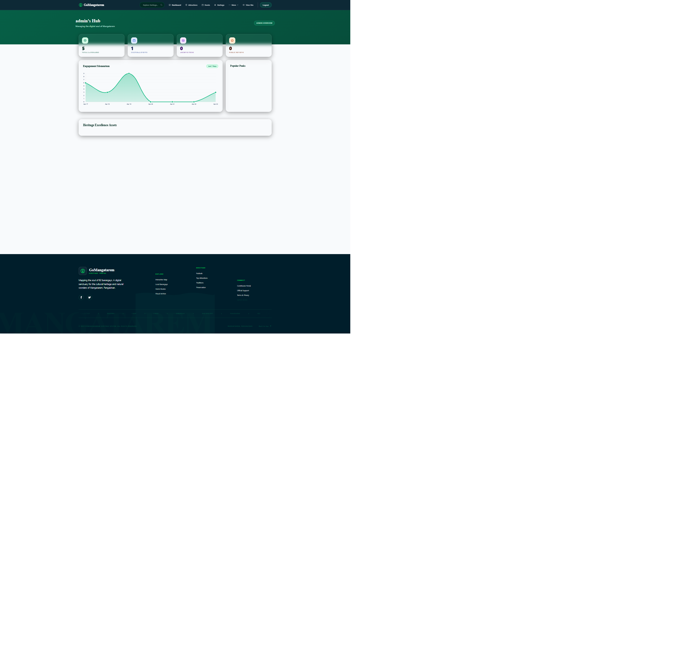
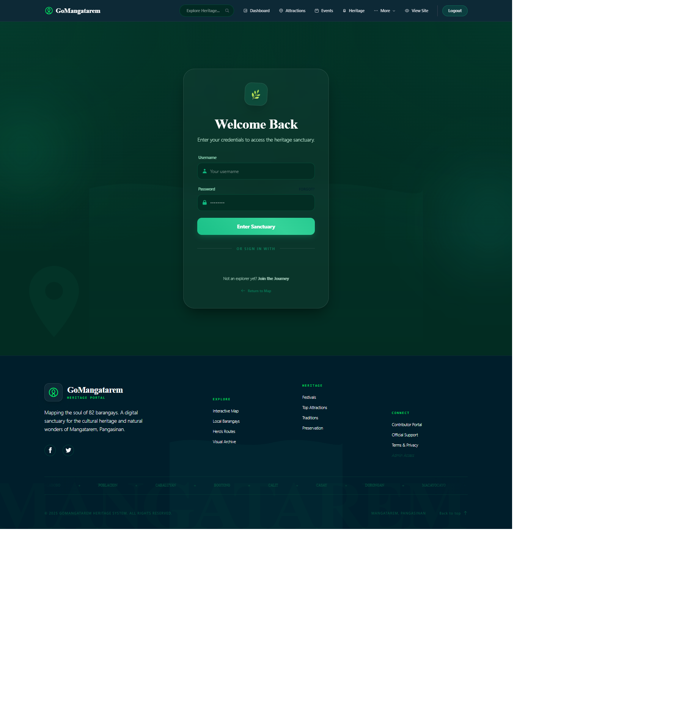
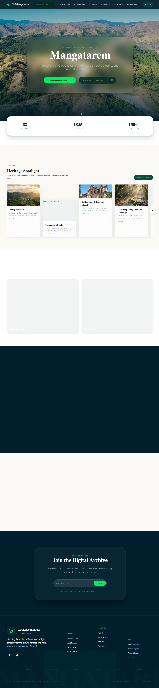
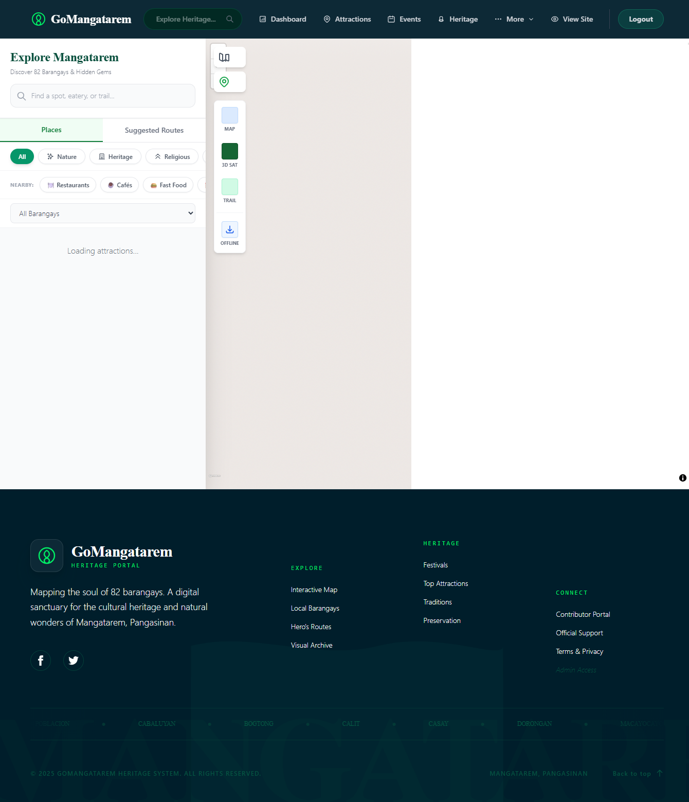

# Chapter 3: Results and Discussion

This chapter presents the comprehensive results of the design, development, and system features of the Interactive Digital Cultural Map and Local Tourism Information System for Mangatarem, Pangasinan. It encapsulates the logical workflows and multi-role system flowcharts designed to replace fragmented legacy processes, details the operational modules and user interfaces engineered for both public and administrative stakeholders, and outlines the terminal testing and evaluation methodologies. In accordance with Capstone 1 guidelines, this chapter focuses on the design, functional features, and systematic testing plans based on the ISO/IEC 25010 framework, establishing the baseline for full implementation and numerical evaluation in Capstone 2.

## Proposed System Flowchart

**Cultural Mapping and Content Moderation (LGU Workflow) Flowchart**
The system workflow begins when a user initiates a session by accessing the digital web portal, prompting the main interactive map interface to load. For a Public Visitor, the workflow moves into the searching and filtering categories module, where they can refine their view by cultural categories or specific barangay boundaries. The system then processes this request to explore the interactive map, pulling data dynamically from the database to render custom visual pins directly on the screen. When a visitor clicks a pin to view attraction details, the system retrieves the full profile—complete with descriptions, hours, and photos—from the database repository. Finally, visitors can leave reviews or interactive feedback, which the system processes and immediately saves to update the live feed.

**Barangay Representative Flowchart**
For the Barangay Representative, the workflow begins with a secure login process that verifies their identity before granting access to their specialized Barangay Dashboard. From this workspace, representatives can digitally fill out heritage forms 01–07 using standard inventory layouts and upload associated photos or videos. Once they submit the asset for review, the workflow saves the submission under a "Pending" status within the Supabase database. This triggers the Tourism Office Admin workflow, where an administrator logs into the system with high-privilege credentials to access the central Admin Dashboard and review pending submissions.

**Tourism Office Admin (Admin) Flowchart**
The system then encounters a crucial administrative decision point: verifying if the asset meets official standards. If the coordinates or details are incorrect, the admin rejects the submission, attaches explanatory notes, and loops the workflow back to the representative's dashboard for correction. If the submission passes verification, the admin approves and publishes the asset; the system instantly changes its status to "Approved," updates the central mapping engine, and renders the new pin on the public map interface to complete the operational workflow.

## System Features and User Interface Discussion

This section details the core functionalities of the Interactive Digital Cultural Map and Local Tourism Information System for Mangatarem, Pangasinan based on the defined data flow processes. The platform is designed with a role-based architecture to ensure data security, operational efficiency, and a streamlined workflow. Access is strictly divided between authorized personnel specifically the System Administrator and the Barangay Representative, alongside the public-facing interfaces designed for the General Public/Tourists and Academic Researchers.

### Administrator

**Figure 3.2** Admin Dashboard

The Administrator (LGU Tourism Office Staff) holds the highest level of control within the system and is primarily responsible for governance, validation, and access control. This feature enables the Administrator to review and verify newly submitted cultural heritage profiles and media assets. This includes validating submitted geographic coordinates, NCCA Forms 01–07 data layouts, and uploaded documents/photos before granting system access or publishing them to the public map. The Administrator manages the moderation queue, approves valid submissions to render them instantly on the public map, or rejects incorrect submissions with descriptive feedback notes routed back to the contributor's dashboard.

### Barangay Representative

**Figure 3.3** Login Portal

The Barangay Representative (Contributor) serves as the grassroots data steward responsible for digitizing and maintaining the local cultural inventory of their specific jurisdiction. This feature enables the representative to digitally fill out NCCA heritage forms 01–07 and upload associated photos or videos. Once submitted, the system saves the record under a "Pending" status in the database and queues it for administrative review. Representatives can track their submissions' moderation status in real time and edit rejected assets based on administrative feedback comments.

### Public User (Tourists / Visitors)

**Figure 3.4** Home Page

The Public User represents the high-concurrency consumer tier, accessing the public-facing interfaces designed for tourism discovery and exploration. This feature provides a dynamic, full-screen map canvas (utilizing Mapbox GL JS) displaying custom vector tiles. Public users can browse georeferenced pins representing cultural landmarks, apply taxonomic category filters, view attraction details (including historical narratives, operating hours, and photos), and submit community ratings or reviews that are saved directly to update the live public feed.

**Figure 3.5** Interactive Map

The interactive map interface provides users with an immersive, full-screen geospatial canvas to explore georeferenced cultural heritage sites and attractions across the municipality.

### Students and Researchers (Academic Users)
Designed specifically to support the academic community, this module provides structured, query-optimized search paths to retrieve cultural and historical archives.
- **Digital Cultural Atlas**: A search-optimized digital database registry providing academic users with comprehensive, read-only access to digitized barangay profiles, historical archives, and traditional heritage accounts.
- **Municipal Archives Retrieval Engine**: A query pipeline allowing researchers to filter the municipal archives by era, category, or keyword, rendering standardized heritage records for academic reference and data gathering, aligned with the primary LGU document repository.

## System Testing and Evaluation

To guarantee technical robustness, compliance with engineering specifications, and organizational usability, a rigorous system evaluation plan has been established under the ISO/IEC 25010 Software Quality Standards. During this terminal phase of Capstone 1, this section outlines the detailed testing plans, execution methodologies, and the customized evaluation instruments designed for each quality characteristic, with actual statistical calculations and final evaluation scores reserved for Capstone 2.

### Functional Testing Plan
The primary objective of Functional Testing is to verify that the system’s modules and logic operate in strict accordance with the defined functional specifications. The testing plan involves executing test cases under simulated user roles to validate the accuracy of database writes, coordinate parsing, and moderation state transitions.
* **Test Case Definition**:
  * *Authentication Security*: Attempting to access the Barangay Contributor Portal or LGU Admin Panel without valid session cookies to verify redirection logic.
  * *Ingestion Validation*: Submitting a heritage profile form with missing geographic coordinates to verify Flask-WTF validation triggers.
  * *Moderation Flow*: Verifying that database records created by contributors are successfully saved in a `PENDING` state and remain invisible on the public map until the status is modified to `APPROVED` by the administrator.
  * *Spatial Search Integrity*: Testing real-time keyword queries and spatial category filters to confirm the client canvas renders only matching coordinate pins.
* **Execution Process**: Testing will be conducted systematically via manual execution on multiple browsers (Google Chrome, Microsoft Edge, Safari) and automated integration tests. The results (Pass/Fail) will be documented in a structured functional matrix.

### Performance Testing Plan
Performance testing evaluates the system's operational efficiency, responsiveness, and stability under varying concurrency levels.
* **Execution Process**: Performance metrics will be gathered using **Google Lighthouse** audits and **Chrome DevTools Performance Traces**. The testing processes focus on measuring:
  * *First Contentful Paint (FCP)*: The time required to render the initial DOM elements on the home screen.
  * *Time to Interactive (TTI)*: The duration before the interactive Mapbox vector map becomes fully responsive to user panning and coordinate filtering.
  * *Database Query Latency*: Measuring API execution times for cached queries (Upstash Redis) compared to raw database queries.
  * *Stress Simulation*: Utilizing load testing utilities to simulate multiple concurrent spatial requests to monitor serverless Flask response times under peak municipal traffic.

### Security Testing Plan
Security testing is executed to validate the system's resilience against unauthorized access, malicious data modification, and common web application vulnerabilities.
* **Execution Process**: The developers will subject the platform to simulated penetration testing and "Red Team" attacks. Testing focuses on:
  * *SQL Injection (SQLi) Prevention*: Input fields, login forms, and search bars will be tested with malicious payloads (e.g., `' OR '1'='1`) to confirm that the SQLAlchemy ORM effectively sanitizes inputs and executes parameterized queries.
  * *Cross-Site Scripting (XSS) Mitigation*: Form submissions containing malicious JavaScript scripts (e.g., ``) will be entered into content fields to verify that the system sanitizes input string formats using the Python `Bleach` library before storage.
  * *Role-Based Access Control (RBAC) Integrity*: Direct URL access attempts (Insecure Direct Object Reference) to the administrative portal (e.g., `/admin/moderation`) using a standard Public User session will be executed to confirm the server terminates unauthorized sessions and logs the security event.

### Usability and User Acceptance Testing (UAT) Plan
Usability testing evaluates the user-friendliness, navigational clarity, and visual accessibility of the user interfaces, while User Acceptance Testing (UAT) assesses whether the system fulfills the operational needs of LGU staff and contributors.
* **Evaluation Instrument**: The developers will utilize a modified Likert-scale questionnaire based on the ISO/IEC 25010 Usability framework. The instrument is divided into:
  * *Part 1: Demographic Profile*: Collecting role, age group, and computer literacy metrics from respondents.
  * *Part 2: Likert-Scale Statements*: A 5-point scale (ranging from "5 - Strongly Agree" to "1 - Strongly Disagree") to evaluate specific statements regarding navigation ease, visual design clarity, and system friendliness.
  * *Part 3: Qualitative Feedback*: Open-ended queries to gather constructive notes for interface polishing.
* **UAT Execution Process**: During the Cutover phase, the UAT will be administered to a selected sample group of stakeholders (including LGU Tourism Officers, Barangay Representatives, and Academic Users). The numerical data and statistical averages collected will serve as the primary findings of Chapter 3, to be analyzed and discussed during the final Capstone 2 manuscript defense.
