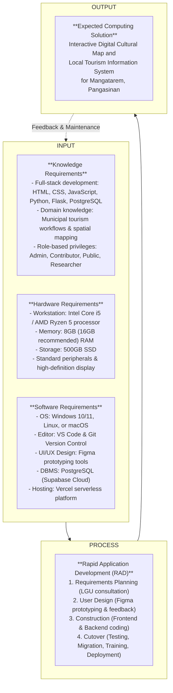

# Chapter 1: Introduction

## Background of the Study

In the modern digital landscape, the integration of advanced computing solutions in local governance and public administration has become a crucial mechanism for enhancing operational efficiency, streamlining workflows, and promoting cultural heritage. Local government units (LGUs) and municipal offices often encounter significant difficulties when relying on traditional, manual record-keeping systems and fragmented physical archives. This manual paradigm frequently restricts public access, increases administrative friction, and limits the visibility and promotion of cultural assets. According to Wilson (2025) in a study on municipal digital transformation, establishing a centralized, web-based presence significantly increases community engagement, information reliability, and municipal visibility compared to legacy, physical-first systems. Consequently, transitioning to integrated database systems and interactive spatial mapping technologies represents a vital developmental path for modernizing local administration and safeguarding cultural records for wider public access.

This study focuses on the Local Government Unit (LGU) of Mangatarem, Pangasinan, which serves as the primary administrative authority, decision-maker, and beneficiary for tourism promotion and cultural data management within the municipality. As a first-class municipality characterized by a rich historical identity, diverse cultural traditions, and significant natural landmarks—such as the Manleluag Spring National Park—Mangatarem holds substantial potential for tourism and heritage preservation. However, the LGU’s current processes for managing and disseminating cultural and tourism information are largely fragmented and heavily dependent on legacy manual operations. The absence of a standardized, centralized repository leads to inconsistent information across public platforms, delayed communication among municipal stakeholders, and severe accessibility limitations for students, researchers, and prospective visitors seeking reliable historical data. These operational gaps highlight the urgent necessity for a centralized, secure digital platform to streamline cultural mapping and municipal tourism data management.

To address these systemic inefficiencies, this research presents the design and development of the "Interactive Digital Cultural Map and Local Tourism Information System for Mangatarem, Pangasinan." This computing solution is introduced as a comprehensive technological platform engineered to replace fragmented, manual documentation with a unified, web-based spatial application. By digitizing cultural mapping records and standardizing tourism data, the system aims to optimize administrative workflows, ensure data consistency, and provide real-time updates for municipal administrators. Furthermore, the implementation of interactive geographical mapping and a centralized digital archive will enrich the user experience for tourists, residents, and researchers, thereby preserving Mangatarem's heritage in a secure, easily accessible, and sustainable digital format.

### Encountered Problems

The Local Government Unit (LGU) of Mangatarem currently encounters critical administrative bottlenecks and operational difficulties in its tourism and cultural information workflows. Primary data collection from individual barangays is highly unstandardized, relying on informal communication channels such as SMS messages, phone calls, or physical document deliveries. This fragmented approach forces the central Tourism Office staff to manually aggregate and format incoming reports, causing substantial administrative delays in reviewing, verifying, and publishing updates. Furthermore, the reliance on manual filing and physical logs limits the LGU's capacity to maintain real-time, synchronized data, which often results in conflicting information being disseminated across various unofficial social media platforms, leading to tourist confusion and reduced credibility.

In addition to administrative delays, the current manual system presents severe accessibility constraints for academic and research-oriented stakeholders. Students and historical researchers seeking verified cultural profiles, local traditions, or barangay history must travel physically to the Municipal Tourism Office to browse physical folders, which are vulnerable to wear, loss, or misplacement. This lack of a centralized, search-optimized digital archive hinders scholarly data gathering and limits the educational promotion of the town’s heritage. The delayed coordination with local stakeholders also restricts the LGU’s ability to promote seasonal cultural events, historical landmarks, and local business establishments dynamically. These structural deficiencies establish the need for a web-based, multi-role computing solution to centralize data ingestion, enforce strict administrative moderation, and provide secure public access to municipal cultural mapping.

## Purpose and Description

The primary purpose of this Capstone Project is to design, develop, and implement a web-based Interactive Digital Cultural Map and Local Tourism Information System for Mangatarem, Pangasinan. This computing solution seeks to centralize, digitize, and standardize the management of the municipality's tourism assets and cultural heritage records, replacing legacy, manual processes with a secure, highly interactive digital platform. By providing a unified administrative moderation pipeline and an engaging, map-driven public interface, the system aims to improve administrative efficiency, eliminate data redundancy, and promote local heritage to a global audience.

Upon deployment, the Interactive Digital Cultural Map and Local Tourism Information System will provide significant benefits and operational value to the following specific stakeholders and beneficiaries:

**Local Government Unit (LGU) and Tourism Office staff** – The system provides a robust, centralized administrative dashboard that simplifies data moderation, allowing tourism officers to verify, approve, or reject content submissions from grassroots contributors. This automated workflow reduces the administrative workload, ensures data integrity, and enables the LGU to maintain an authoritative, synchronized repository of municipal cultural assets.

**Barangay Representatives and Contributors** – Designated barangay officials gain a secure, dedicated portal to directly upload localized historical profiles, high-resolution media, and event announcements. This decentralized contribution structure empowers local representatives to showcase their respective jurisdictions' heritage while standardizing the data formatting before submission to the central admin.

**General Public, Tourists, and Visitors** – Public users benefit from an interactive, mobile-responsive geographical map equipped with spatial filtering, detailed landmark pop-ups, dynamic routing, and heritage categorization. This interface enhances the visitor experience, facilitates travel planning, and increases the discoverability of local landmarks and business establishments.

**Students and Academic Researchers** – Academic users are provided with structured access to the Digital Cultural Atlas, allowing them to search, filter, and extract detailed historical records, cultural profiles, and community traditions from any location, eliminating the necessity for physical travel to municipal archives.

**Local Residents of Mangatarem** – The community benefits from the digital preservation of their intangible heritage, traditional practices, and historical festivals. This secure repository fosters municipal pride and ensures that Mangatarem's rich cultural identity is preserved for future generations.

The administrative rationale behind the project is to resolve the inconsistencies, communication delays, and accessibility bottlenecks inherent in the current manual workflow. By replacing fragmented communication with a standardized digital pipeline, the project assumes that the system will establish a definitive "source of truth" for municipal tourism and cultural data, thereby maximizing stakeholder satisfaction and enhancing operational transparency.

## Objectives of the Study

The main objective of this study is to design and develop an Interactive Digital Cultural Map and Local Tourism Information System for the Local Government Unit (LGU) of Mangatarem, Pangasinan. The system is engineered to replace legacy, manual processes with a centralized, web-based platform that optimizes information management and promotional workflows.

Furthermore, the developers aim to achieve the following specific objectives:

1. To analyze the existing processes of collecting, verifying, and disseminating tourism and cultural information in Mangatarem, Pangasinan, in order to identify administrative inefficiencies, workflow bottlenecks, and data integration challenges.
2. To identify and design the key system modules, workflows, and access control parameters for the designated user categories:
   * **Administrative and Stakeholder Users**: Incorporating System Administrators (Tourism Office Staff) and Barangay Representatives (Contributors) to facilitate secure data entry, content submission, and moderation workflows.
   * **General Public and Academic Users**: Incorporating Tourists, Visitors, and Academic Researchers to facilitate spatial mapping, digital heritage exploration, and research-oriented data extraction.
3. To test and evaluate the system's functionality, performance, security, usability, and acceptability in accordance with the ISO/IEC 25010 Software Quality Standards to ensure compliance with technical specifications and user expectations.
4. To prepare a comprehensive, phased implementation plan for the deployment of the system, including server migration, database initialization, and stakeholder training.

## Conceptual Framework

This study utilizes the Input-Process-Output (IPO) model to delineate the systematic framework and developmental lifecycle of the proposed computing solution. The IPO model serves as a structured technical roadmap, defining the foundational resources required (Input), the software engineering methodology executed to construct the platform (Process), and the resulting operational system delivered to the municipality (Output), with a continuous feedback loop to ensure long-term maintenance and alignment.

The **Input** phase encompasses the technical, physical, and domain-specific requirements necessary to initiate development. This includes *Knowledge Requirements*, which demand technical proficiency in full-stack web development (specifically HTML, CSS, JavaScript, Python, Flask, and PostgreSQL) and a thorough understanding of municipal tourism workflows, spatial mapping, and user role privileges. *Hardware Requirements* specify the physical development and hosting infrastructure, requiring workstations equipped with at least an Intel Core i5/AMD Ryzen 5 processor, 8GB to 16GB of RAM, and high-speed SSD storage to support compilation and database execution. *Software Requirements* include the necessary developmental tools, specifically Visual Studio Code, Git, Figma for UI/UX design, Supabase for cloud-native PostgreSQL data management, and Vercel for hosting.

The **Process** phase outlines the execution of the Rapid Application Development (RAD) methodology, which systematically progresses through four iterative, stakeholder-driven stages:
1. *Requirements Planning*: Collaborating with LGU officers to establish system boundaries, define user categories, and analyze legacy processes.
2. *User Design*: Creating interactive Figma prototypes and conducting stakeholder reviews to refine user interfaces.
3. *Construction*: Implementing frontend rendering (Tailwind CSS, Mapbox GL JS) and server-side logic (Flask, SQLAlchemy) in rapid development cycles.
4. *Cutover*: Executing comprehensive testing, database migration, and administrator training prior to final server deployment.

The **Output** phase represents the completed, fully functional computing solution: the Interactive Digital Cultural Map and Local Tourism Information System for Mangatarem, Pangasinan. The system integrates the inputs and processes into a secure, multi-role platform that resolves operational inefficiencies and preserves municipal cultural heritage.



The conceptual framework illustrated above delineates the systematic flow of the project. The Inputs specify the technical and physical resources, along with the domain knowledge required by the developers to undertake the project. These resources feed into the Process, which employs the Rapid Application Development (RAD) methodology to iteratively design, prototype, and build the platform through structured phases. This structured process ensures that the final Output — the Interactive Digital Cultural Map and Local Tourism Information System — is developed efficiently and aligns with the functional and operational requirements of the Mangatarem LGU and its stakeholders. The feedback loop ensures that any issues identified during testing or post-deployment can be communicated back to the development team to refine the system inputs and processes, resulting in continuous improvement.

## Scope and Limitations

### Scope

The scope of this project is strictly defined by the design, development, and deployment of a web-based Interactive Digital Cultural Map and Local Tourism Information System tailored for the LGU of Mangatarem, Pangasinan. The technology stack consists of HTML5, CSS3 (utilizing the Tailwind CSS framework), and vanilla JavaScript for the responsive client-side interface, with Mapbox GL JS integrated for spatial mapping and vector tile rendering. The backend application logic is engineered in Python using the Flask micro-framework, and the relational database is built on PostgreSQL, hosted and managed via Supabase Cloud. Figma serves as the primary UI/UX design tool during the prototyping phase. 

The software's key functionalities are divided between two main access tiers. The Public and Academic tier provides public users, tourists, and students with an interactive municipal map to search, locate, and filter tourist attractions, natural heritage sites, local events, and business establishments by category. It also includes the Digital Cultural Atlas, providing structured access to verified historical profiles and barangay-level cultural records to support academic research. The Administrative and Stakeholder tier provides authorized Barangay Representatives with a secure contribution portal to submit, edit, and upload media assets for their respective jurisdictions. It also equips LGU Tourism Admins with a centralized dashboard to moderate incoming submissions through a formal approve-or-reject workflow, manage user accounts, oversee role-based access control, and publish municipal-wide tourism notices and announcements.

### Limitations

This section outlines the boundaries of the system’s functionality to establish realistic expectations and clearly define areas excluded from the initial development scope. Primarily, the system is a web-based application, meaning its operational availability is highly dependent on an active internet or mobile data connection; offline map caching or offline data browsing features are entirely excluded from this scope. The system operates as an independent municipal platform and does not feature online booking, ticketing, reservation management, or payment gateways for local accommodations, restaurants, tour guides, or events. All financial transactions and external bookings must be conducted directly with the respective third-party establishments.

Furthermore, the system’s advanced scheduling, analytical, or automated features are restricted to specific administrative parameters. The content contribution and moderation workflows are strictly restricted to authenticated LGU staff and registered Barangay Representatives; the general public has no write permissions to alter map pins or database records directly. Additionally, the system does not integrate with national government networks, such as the Department of Tourism (DOT) or the National Commission for Culture and the Arts (NCCA) databases. Finally, the geographic scope of the system is strictly limited to the administrative boundaries of Mangatarem, Pangasinan, and does not capture spatial or cultural data from neighboring municipalities or provinces.

## Definition of Terms

For the purpose of clarity and conceptual consistency, the key terms utilized in this study are operationally defined as follows:

**Administrative and Stakeholder Users** – The user category consisting of the LGU Tourism Office staff (System Administrators) and authorized Barangay Representatives (Contributors) who hold internal access to the system. This category is responsible for submitting, reviewing, and approving cultural heritage data, managing the platform's operational integrity, and overseeing the municipality's digital tourism presence.

**General Public and Academic Users** – The user category consisting of tourists, visitors, students, and researchers who access the system to navigate the interactive map, search for points of interest, and view published cultural and tourism information. These users consume the data for leisure, travel planning, or academic data gathering without requiring administrative privileges.

**Interactive Digital Cultural Map** – The core spatial visualization module of the system that provides an interactive, georeferenced visual map of tourist spots, historical landmarks, natural attractions, and cultural heritage sites within the municipality of Mangatarem, Pangasinan. Users can interact with the map by clicking pins, filtering categories, and viewing detailed multimedia information for each location.

**Local Government Unit (LGU)** – Refers to the municipal government of Mangatarem, Pangasinan, serving as the main beneficiary, authoritative body, and decision-maker over the tourism information system and its content governance policies.

**Rapid Application Development (RAD)** – The software development methodology selected for this study, characterized by rapid prototyping, iterative feedback cycles, flexible requirements gathering, and continuous stakeholder involvement to accelerate system construction while maintaining alignment with user needs.

**Content Moderation Workflow** – The formal administrative pipeline by which the System Administrator reviews pending submissions (historical data, landmark profiles, media files) from Barangay Representatives and decides whether to approve, reject, or request revisions before publishing them to the public interface.

**Digital Cultural Atlas** – The search-optimized historical database module designed to support academic users and researchers by providing structured, easily accessible historical records, barangay profiles, and cultural narratives matching national documentation standards.

## Review of Related Literature

To establish the academic baseline and theoretical foundation for this study, the researchers conducted a comprehensive review of related literature from the period 2020 to 2025. This review is structured around the core objectives of the study, examining recent advancements in municipal digital transformation, spatial mapping, content moderation workflows, and usability testing within both local (Philippine) and foreign academic contexts.

### Local Studies

#### Existing Tourism Information Management Processes in Philippine LGUs
Soncuya (2020) conducted a critical evaluation of cultural mapping initiatives in municipal contexts, highlighting that many Philippine local government units (LGUs) continue to rely on fragmented physical documentation and inconsistent archiving methods. The study demonstrated that such manual practices lead to rapid data degradation, informational errors, and a general lack of coordination between regional tourism offices and grassroots communities. However, Soncuya also emphasized that establishing a structured, standardized reporting framework paired with a clear legal baseline significantly enhances the sustainability and administrative longevity of cultural mapping databases. This finding directly supports the first objective of this study by validating the critical need to replace Mangatarem's manual reporting channels with a standardized, web-based digital workflow.

In parallel, Coro II et al. (2022) examined the digitization process of tourism information systems in rural municipalities, utilizing Siargao as a primary case study. Their research indicated that transitioning to digital platforms drastically reduces data dissemination delays and improves the accuracy of public tourist guides. A key finding of the study was that the successful adoption of new IT infrastructure in rural municipalities depends heavily on early stakeholder engagement and localized user training. This case study provides a direct real-world precedent for the fourth objective of this study, guiding the design of the phased deployment and training strategy tailored to the technical readiness of the Mangatarem LGU.

#### Grassroots Content Contribution and Centralized Moderation
Zuniga (2023) evaluated the implementation of participatory mapping frameworks that integrate historical preservation with GPS technology in provincial contexts. The study argued that allowing local community members and barangay-level contributors to directly input primary-source historical data significantly enriches the depth and localized accuracy of the central database. However, Zuniga also noted that to prevent the spread of unverified or inaccurate data, a centralized administrative gatekeeping mechanism is mandatory. This research strongly validates the second objective of this study, supporting the structural separation of roles between the Barangay Representative ( grassroots contributor) and the LGU Tourism Administrator (content moderator) to ensure data integrity.

#### Usability, Cultural Pride, and System Acceptance in Philippine Municipalities
De Vera et al. (2022) investigated the impact of digital preservation on municipal intangible heritage and local tourism economies. Their findings revealed that digitizing local festivals, traditional crafts, and community history using multimedia-rich web applications increases tourist interest and strengthens municipal pride among residents by 45%. This research underscores the importance of the second objective of this study, confirming that incorporating multimedia galleries and interactive event calendars directly enhances user engagement.

Finally, Mendoza (2021) analyzed the operational hurdles faced by municipal IT systems after deployment, identifying that lack of data governance and inadequate post-launch maintenance plans are the leading causes of system abandonment. The study suggested that a municipal information system must be built on a modular, easily maintainable architecture and backed by clear administrative protocols. This analysis serves as a vital warning for the execution of the fourth objective of this study, reinforcing the necessity of preparing a detailed maintenance plan and administrative guidelines during the cutover phase.

### Foreign Studies

#### Digital Transformation and Spatial Visualization Frameworks
Kumar and Singh (2022) developed a web-based geographic mapping platform designed to visualize historical landmarks and cultural evolution over time. Their technical framework successfully integrated spatial coordinate datasets with historical photography galleries, demonstrating that interactive map pop-ups and category-based filtering significantly improve spatial comprehension and visitor navigation ease. This foreign study provides a concrete technical model for the first and second objectives of this study, supporting the choice of integrating georeferenced spatial coordinate pins with a search-optimized database interface.

Similarly, Chen et al. (2024) conducted an empirical study on the impact of storytelling-driven interactive maps on tourist engagement. Their findings indicated that web platforms that pair geographical maps with detailed historical narratives and multimedia slideshows retain public visitors 40% longer compared to standard, text-heavy tourism directories. The authors concluded that a visually engaging, responsive frontend design is the most critical factor in encouraging public exploration. This study directly aligns with the second objective of this study, emphasizing that usability and responsive UI design are vital for the public-facing portal.

#### Standardized Cultural Documentation and System Quality
Wang (2023) explored the integration of tangible and intangible heritage records in digital archiving systems. The study argued that digital mapping must extend beyond physical architecture to incorporate traditional practices, oral histories, and community events to present a comprehensive cultural profile. Wang established a standardized schema for documenting intangible assets, which supports the second objective of this study by informing the metadata fields and database tables engineered for the Mangatarem cultural registry.

Furthermore, Tan (2023) evaluated user adoption models for digital tourism portals, finding that modular, component-based software design simplifies post-deployment feature expansion. The research also demonstrated that providing simple, highly intuitive navigation paths reduces user resistance when stakeholders transition from manual paper forms to digital systems. This supports the second and fourth objectives by validating the utilization of a phased development approach (RAD) to incrementally build and refine the user design.

Lastly, Petrovic (2022) investigated data validation algorithms in participatory heritage mapping systems. The study demonstrated that integrating automated input validation, secure session handling, and role-based access control (RBAC) prevents database corruption and unauthorized data modification by malicious actors. This technical research supports the third objective of this study, reinforcing the need to conduct rigorous security testing against threats such as SQL injection and unauthorized role escalation.

### Synthesis

The compiled literature establishes a cohesive academic and technical justification for the development of the Interactive Digital Cultural Map and Local Tourism Information System for Mangatarem, Pangasinan. Local studies by Soncuya (2020) and Coro II et al. (2022) confirm that legacy manual tourism management processes are highly prone to administrative delays and data fragmentation, establishing a clear need for digitization to achieve municipal efficiency (Objective 1). The research by Zuniga (2023) and Wang (2023) supports the core system design, proving that a decentralized, community-led data contribution model paired with central administrative moderation is the most effective approach for capturing accurate heritage records while maintaining data integrity (Objective 2). 

Reflecting these requirements, the technical frameworks and usability findings presented by Kumar and Singh (2022), Chen et al. (2024), and Tan (2023) provide a clear engineering blueprint for constructing the georeferenced mapping interface and modular database tables, ensuring high-concurrency public exploration and long-term system scalability. Finally, the security and maintenance assessments by Petrovic (2022) and Mendoza (2021) highlight the critical necessity of executing rigorous ISO/IEC 25010 testing plans and establishing clear post-deployment maintenance protocols to prevent security vulnerabilities and ensure project sustainability (Objectives 3 and 4). By integrating these diverse local and foreign findings, the developers aim to deliver a secure, highly usable, and academically validated computing solution that safeguards Mangatarem’s rich cultural heritage.


# Chapter 2: Methodology and Design

This chapter presents the methodology and system design adopted in the development of the Interactive Digital Cultural Map and Local Tourism Information System for Mangatarem, Pangasinan. It outlines the Rapid Application Development (RAD) model combined with a Participatory GIS (PGIS) framework, chosen to guide the planning, prototyping, construction, and deployment of the platform. Additionally, it details the primary sources of data, the data gathering techniques employed, and the structural design of the system through architectural blueprints, process flowcharts, dataflow diagrams, and entity-relationship diagrams, culminating in a structured project timeline and implementation strategy.

## Software Development Methodology

In software engineering, the use of a well-defined software development methodology (SDM) is crucial for ensuring a structured, efficient, and goal-oriented approach to system development. It serves as a comprehensive framework that guides developers in systematically planning, designing, implementing, testing, and maintaining a software application. For the proposed Interactive Digital Cultural Map and Local Tourism Information System, selecting an appropriate SDM is essential to align the project with the municipal government's specific administrative workflows, spatial data constraints, and development timeframe.

This study adopted the Rapid Application Development (RAD) methodology, integrated with a Participatory GIS (PGIS) framework. RAD was selected due to its iterative nature and strong focus on rapid prototyping and continuous stakeholder feedback over rigid, paper-based planning. Given the fragmented, manual, and delay-prone state of the current tourism reporting workflows in Mangatarem, the RAD model provides the developers with the flexibility to quickly build functional web prototypes (such as the interactive map and content moderation dashboard) and refine them in response to direct feedback from LGU staff. The PGIS framework ensures that local barangay representatives actively participate in defining how their cultural heritage is spatially represented, thereby increasing data accuracy and community ownership of the platform.

The RAD methodology is characterized by short development cycles and continuous user involvement, which minimizes the risk of structural misalignment and ensures that the final computing solution meets the exact needs of its beneficiaries. The development lifecycle is structured into four primary phases: Requirements Planning, User Design, Construction, and Cutover.

1. **Requirements Planning** – During the Requirements Planning phase, the developers conducted consultations and interviews with LGU Tourism Office officers and Barangay Representatives to analyze the current manual communication workflow, define the project boundaries, and establish the core system requirements. The objective was to identify existing bottlenecks, determine the system's target users, and map out the necessary administrative and public modules.
2. **User Design** – The User Design phase involved creating interactive client wireframes and user interface mockups using design tools such as Figma. These mockups—including the full-screen spatial map, barangay submission forms, and administrative moderation screens—were presented to stakeholders for iterative evaluations, ensuring that the navigation logic, layout, and visual accessibility aligned with user expectations.
3. **Construction** – In the Construction phase, the developers converted approved Figma designs into a functional web application. The frontend interface was engineered using HTML5, CSS3 (utilizing the Tailwind CSS framework), Mapbox GL JS for spatial mapping, and JavaScript. The server-side logic was built in Python using the Flask micro-framework, with PostgreSQL serving as the primary relational database, hosted via Supabase Cloud. Unit testing and feature iterations were conducted continuously during this phase to ensure technical compliance.
4. **Cutover** – The final phase, Cutover, involves performing comprehensive system testing, migrating historical cultural data from physical folders into the PostgreSQL database, conducting training seminars for LGU officers and Barangay Representatives, and deploying the completed platform to the live production server (Vercel) for public launch.

## Sources of Data

The sources of data in this study are integral to understanding the operational challenges and user requirements related to managing municipal tourism and cultural data in Mangatarem, Pangasinan. These sources encompass individuals, administrative groups, and localized data archives that provide primary and secondary information:

- **LGU Tourism Office Staff** – Municipal tourism officers and IT staff who provide official tourism guidelines, municipal promotion policies, and administrative moderation rules. They serve as the primary source for content moderation standards and system access parameters.
- **Barangay Officials and Representatives** – Authorized contributors from each barangay who act as vital sources of grassroots historical narratives, localized heritage sites, natural attractions, and community traditions that are not centrally documented.
- **Municipal Archives and Physical Records** – Printed brochures, historical municipal profiles, local heritage reports, and physical document registries maintained by the LGU, which serve as secondary data sources to establish the database's initial cultural inventory.
- **Tourism and Heritage Stakeholders** – Tourists, local residents, and academic researchers whose feedback during surveys and testing provided usability, navigational, and feature expectations for the public-facing interactive map and digital atlas.

## Data Gathering Techniques

To gather comprehensive qualitative and quantitative data for system requirements and post-development evaluation, the developers implemented four distinct data gathering techniques:

**Surveys and Questionnaires**
- *How*: The developers designed and distributed structured survey questionnaires to select tourist visitors, local residents, and academic researchers. The surveys utilized a 5-point Likert scale to assess user expectations regarding information accessibility, preferences for digital spatial mapping, and common difficulties encountered when searching for cultural data.
- *When*: This technique was applied during the early stages of the Requirements Planning phase to establish a quantitative baseline of user needs, and subsequently during the Cutover phase to evaluate system usability.
- *Why*: The quantitative data collected helped the development team prioritize critical public features—such as spatial category filtering and the Digital Cultural Atlas search engine—ensuring the system is highly responsive to public and academic requirements.

**Interviews**
- *How*: Semi-structured, face-to-face interviews were conducted with the central LGU Tourism Office staff and designated Barangay Representatives. The developers utilized an interview guide containing open-ended questions regarding their daily workflows, data submission habits, and system features.
- *When*: Interviews were executed during the first phase of the development lifecycle (Requirements Planning) to gather deep qualitative insights directly from internal users.
- *Why*: This method allowed the developers to analyze the procedural bottlenecks of the legacy manual system, providing the necessary workflow parameters to design the secure Barangay Portal and central Content Moderation Dashboard.

**Observation**
- *How*: The developers conducted direct, non-participant observation of the daily operations at the Municipal Tourism Office, documenting how staff process tourist inquiries, verify incoming cultural updates, and physically catalog historical folders.
- *When*: Direct observations were conducted concurrently with interviews during the Requirements Planning phase.
- *Why*: Witnessing the manual operations firsthand enabled the developers to identify procedural delays, document security risks, and user frustrations that stakeholders might omit during interviews, thereby validating the need for automated moderation.

**Document Analysis**
- *How*: The developers analyzed physical tourism brochures, manual barangay profile folders, local historical documents, and official national heritage guidelines matching NCCA cultural registry forms (Form 01–07).
- *When*: This technique was executed during the prototyping and initial construction stages.
- *Why*: Document analysis provided the exact schema and data fields required for the SQL database, ensuring that the digital forms in the developed system collect accurate, standardized heritage data matching national registry guidelines.

## System Design

### System Architecture

The System Architecture design represents the structural blueprint detailing the components, logical layers, and data transactions of the software system. It defines how users, network protocols, server instances, and data persistence engines are integrated to deliver a secure and highly responsive service.

```
+-----------------------------------------------------------------------------+
|                                CLIENT LAYER                                 |
|   +--------------------------+           +------------------------------+   |
|   |  Public Users / Students |           | LGU Admins / Barangay Reps   |   |
|   |  Web Browser Interface   |           | Secure Portal (Form Access)  |   |
|   +------------+-------------+           +--------------+---------------+   |
+----------------|----------------------------------------|-------------------+
                 | HTTPS (Request/Response)               | HTTPS / Web Session
+----------------v----------------------------------------v-------------------+
|                        CLOUD PLATFORM LAYER (VERCEL)                        |
|   +---------------------------------------------------------------------+   |
|   |                      Frontend Rendering Engine                      |   |
|   |           HTML5, Tailwind CSS, JavaScript, Mapbox GL JS             |   |
|   +---------------------------------+-----------------------------------+   |
|                                     | Serverless Route                       |
|   +---------------------------------v-----------------------------------+   |
|   |                      Backend Application Logic                      |   |
|   |                 Python, Flask Framework, SQLAlchemy                 |   |
|   +---------------------------------+-----------------------------------+   |
+-------------------------------------|---------------------------------------+
                                      | Secure PostgreSQL Link
+-------------------------------------v---------------------------------------+
|                       DATA PERSISTENCE LAYER (SUPABASE)                     |
|   +-----------------------+                   +-------------------------+   |
|   |  PostgreSQL Database  |                   |   Object Asset Storage  |   |
|   |  (User & Heritage TB) |                   |  (Photos & PDF Uploads) |   |
|   +-----------+-----------+                   +-------------------------+   |
|               | Cache Link                                                  |
|   +-----------v-----------+                                                 |
|   |     Upstash Redis     |                                                 |
|   |  (Map Cache Engine)   |                                                 |
|   +-----------------------+                                                 |
+-----------------------------------------------------------------------------+
```

*(Figure 2.1: System Architecture Diagram. The cloud-native model isolates Client, Cloud Platform, and Data Persistence layers.)*

The architecture follows a modern three-tier client-server model, ensuring a secure and optimized separation of concerns. At the **Client Layer**, users access the system via modern web browsers on mobile phones or desktops. The public-facing interface utilizes HTML5, Tailwind CSS, and vanilla JavaScript, with **Mapbox GL JS** integrated for real-time spatial vector tile rendering. The **Cloud Platform Layer** is hosted on **Vercel**, serving the frontend static files and executing backend application logic written in **Python** using the **Flask** framework as serverless API routes. This layer is responsible for processing requests, managing user authentication via secure cookies, and conducting data validation. The **Data Persistence Layer** is anchored on **Supabase**, hosting the managed **PostgreSQL** database (containing users, heritage profiles, and audit log tables) and Object Storage for high-resolution photography uploads. Additionally, **Upstash Redis** is integrated within this layer to cache georeferenced spatial datasets, reducing database load and ensuring low-latency rendering of map pins on the client interface.

### Existing Process Flowchart

A process flowchart is a graphical representation that utilizes standardized symbols to illustrate the sequential steps, logic checkpoints, and data directions of an operational workflow. In system analysis, a flowchart is critical to visualize the "as-is" manual processes, facilitating the identification of bottlenecks, redundancies, and structural vulnerabilities.

```
       [Start: Tourist seeks Info]              [Start: Barangay Rep seeks Update]
                    |                                           |
                    v                                           v
         /---------------------\                     [Compile Physical Report]
        <  Has Internet Access? >                               |
         \---------------------/                                v
          /                 \                        [Formal SMS/Paper Submission]
     (Yes) /               (No) \                               |
          v                       v                             v
  [Search Social Media]    [Travel to LGU Office]    [Manual Sorting at LGU Office]
          |                       |                             |
          v                       v                             v
  [Outdated/Conflicting]   [Locate Paper Folders]    [Review and Call for Corrections]
          |                       |                             |
          v                       v                             v
 [Visitor Confusion]       [Hand-written Logs]       [Manual Typing and Brochure Print]
          |                       |                             |
          \                       /                             v
           \----> [Exit] <-------/                  [Outdated Local Info Published]
```

*(Figure 2.2: Existing Manual Process Flowchart. Process paths represent manual inquiries (left) and paper-based information updates (right).)*

The flowchart delineates the two manual, inefficient workflows currently used in Mangatarem, revealing significant informational delays and data synchronization issues. The tourist inquiry workflow (Left Path) highlights that visitors seeking local information must either browse unverified, fragmented social media pages—which often contain conflicting or outdated details, causing tourist confusion—or travel physically to the Municipal Tourism Office. At the office, staff must manually search through physical binders and handwritten logs. If a document is misplaced or in use, the tourist is left without data, resulting in operational inefficiencies. 

The content reporting workflow (Right Path) illustrates that when a Barangay Representative seeks to update a cultural record or report an upcoming event, they submit physical documents or send unstandardized SMS text messages to the central Tourism Office. This forces central staff to manually sort and transcribe disparate data formats. Any missing details require a repetitive cycle of follow-up phone calls, creating severe time lags. By the time the LGU compiles, verifies, and publishes these updates via printed brochures or social media announcements, the information is often already outdated, highlighting the urgent need for digital automation.

### Dataflow Diagram (DFD)

A Dataflow Diagram (DFD) is a logical design tool used to visualize the flow of information through a system, mapping the inputs, processing routes, data storage components, and outputs. In system design, DFD notation utilizes specific geometric symbols to model data pathways: External Entities are represented as rectangles, Processes as rounded squares, Data Stores as open-ended rectangles, and Data Flows as labeled directional arrows.

```
  +------------------------------+                       +-----------------------------+
  |  EE1: General Public /       |                       | EE2: Barangay Contributor / |
  |  Academic Users (Tourist)    |                       | LGU Admin (Internal Users)  |
  +----+--------------------^----+                       +----+--------------------^---+
       |                    |                                 |                    |
       | Search/View Query  | Map/Profile Data                | Forms / Submissions| Status / Logs
       |                    |                                 |                    |
  +----v--------------------+----+                       +----v--------------------+---+
  |                              |                       |                             |
  |    Process 1.0: Browse &     |                       |    Process 2.0: Content     |
  |     Spatial Map Search       |                       |   Submission & Moderation   |
  |   (Public View Interface)    |                       |  (Barangay & Admin Portal)  |
  |                              |                       |                             |
  +------------+-----------^-----+                       +------------+-----------^-----+
               |           |                                          |           |
     Write/Read|           |Read Map Pins                    Save Spot|           |Read User
       Queries |           |Data                             & Event  |           |Details
  +------------v-----------+-----+                       +------------v-----------+-----+
  |                              |                       |                             |
  |  D2: Tourist Spots & Heritage|                       |  D1: User Accounts & Roles  |
  |          Data Store          |                       |         Data Store          |
  |                              |                       |                             |
  +------------------------------+                       +-----------------------------+
```

*(Figure 2.3: Dataflow Diagram Level 1. The diagram outlines the data flows and boundaries between Public Users, Internal Stakeholders, processes, and data stores.)*

The Level-1 Dataflow Diagram details how information moves between external actors, processing modules, and data repositories. **General Public and Academic Users (EE1)** input search parameters and category filters into Process 1.0 (Browse & Spatial Map Search). This process queries Data Store D2 (Tourist Spots & Heritage Data Store) to retrieve georeferenced map coordinates and cultural atlas profiles, rendering them back to the client interface. 

For internal administrative data management, **Barangay Representatives and LGU Administrators (EE2)** interact with Process 2.0 (Content Submission & Moderation). Barangay representatives input structured cultural records and media assets through the secure submission dashboard, which writes temporary records to Data Store D2 in a pending status. The LGU Administrator retrieves these pending submissions, conducts qualitative reviews, and inputs moderation statuses (approve/reject). Once approved, Process 2.0 updates the record status in Data Store D2, making it immediately accessible to Process 1.0 for public rendering. Access permissions, logins, and session audit logs are validated by verifying user credentials against Data Store D1 (User Accounts & Roles Data Store).

### Entity-Relationship Diagram (ERD)

#### 1. Definition, Importance, and Purpose of the ERD

An Entity-Relationship Diagram (ERD) is a structural database design tool that visually maps the logical architecture of a relational database. It defines the core data tables (entities), the specific data fields that characterize them (attributes), and the referential integrity rules (relationships) that connect them. In database engineering, the ERD serves as a conceptual blueprint that bridges abstract user requirements and physical SQL schemas. It prevents data redundancy, guarantees referential integrity through primary and foreign keys, optimizes query join execution paths, and provides a scalable data framework that accommodates future system expansions without database corruption.

#### 2. ERD Illustration

```
  +-------------------------+             +-------------------------+
  |          USER           |             |  PASSWORD_RESET_TOKEN   |
  +-------------------------+             +-------------------------+
  | PK  id (UUID)           |-------------| PK  id (UUID)           |
  | FK  barangay_id (INT)   | 1:N         | FK  user_id (UUID)      |
  |     email (VARCHAR)     |             |     token (VARCHAR)     |
  |     role (VARCHAR)      |             |     expires_at (DATETIME) |
  +-------------------------+             +-------------------------+
               | N:1
               |
  +------------v------------+             +-------------------------+
  |      BARANGAY_INFO      | 1:N         |    HERITAGE_PROFILE     |
  +-------------------------+-------------+-------------------------+
  | PK  id (INT)            |             | PK  id (UUID)           |
  |     name (VARCHAR)      |             | FK  barangay_id (INT)   |
  |     latitude (DOUBLE)   |             | FK  attraction_id (UUID)|
  |     longitude (DOUBLE)  |             |     ncca_form (VARCHAR) |
  +-------------------------+             |     narrative (TEXT)    |
         | 1:N           | 1:N            +-------------------------+
         |               |
  +------v------+ +------v------+         +-------------------------+
  | ATTRACTION  | |    EVENT    |         |      ESTABLISHMENT      |
  +-------------+ +-------------+         +-------------------------+
  | PK  id(UUID)| | PK  id(UUID)|    1:N  | PK  id (UUID)           |
  | FK  brgy_id | | FK  brgy_id |---------| FK  barangay_id (INT)   |
  |     name    | |     name    |         |     name (VARCHAR)      |
  |     lat     | |     date    |         |     type (VARCHAR)      |
  |     lng     | |     media   |         +-------------------------+
  |     media   | +-------------+                      |
  +-------------+                                      | 1:N
                                          +------------v------------+
                                          |   ESTABLISHMENT_ROOM    |
                                          +-------------------------+
                                          | PK  id (UUID)           |
                                          | FK  establishment_id    |
                                          |     room_type (VARCHAR) |
                                          |     price (DECIMAL)     |
                                          +-------------------------+
```

*(Figure 2.4: Entity-Relationship Diagram. The conceptual data model underlines Primary Keys and enforces referential cardinality across tables.)*

#### 3. Comprehensive Discussion of ERD Content

The system's database schema consists of fifteen highly integrated, normalized tables designed to capture geographic coordinates, cultural records, user privileges, and security audit logs:

##### A. Entities (Uppercase, Singular Form)
1. `USER`: A singular authenticated user account holding a defined role (Admin, Contributor, Public, Guard).
2. `PASSWORD_RESET_TOKEN`: A secure, short-lived verification token linked to a `USER` for password recovery.
3. `BARANGAY_INFO`: The municipal administrative boundary acting as the geographic anchor for all spots and events.
4. `HERITAGE_PROFILE`: The registry file matching national NCCA inventory standards (Form 01–07) for cultural assets.
5. `ATTRACTION`: A georeferenced tourism destination or landmark within the municipality.
6. `EVENT`: A scheduled local cultural festival, religious event, or municipal calendar announcement.
7. `ESTABLISHMENT`: A local hospitality or dining business registered in the tourism directory.
8. `ESTABLISHMENT_ROOM`: A room category or accommodation option offered by a lodging `ESTABLISHMENT`.
9. `ESTABLISHMENT_MENU_ITEM`: A food or beverage selection provided by a dining `ESTABLISHMENT`.
10. `ESTABLISHMENT_REVIEW`: An authenticated customer review, rating, and testimonial submitted for an `ESTABLISHMENT`.
11. `REVIEW_PHOTO`: A multimedia photo upload linked to a specific `ESTABLISHMENT_REVIEW` for visual validation.
12. `USER_FAVORITE_ESTABLISHMENT`: A joining table linking a `USER` to their bookmarked `ESTABLISHMENT` entries.
13. `VISITOR_LOG`: A checkpoint security entry recording visitor entries and exits at landmarks (managed by Guards).
14. `NEWSLETTER_SUBSCRIBER`: A visitor-submitted email subscription powering municipal tourism updates.
15. `DATABASE_AUDIT_LOG`: An immutable chronological trail capturing all administrative changes to ensure accountability.

##### B. Attributes (Characteristics, Primary Keys, and Foreign Keys)
Attributes define the columns or properties characterizing each entity.
* **Primary Keys (PK)**: System-wide unique identifiers that enforce entity integrity, represented first in the attribute list and visually *underlined* (e.g., `id` columns across all tables).
* **Foreign Keys (FK)**: Relational fields referencing a PK in another table to enforce referential integrity.
  * In the `USER` entity, `id` is the underlined PK. The attribute `barangay_id` is an FK referencing the PK of the `BARANGAY_INFO` table, linking the user to a specific jurisdiction.
  * In the `HERITAGE_PROFILE` entity, the primary key `id` is underlined, and `barangay_id` is an FK referencing `BARANGAY_INFO`, while `attraction_id` is an optional FK referencing `ATTRACTION`.
  * In the `ESTABLISHMENT_ROOM` entity, `id` is the underlined PK, and `establishment_id` is an FK referencing `ESTABLISHMENT`, linking room records directly to their business parent.

##### C. Relationships (Cardinality, Optionability, and Labels)
The relational associations within the database are primarily characterized by **one-to-many (1:N)** cardinallity:
1. **`USER` to `PASSWORD_RESET_TOKEN` (1:N)**: A one-to-many relationship where one `USER` can request multiple secure reset tokens. The relationship is *optional* for `USER` but *mandatory* for `PASSWORD_RESET_TOKEN`. **Label**: "requests".
2. **`BARANGAY_INFO` to `USER` (1:N)**: A one-to-many relationship where a barangay can have multiple registered user accounts. The relationship is *optional* for the barangay (as some barangays may not have registered contributors yet) but *mandatory* for user profile association. **Label**: "stewards".
3. **`BARANGAY_INFO` to `HERITAGE_PROFILE` (1:N)**: A one-to-many relationship mapping cultural records to geographic boundaries. It is *mandatory* for `HERITAGE_PROFILE`. **Label**: "contains".
4. **`BARANGAY_INFO` to `ESTABLISHMENT` (1:N)**: A one-to-many relationship mapping local businesses to administrative locations. It is *mandatory* for `ESTABLISHMENT`. **Label**: "locates".
5. **`BARANGAY_INFO` to `EVENT` (1:N)**: A one-to-many relationship where a barangay hosts multiple calendar events. It is *mandatory* for `EVENT`. **Label**: "hosts".
6. **`HERITAGE_PROFILE` to `ATTRACTION` (1:1 / optional 1:N)**: A flexible link where a national heritage record can optionally be mapped to a tourist spot. It is *optional* for `HERITAGE_PROFILE`. **Label**: "promotes".
7. **`ESTABLISHMENT` to `ESTABLISHMENT_ROOM` (1:N)**: A one-to-many relationship mapping rooms to lodging businesses. It is *mandatory* for the room record to point to a parent business. **Label**: "offers".
8. **`ESTABLISHMENT` to `ESTABLISHMENT_MENU_ITEM` (1:N)**: A one-to-many relationship mapping dishes to restaurants. It is *mandatory* for the menu item. **Label**: "serves".
9. **`ESTABLISHMENT` to `ESTABLISHMENT_REVIEW` (1:N)**: A one-to-many relationship mapping public reviews to business listings. It is *mandatory* for the review table. **Label**: "receives".
10. **`ESTABLISHMENT_REVIEW` to `REVIEW_PHOTO` (1:N)**: A one-to-many relationship mapping uploaded images to reviews. It is *optional* for a review to contain a photo, but *mandatory* for the photo to link to a valid review. **Label**: "includes".
11. **`USER` to `USER_FAVORITE_ESTABLISHMENT` (1:N)**: A one-to-many mapping representing bookmarks. It is *mandatory* for the favorite record to point to a valid user. **Label**: "favorites".
12. **`ESTABLISHMENT` to `USER_FAVORITE_ESTABLISHMENT` (1:N)**: A one-to-many association mapping favorited listings back to the business. It is *mandatory*. **Label**: "is_favorited_by".
13. **`USER` to `VISITOR_LOG` (1:N)**: A one-to-many security logging relationship. A verified guard (represented by `USER`) logs multiple guest entries. It is *mandatory* for `VISITOR_LOG`. **Label**: "logs".
14. **`USER` to `DATABASE_AUDIT_LOG` (1:N)**: A one-to-many accountability mapping. Administrative modifications executed by an authenticated `USER` are chronologically audited. It is *mandatory* for `DATABASE_AUDIT_LOG`. **Label**: "audits".

## Implementation Plan

### Project Timeline

The development timeline is structured around the four distinct phases of the RAD methodology, spanning a total of 13 weeks. To align the project timeline with a realistic academic semester, the schedule is mapped from **June 3, 2024, to August 30, 2024**.

```
    Phase 1: Requirements Planning (Week 1 - Week 2: June 3 - June 14, 2024)
    * Conduct interviews with LGU Tourism Office officers.
    * Perform direct observation of manual workflows.
    * Output: Approved Requirements Document.

    Phase 2: User Design (Week 3 - Week 4: June 17 - June 28, 2024)
    * Develop UI/UX mockups and wireframes in Figma.
    * Conduct prototype reviews and feedback sessions with stakeholders.
    * Milestone: Prototype Approval (June 28, 2024).

    Phase 3: Construction (Week 5 - Week 10: July 1 - August 9, 2024)
    * Set up PostgreSQL database tables and Supabase cloud configurations.
    * Code frontend mapping canvas (Mapbox GL JS) and backend APIs (Flask).
    * Perform unit testing and incremental feature integrations.
    * Milestone: Feature-Complete System Build (August 9, 2024).

    Phase 4: Cutover (Week 11 - Week 13: August 12 - August 30, 2024)
    * Execute system testing (functional, performance, security, usability).
    * Migrate manual records from physical folders to database tables.
    * Conduct user training for LGU staff and Barangay Representatives.
    * Deployment & Public Launch: August 30, 2024.
```

*(Figure 2.5: Gantt Chart — Project Timeline. The 13-week schedule maps from June 3, 2024, to the final public launch on August 30, 2024.)*

### Deployment Plan

The deployment strategy utilizes a phased release model to ensure system reliability and minimize operational risks:

1. **Phased Pilot Launch (Staging)**: The system will initially be deployed to a secure staging environment. Staging access is restricted to the central LGU Tourism staff and a select pilot group of three (3) Barangay Representatives. This phase focuses on validating the multi-role submission and moderation workflow in real-world scenarios.
2. **Production Migration**: Following the successful validation of the pilot test and resolution of user feedback, the software will be migrated to the production environment. Client-side static files and serverless Flask functions will be deployed on **Vercel** with optimized security headers. Relational data tables will be initialized on the production **Supabase (PostgreSQL)** database instance, with caching paths routed through **Upstash Redis**.
3. **Stakeholder Training**: The development team will conduct comprehensive, localized training seminars at the municipal hall. Training will guide LGU administrators through moderation workflows and account management, while Barangay Representatives will learn to digitize NCCA profiles. Customized user manuals will be distributed.
4. **Public Cutover**: Upon completion of training, the DNS records will be modified to point to the live Vercel domain, officially launching the "Interactive Digital Cultural Map" to the public.

### Resource Requirements

The successful development, execution, and long-term operations of the system require the following technical and physical resources:

**Hardware Resources:**
- **Development Workstations**: Workstations equipped with at least an Intel Core i5/AMD Ryzen 5 processor, 16GB of RAM, and a 500GB SSD to run compilers and database tools.
- **LGU Administrator Station**: An office desktop at the Municipal Tourism Office with at least an Intel Core i5, 8GB RAM, and a high-speed, stable internet connection.
- **Client Devices**: Standard smartphones, laptops, or personal computers with modern browser access for public visitors, barangay contributors, and student researchers.

**Software Resources:**
- **Development Tools**: Visual Studio Code, Git Version Control, Python 3.12+, and the `uv` package manager for secure dependency handling.
- **Prototyping Software**: Figma for UI/UX wireframing and design layouts.
- **Hosting and Cloud Infrastructure**: **Vercel** (serverless hosting), **Supabase** (PostgreSQL relational database and asset storage), and **Upstash** (Redis database caching).
- **Web Browser Support**: Modern, updated web browsers including Google Chrome, Microsoft Edge, Mozilla Firefox, or Apple Safari.

**Human Resources:**
- **Development Team**: Capstone developers responsible for frontend coding, backend API scripting, database engineering, and final deployment.
- **LGU Administrators**: Tourism Office IT staff responsible for reviewing submissions, managing contributor credentials, and maintaining data validity.
- **Barangay Contributors**: Designated representatives responsible for uploading historical facts, photography, and event details for their barangays.
- **Academic Advisors**: The capstone project faculty advisor providing technical guidance and structural validation throughout the study.


# Chapter 3: Results and Discussion

This chapter presents the comprehensive results of the design, development, and system features of the Interactive Digital Cultural Map and Local Tourism Information System for Mangatarem, Pangasinan. It encapsulates the logical workflows and multi-role system flowcharts designed to replace fragmented legacy processes, details the operational modules and user interfaces engineered for both public and administrative stakeholders, and outlines the terminal testing and evaluation methodologies. In accordance with Capstone 1 guidelines, this chapter focuses on the design, functional features, and systematic testing plans based on the ISO/IEC 25010 framework, establishing the baseline for full implementation and numerical evaluation in Capstone 2.

## Proposed System Flowchart

The operational workflow of the Interactive Digital Cultural Map and Local Tourism Information System is formalized through a centralized, multi-role system flowchart. Within the context of the Rapid Application Development (RAD) methodology, this flowchart serves as a critical blueprint for aligning functional capabilities with stakeholder expectations during rapid iterations. By mapping the logical pathways of distinct actor groups, the flowchart visualizes the transition from fragmented, legacy manual processes to a synchronized, community-driven digital ecosystem.

The system flowchart is architecturally divided into three role-based user lanes (Swimlanes) and a unified database processing engine, isolating security boundaries and operational concerns. This design guarantees strict data governance, where grassroots data capture is verified through administrative oversight before public exposure.

```
+--------------------------------------------------------------------------------------------------+
|                                    OPERATIONAL SWIMLANES                                         |
+------------------+-------------------------+-------------------------+---------------------------+
|   VISITOR LANE   |    CONTRIBUTOR LANE     |     ADMINISTRATOR LANE  |   DATABASE / SYSTEM LANE  |
|  (Public User)   |  (Barangay Contributor) |    (LGU Tourism Staff)  |  (PostgreSQL & Map Engine)|
+------------------+-------------------------+-------------------------+---------------------------+
| V1: Access Web   | C1: Secure Login        | A1: Secure Login (Admin)| DB1: spatial coordinate   |
|     Map Portal   |     via Secure Form     |     via Secure Form     |     verification, check   |
|        |         |        |                |        |                |     role permissions      |
|        v         |        v                |        v                |        |                  |
| V2: Apply spatial| C2: Access Barangay     | A2: Access Admin Panel  |        |                  |
|     filters      |     Steward Dashboard   |     & Moderation Queue  |        |                  |
|        |         |        |                |        |                |        |                  |
|        v         |        v                |        v                |        |                  |
| V3: Explore Pins | C3: Fill Standardized   | A3: Retrieve Pending   |        |                  |
|     on Map Canvas|     Heritage Form       |     Submissions         |        |                  |
|        |         |        |                |        |                |        |                  |
|        v         |        v                |        v                |        |                  |
| V4: View Details | C4: Upload Photos &     | A4: Decision Gate       |        |                  |
|     from DB      |     Evidentiary Media   |     (Meets Standards?)  |        |                  |
|        |         |        |                |        /       \        |        |                  |
|        v         |        v                |   (Yes) /     \ (No)    |        |                  |
| V5: Leave Review | C5: Submit Asset for    |        v       v        |        |                  |
|     & Feedback   |     Admin Moderation    |   A5: Approve A6: Reject|        |                  |
|                  |                         |       |       & log memo|        v                  |
|                  |                         |       |                 | DB1: PostGIS ST_AsMVT    |
|                  |                         |       \-----------------+----> serving vector tiles|
+------------------+-------------------------+-------------------------+---------------------------+
```

*(Figure 3.1: Proposed System Flowchart. The multi-lane flowchart outlines the role-based validation, submission, and public access workflows.)*

### Operational Swimlanes and Actor Roles

The workflow partitions responsibilities across four vertical channels to ensure security, usability, and data integrity:

1. **General Public and Academic Users (Visitor Lane)** – Represents the high-concurrency consumer tier. Public users browse the georeferenced municipal map, apply spatial filters to locate attractions, and access verified historical records. Additionally, authenticated public users can submit interactive feedback and reviews for establishments, pushing user-generated ratings to the system database.
2. **Barangay Representatives (Contributor Lane)** – Represents the grassroots data stewardship tier. Contributor accounts are restricted to a single verified representative per barangay. Representatives digitize primary-source historical data, upload local photos, and submit heritage profiles directly through the contributor portal.
3. **LGU Tourism Office Administrators (Admin Lane)** – Represents the administrative moderation and quality assurance tier. Administrators possess high-privilege access to oversee user accounts, publish municipal-wide tourism announcements, and qualitative audits. They manage the moderation queue to verify and authorize all submissions.
4. **Database and Mapping Engine (System Lane)** – Serves as the central repository and transaction coordinator. It manages persistent storage, validates spatial boundaries, records action logs to the database audit registry, and executes PostGIS vector tile generation to serve dynamic map pins to client interfaces.

### Alphanumeric Step-by-Step Workflow Path Mapping

The precise sequential interactions mapped across the proposed system flowchart are structured as follows:

* **General Visitor Workflow Path (V1–V5):**
  * **V1: Access Web Portal**: The visitor initiates a secure web session, loading the public portal containing the map atlas.
  * **V2: Search & Filter Categories**: The visitor applies dynamic taxonomic queries (e.g., natural heritage, built heritage, intangible cultural assets) or filters by barangay boundary.
  * **V3: Explore Interactive Map**: The map coordinates with the backend to render georeferenced visual pins dynamically on the Mapbox GL JS map canvas.
  * **V4: View Attraction/Establishment Details**: Clicking a pin fetches detailed profiles from the database, rendering historical narratives, operating statuses, business menus, and accommodation configurations.
  * **V5: Leave Review / Interactive Feedback**: Authenticated visitors submit community ratings, reviews, and validating media, pushing new interactive feedback to the database engine.
* **Barangay Contributor Workflow Path (C1–C5):**
  * **C1: Secure Login**: The contributor authenticates via a Flask-Login form utilizing secure cookie validation.
  * **C2: Access Barangay Dashboard**: The system redirects the user to their designated dashboard, exposing local stewardship progress metrics.
  * **C3: Digitally Fill Heritage Forms 01–07**: The contributor inputs structured primary-source data conforming to the national cultural heritage inventory protocols.
  * **C4: Upload Photos & Media Assets**: The contributor attaches high-resolution photography and documents to serve as evidentiary support for the heritage profile.
  * **C5: Submit Asset for Review**: Committing the form triggers a transactional save, marking the asset's state as `PENDING` and queuing it in the moderation queue.
* **Tourism Office Admin Workflow Path (A1–A6):**
  * **A1: Secure Login (Admin)**: The administrator authenticates via a high-privilege credentials form.
  * **A2: Access Admin Dashboard**: The admin views active system metrics, active session logs, page views, establishment updates, and the pending moderation queue.
  * **A3: Review Pending Submissions**: The administrator retrieves queued entries from the moderation queue.
  * **A4: Decision Gate (Meets Standards?)**: The administrator conducts a qualitative audit of the metadata, geo-coordinates, and media assets.
  * **A5: Approve & Publish (Yes Branch)**: If the asset meets requirements, the admin approves it. The database updates the state to `APPROVED`, and the mapping engine immediately renders the pin to the general public.
  * **A6: Reject & Send Feedback (No Branch)**: If the asset fails audits, the admin rejects it, logs detailed correction requests, and routes it back to the respective contributor dashboard in a `REJECTED` state for rectification.
* **Database and Mapping Engine System Path (DB1):**
  * **DB1: PostgreSQL & Mapbox Vector Tiles**: Implements strict validation constraints, logs transaction records to the `DATABASE_AUDIT_LOG`, updates caching via Upstash Redis, and serves optimized vector tiles via PostGIS `ST_AsMVT` to visitor interfaces.

### Core Pipelines of the System Flow

The operational workflow transitions through four critical pipelines designed to automate spatial rendering and prevent unauthorized data modifications:

1. **Data Ingestion Pipeline** – Coordinates how incoming data from forms (Jinja2 templates, Flask-WTF validation, and secure upload handlers) is accepted, parsed for geographic coordinates, and written to database tables.
2. **Moderation Queue Pipeline** – Restricts public database queries to only retrieve rows whose status is explicitly marked as `APPROVED`. New contributions from Barangay Representatives are locked in a `PENDING` state, isolated from the public atlas.
3. **Administrative Review Pipeline** – Empowers the LGU Tourism Office with a consolidated moderation portal. The system generates detailed comparison diffs, allowing admins to inspect submitted coordinates against physical boundaries before committing.
4. **Public Publication Pipeline** – Automates the transition of verified data to public visualization. Once approved, caching layers are invalidated, and the new georeferenced coordinates are fed into the Mapbox Vector Tile generation script, achieving real-time, low-latency pin rendering.

## System Features and User Interfaces

The structural capabilities of the Interactive Digital Cultural Map and Local Tourism Information System are rigidly organized around the access privileges and operational requirements of its four primary user roles:

### 1. System Administrator (Tourism Office Staff / IT Staff)
The System Administrator holds the highest level of administrative control and is primarily responsible for system governance, validation, and access control.
- **Content Moderation Module**: A centralized, high-privilege moderation dashboard where administrators retrieve, review, and evaluate pending cultural profiles and media uploads submitted by contributors. The module provides a comparison diff interface and a single-click action to approve and publish the georeferenced coordinates to the public map, or reject the submission and log specific correction notes.
- **User Account Management**: Tools to manage system credentials, verify new contributor profiles, and grant or revoke access privileges to maintain platform integrity.
- **Global Settings and System Auditing**: Access to system-wide audit registries (`DATABASE_AUDIT_LOG`) to monitor modification histories, configure global mapping boundaries, and publish LGU notices.

### 2. Barangay Representative (Contributor)
The Barangay Representative serves as the grassroots data contributor, responsible for digitizing and maintaining the local cultural inventory of their specific jurisdiction.
- **Grassroots Submission Portal**: A secure dashboard restricted to a single verified contributor per barangay, enabling them to draft and submit cultural profiles. The portal provides standardized digital forms matching national NCCA heritage formats.
- **Media Upload Module**: Integrated drag-and-drop secure media handlers to upload high-resolution photography and supporting documents, automatically generating relational links to parent heritage profiles.
- **Status and Revision Tracker**: A progress dashboard displaying the real-time moderation status of their submissions (`PENDING`, `APPROVED`, `REJECTED`). If a submission is rejected, the tracker displays the admin's correction notes, allowing the contributor to edit and resubmit.

### 3. Public User (Tourists / Visitors)
This tier represents the primary public consumer interface, designed with a focus on responsive UI/UX to encourage tourism discovery.
- **Georeferenced Map Canvas**: A dynamic, full-screen map interface (utilizing Mapbox GL JS) displaying custom vector tiles. Public users browse georeferenced pins representing natural heritage sites, local landmarks, and events.
- **Taxonomic Filtering Module**: Advanced filter pickers allowing visitors to segment map pins by category (e.g., historical spots, eco-tourism, local festivals) or filter pins within specific barangay boundaries.
- **Establishment Review and Caching Engine**: Clicking a pin renders a detailed pop-up display with narratives, menu options, or lodging details. Authenticated visitors can submit reviews, ratings, and validation photos, which are processed via an automated validation pipeline.

### 4. Students and Researchers (Academic Users)
Designed specifically to support the academic community, this module provides structured, query-optimized search paths to retrieve cultural and historical archives.
- **Digital Cultural Atlas**: A search-optimized digital database registry providing academic users with comprehensive, read-only access to digitized barangay profiles, historical archives, and traditional heritage accounts.
- **Municipal Archives Retrieval Engine**: A query pipeline allowing researchers to filter the municipal archives by era, category, or keyword, rendering standardized heritage records for academic reference and data gathering, aligned with the primary LGU document repository.

## System Testing and Evaluation

To guarantee technical robustness, compliance with engineering specifications, and organizational usability, a rigorous system evaluation plan has been established under the ISO/IEC 25010 Software Quality Standards. During this terminal phase of Capstone 1, this section outlines the detailed testing plans, execution methodologies, and the customized evaluation instruments designed for each quality characteristic, with actual statistical calculations and final evaluation scores reserved for Capstone 2.

```
       +-------------------------------------------------------------+
       |             ISO/IEC 25010 QUALITY FRAMEWORK                |
       +-------------------------------------------------------------+
       |                                                             |
+------v------+      +------v------+      +------v------+      +------v------+
| FUNCTIONAL  |      | PERFORMANCE |      |  SECURITY   |      |  USABILITY  |
| SUITABILITY |      | EFFICIENCY  |      |   TESTING   |      | & ACCEPTANCE|
+------+------+      +------+------+      +------+------+      +------+------+
       |                    |                    |                    |
  Verify role-        Measure load         Simulate attacks     Likert-Scale
  based form          speeds, API          (SQLi, XSS)          evaluation by
  validation,         latencies, and       and validate         stakeholders &
  and moderation      redis caching         SQLAlchemy           UAT testers
  state flow          efficiency           ORM sanitization     (5-Point Scale)
```

*(Figure 3.2: ISO/IEC 25010 Software Quality Evaluation Framework. The multi-phased testing strategy evaluates four core technical characteristics.)*

### Functional Testing Plan
The primary objective of Functional Testing is to verify that the system’s modules and logic operate in strict accordance with the defined functional specifications. The testing plan involves executing test cases under simulated user roles to validate the accuracy of database writes, coordinate parsing, and moderation state transitions.
* **Test Case Definition**:
  * *Authentication Security*: Attempting to access the Barangay Contributor Portal or LGU Admin Panel without valid session cookies to verify redirection logic.
  * *Ingestion Validation*: Submitting a heritage profile form with missing geographic coordinates to verify Flask-WTF validation triggers.
  * *Moderation Flow*: Verifying that database records created by contributors are successfully saved in a `PENDING` state and remain invisible on the public map until the status is modified to `APPROVED` by the administrator.
  * *Spatial Search Integrity*: Testing real-time keyword queries and spatial category filters to confirm the client canvas renders only matching coordinate pins.
* **Execution Process**: Testing will be conducted systematically via manual execution on multiple browsers (Google Chrome, Microsoft Edge, Safari) and automated integration tests. The results (Pass/Fail) will be documented in a structured functional matrix.

### Performance Testing Plan
Performance testing evaluates the system's operational efficiency, responsiveness, and stability under varying concurrency levels.
* **Execution Process**: Performance metrics will be gathered using **Google Lighthouse** audits and **Chrome DevTools Performance Traces**. The testing processes focus on measuring:
  * *First Contentful Paint (FCP)*: The time required to render the initial DOM elements on the home screen.
  * *Time to Interactive (TTI)*: The duration before the interactive Mapbox vector map becomes fully responsive to user panning and coordinate filtering.
  * *Database Query Latency*: Measuring API execution times for cached queries (Upstash Redis) compared to raw database queries.
  * *Stress Simulation*: Utilizing load testing utilities to simulate multiple concurrent spatial requests to monitor serverless Flask response times under peak municipal traffic.

### Security Testing Plan
Security testing is executed to validate the system's resilience against unauthorized access, malicious data modification, and common web application vulnerabilities.
* **Execution Process**: The developers will subject the platform to simulated penetration testing and "Red Team" attacks. Testing focuses on:
  * *SQL Injection (SQLi) Prevention*: Input fields, login forms, and search bars will be tested with malicious payloads (e.g., `' OR '1'='1`) to confirm that the SQLAlchemy ORM effectively sanitizes inputs and executes parameterized queries.
  * *Cross-Site Scripting (XSS) Mitigation*: Form submissions containing malicious JavaScript scripts (e.g., `<script>alert("XSS")</script>`) will be entered into content fields to verify that the system sanitizes input string formats using the Python `Bleach` library before storage.
  * *Role-Based Access Control (RBAC) Integrity*: Direct URL access attempts (Insecure Direct Object Reference) to the administrative portal (e.g., `/admin/moderation`) using a standard Public User session will be executed to confirm the server terminates unauthorized sessions and logs the security event.

### Usability and User Acceptance Testing (UAT) Plan
Usability testing evaluates the user-friendliness, navigational clarity, and visual accessibility of the user interfaces, while User Acceptance Testing (UAT) assesses whether the system fulfills the operational needs of LGU staff and contributors.
* **Evaluation Instrument**: The developers will utilize a modified Likert-scale questionnaire based on the ISO/IEC 25010 Usability framework. The instrument is divided into:
  * *Part 1: Demographic Profile*: Collecting role, age group, and computer literacy metrics from respondents.
  * *Part 2: Likert-Scale Statements*: A 5-point scale (ranging from "5 - Strongly Agree" to "1 - Strongly Disagree") to evaluate specific statements regarding navigation ease, visual design clarity, and system friendliness.
  * *Part 3: Qualitative Feedback*: Open-ended queries to gather constructive notes for interface polishing.
* **UAT Execution Process**: During the Cutover phase, the UAT will be administered to a selected sample group of stakeholders (including LGU Tourism Officers, Barangay Representatives, and Academic Users). The numerical data and statistical averages collected will serve as the primary findings of Chapter 3, to be analyzed and discussed during the final Capstone 2 manuscript defense.
