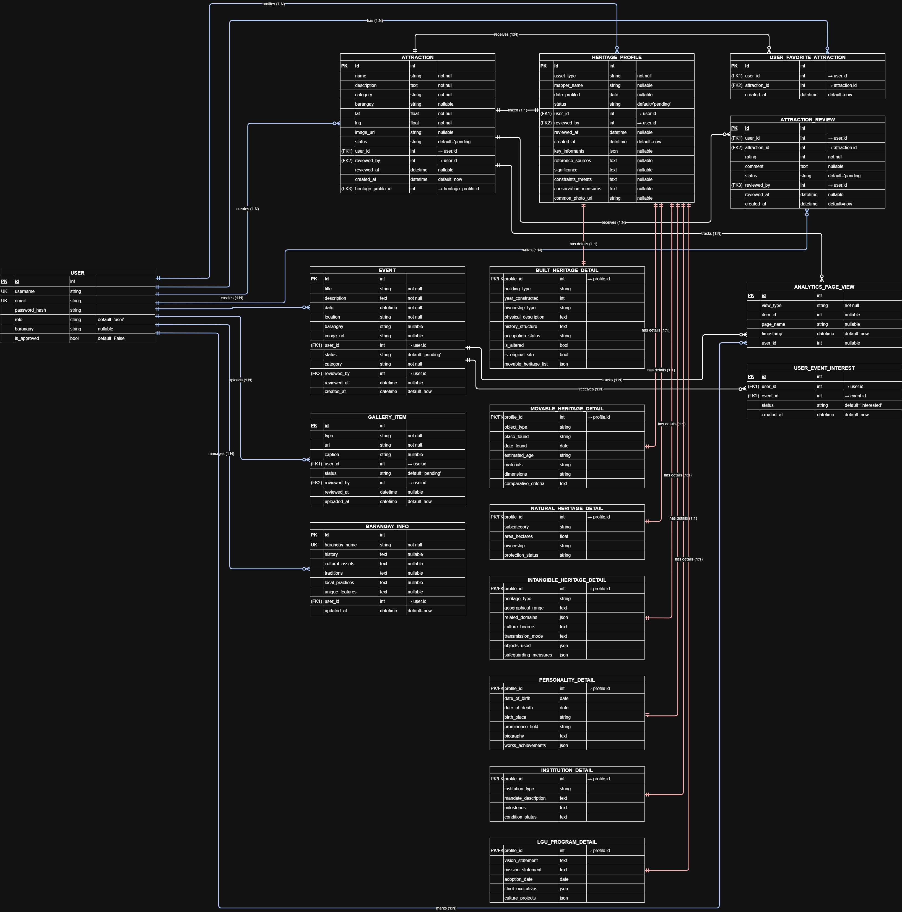
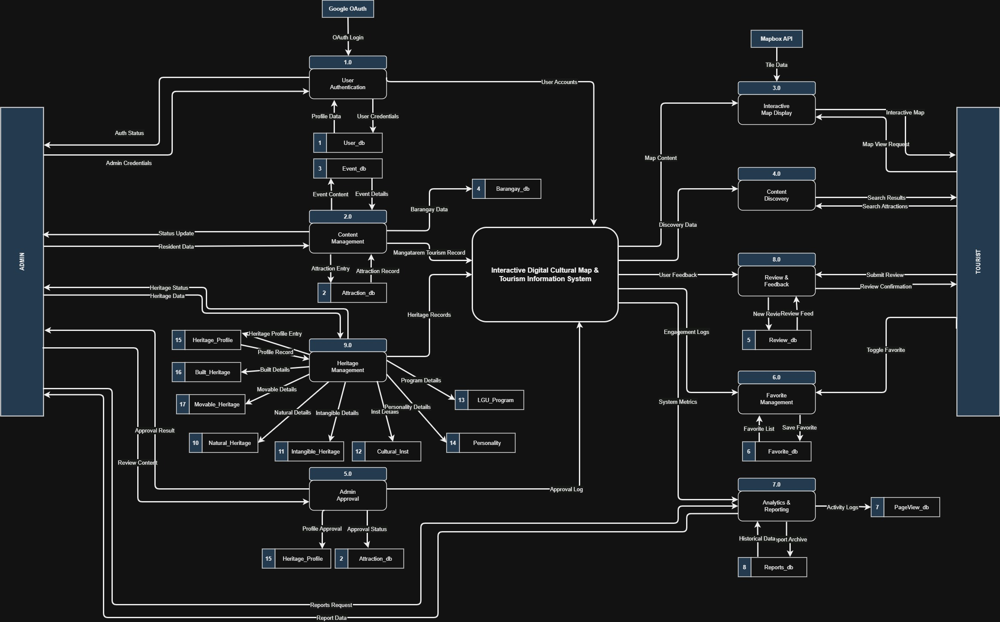
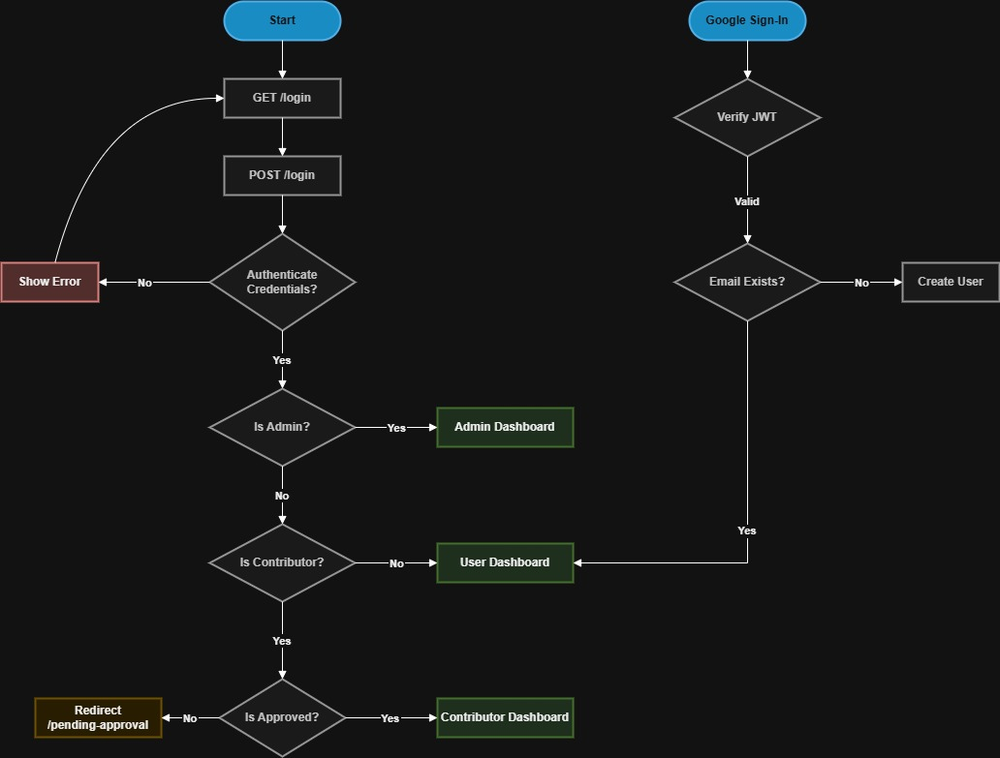
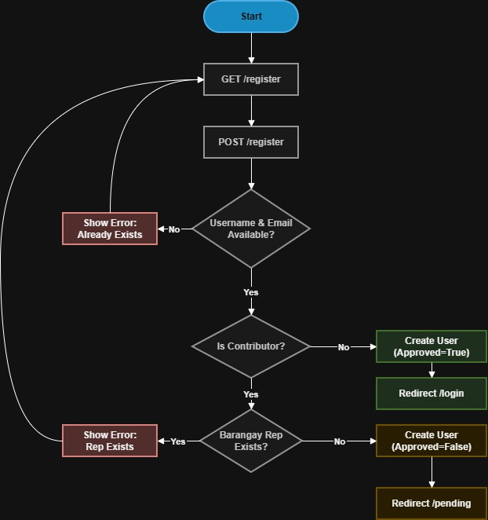
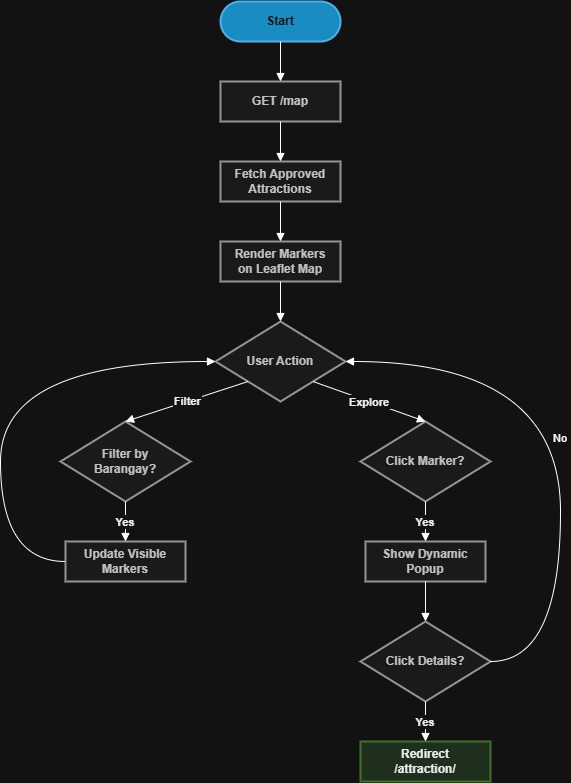

# Interactive Digital Cultural Map and Local Tourism Information System

  
<strong>A comprehensive solution for Mangatarem, Pangasinan tourism</strong>

  
<strong>Team Members:</strong> Jem Carlo Austria, Maryjane Dalas, Rea Solis, Joy De Guzman 
  <strong>Team:</strong> B3

## Key Features
- Interactive Cultural Mapping
- Tourism Information Portal
- Events & Festival Directory
- Multimedia Gallery
- Advanced Search & Filter Tools

## Mangatarem LGU Profile
- **Status:** 1st-class landlocked municipality in Pangasinan
- **Area:** Largest town in Pangasinan by land area (317.50 km²)
- **Population:** 79,323 - 79,648 residents (2020 census)
- **Barangays:** 82 barangays across the municipality
- **Tourism:** Promotes eco-tourism initiatives and hosts festivals like the Tupig Festival.

**Partner Info**
- **Contact:** Rachelle T. Cabornay, Senior Tourism Operations Officer, Municipal Economic Enterprise Office (M.E.O.)
- **Tourism Relevance:**
  - Hosts Tupig Festival highlighting local farmers.
  - Develops eco-tourism sites like Manleluag Spring.
  - Features scenic Daang Kalikasan road linking to Zambales.
  - Participates in Pangasinan-wide agri-tourism expos.

## Issues and Challenges Identified (Current State)

  <strong>Current Inefficient Process:</strong> Search Social Media ➔ Visit Tourism Office ➔ Search Physical Files ➔ <em>High Risk of Confusion</em>

- **Information management** is currently fragmented and largely manual, resulting in irregularly updated online content.
- **Lack of standardized tourism materials** leads to inconsistent data across different platforms.
- **Slow coordination with stakeholders** relying on traditional communication methods delays the sharing of accurate information.
- **Limited accessibility** for students and researchers seeking cultural information.

## Main Objective & Purpose of the System
The primary objective of this capstone project is to design and develop the **Interactive Digital Cultural Map and Local Tourism Information System**, a centralized web-based platform dedicated to showcasing the cultural identity and tourism assets of Mangatarem, Pangasinan. 

This system addresses the information gap by:
- Integrating an interactive mapping interface with a comprehensive information portal.
- Allowing users to easily locate and explore barangay-level cultural spots, historical landmarks, and local festivities.

Built using cost-effective and scalable open-source technologies like **Python (Flask)** and **Leaflet.js/Mapbox**, the system provides a viable solution for implementation by the Local Government Unit. 

**Significance:**
- Bridges the information gap for tourists requiring navigation and students conducting cultural research.
- Transforms how local heritage is accessed and preserved.
- Stimulates local economic activity by increasing the visibility of community attractions.
- Fosters a deeper sense of pride and cultural awareness among the residents of Mangatarem.

## Scope of the System
- **Interactive Cultural Map:** Navigable map displaying barangay-level cultural highlights with zoom, pan, and location details.
- **Cultural Information Portal:** Central repository for barangay profiles, cultural assets, traditions, and points of interest.
- **Events and Festival Directory:** Calendar view of local festivities and citywide celebrations with scheduling details.
- **Multimedia Gallery:** Organized collection of photos and videos showcasing local traditions and community activities.
- **Search and Filter Tools:** Quick retrieval of information by barangay, category, or attraction type.
- **Admin and Contributor Module:** Content management with approval workflow for authorized barangay representatives.
- **Tourist Guide and Routes:** Recommended themed itineraries for exploring the municipality efficiently.
- **Analytics Dashboard:** Visualizes system usage data and engagement trends for decision-makers.

**Extended Scope Details:**
- Covers all 82 barangays across the municipality.
- Enables digital coordination for all 82 barangays to independently submit and update their local cultural events and profiles.
- Promotes eco-tourism initiatives and hosts festivals like the Tupig Festival.
- Facilitates organized planning and efficient sharing of specific cultural events directly from the source.
- **Real-time fare budget estimation:** Enables tourists to select attractions and services to instantly generate an itemized cost breakdown (e.g., tricycle/jeepney fares).

## Users of the System

| User Group | Roles & Responsibilities |
|------------|---------------------------|
| **System Administrator** *(Tourism Office Staff / IT Staff)* | - Manages user accounts and system access permissions - Approves/rejects content submissions from contributors - Oversees platform maintenance and technical operations |
| **Contributor** *(Barangay Representative)* | - Submits content about local attractions and events - Updates information within their jurisdiction - Uploads photos and videos of community activities |
| **Public User** *(Tourists / Visitors)* | - Navigates interactive map to locate attractions - Searches and filters for specific points of interest - Views suggested routes and cultural information |
| **Academic Users** *(Students & Researchers)* | - Accesses historical data and cultural profiles - Gathers research data on local heritage - Studies cultural traditions and community practices |
| **Stakeholders** *(LGU of Mangatarem - Primary)* | - Main beneficiary and decision-maker for tourism promotion and cultural data management |

## Key Use Cases
- **Tourists Exploring Local Attractions:** Navigate the Interactive Map to locate specific spots (e.g., Manleluag Spring), view pop-up details, get directions, and discover landmarks.
- **Academic Research and Data Gathering:** Students access barangay profiles for academic studies, historical data, traditions, and local practices.
- **Content Contribution by Barangay Officials:** Authorized Representatives log in to update local information, upload photos, update history, and add events.
- **Content Moderation and System Management:** System Administrator uses Admin Dashboard to review submissions, approve/reject content, and manage users.

## Hardware, Software and Service Requirements
### Development Requirements
- **Hardware:** Intel Core i5/i7, 8GB+ RAM
- **Languages:** Python, HTML5, CSS3, JavaScript
- **Frameworks:** Flask, Tailwind CSS, Leaflet.js or Mapbox
- **Database:** SQLite (development) and Supabase (PostgreSQL)
- **Version Control:** Git and GitHub
- **Code Editor:** VS Code

### Deployment & User Access Requirements
- **Web Hosting Service:** Vercel
- **Database Server:** SQLite or PostgreSQL for production
- **Map Tile Service:** OpenStreetMap or CartoDB via Leaflet or Mapbox
- **Client Device:** Smartphone, Tablet, Laptop, or Desktop Computer
- **Web Browser:** Chrome, Firefox, Safari, or Edge
- **Connectivity:** Stable Internet Connection or Mobile Data Service

## Methodology: Rapid Application Development (RAD)
**Key Benefits:**
- Rapid Prototyping
- Iterative Feedback
- User-Centered Design
- Reduced Development Time
- Flexible Requirements

## Flowcharts & Logic
### Legacy Process: Key Bottlenecks
- **Manual Surveys:** Staff use paper forms for on-site data collection.
- **Manual Entry:** Typing data into Word or Excel is slow and leads to errors.
- **Traditional Delivery:** Data is submitted via physical handovers or simple dashboards.
- **Slow Verification:** Manual approvals cause long delays if corrections are needed.
- **Isolated Storage:** Data stays in local databases, making public access difficult.

### Legacy Tourism Issues
- **Office Visits:** Tourists must go to the office for info.
- **Broken Info:** Brochures and talk are hard to follow.
- **Manual Maps:** Paper maps make it easy to get lost.
- **No Updates:** You only see if a place is shut when you arrive.

### System Flow & Diagrams

#### Entity Relationship Diagram (ERD)

#### Data Flow Diagram (DFD)

#### Core System Flows
1. **Login and Security Flows**
   
   - *Standard Login:* Checks roles to open the correct dashboard.
   - *Google Login:* Fast one-tap access for visitors; automatically creates profiles.
   - *Password Reset:* via email links.
   - *Logging Out:* Ends session, clears tokens, redirects to home page.

2. **Registration & Validation Logic**
   
   - *Identity Check:* Prevents duplicate accounts.
   - *User Roles:* Fast access for visitors, extra checks for contributors.
   - *One Rep Limit:* Only one representative per barangay.
   - *Admin Approval:* Contributors stay "Pending" until confirmed.

3. **Map Exploration Flow**
   
   - *Auto Loading:* System pulls verified spots instantly.
   - *Interactive Markers:* Rendered by Leaflet JS.
   - *Barangay Filters:* Sidebar sorting by specific areas.
   - *Fast Previews:* Popups with photos and quick info on click.
   - *Full Pages:* Complete attraction pages via "View Details".

## System Architecture Design
*(Refer to external architecture documentation and interactive prototypes)*

