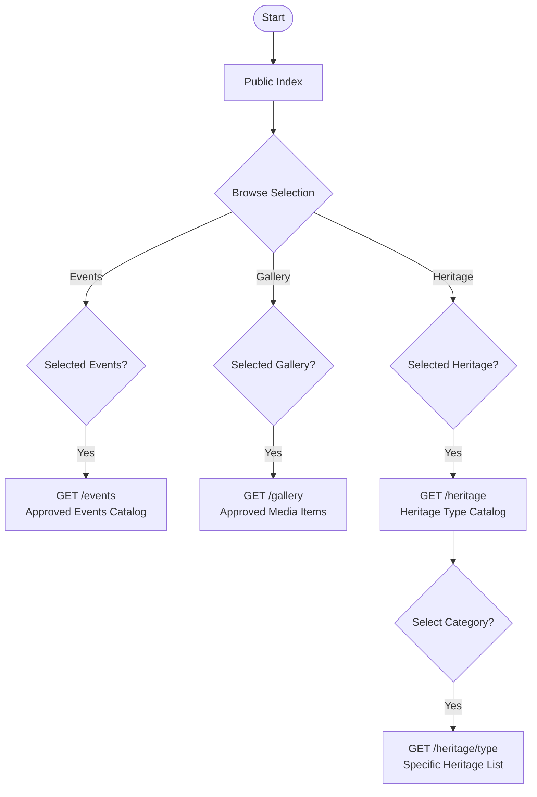

# Cultural Content Flowchart

This flowchart documents how users access various cultural content types including events, gallery media, and heritage catalogs.

## Mermaid Diagram

## Description
1.  **Central Hub**: The homepage acts as the entry point to all cultural data.
2.  **Modular Access**: Users can jump into three distinct content streams:
    - **Events**: Chronological listing of local festivals and activities.
    - **Gallery**: Visual media uploaded by contributors and approved by admins.
    - **Heritage**: A multi-category catalog of tangible and intangible cultural assets.
3.  **Filtered Discovery**: For heritage items, users first browse by type (e.g., Architecture, Traditions) before seeing specific entries.
4.  **Admin Gating**: Only content marked as `approved` is visible in these public views.
