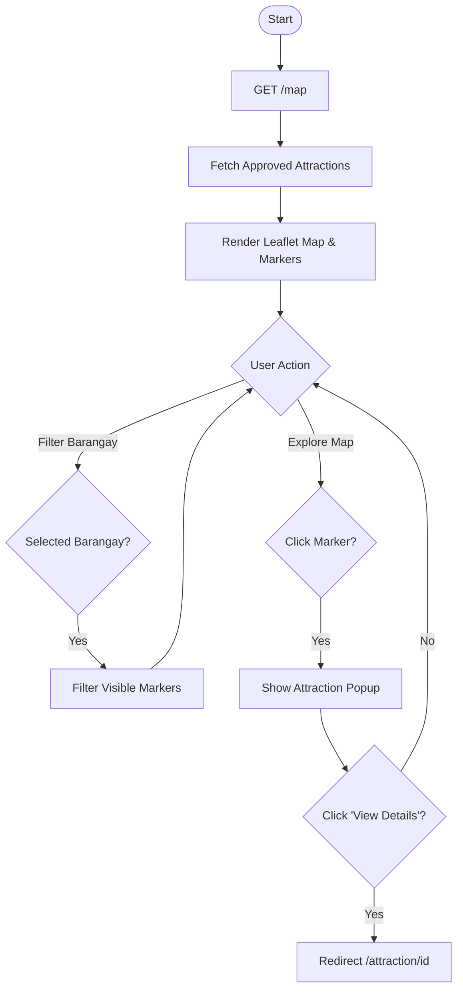

# Map Exploration Flowchart

This flowchart documents how users interact with the interactive digital map to discover attractions and culture.

## Mermaid Diagram

## Description
1.  **Initial Load**: The system fetches all approved attractions and renders them as markers on a Leaflet.js map.
2.  **Interaction Loop**: The user can choose between two primary actions:
    - **Filter**: Narrow down attractions by selecting a specific barangay.
    - **Explore**: Click on markers to see a brief summary (popup).
3.  **Discovery**: From any popup, users can deep-dive into the full attraction details page.
4.  **Real-time Response**: Filtering is handled client-side/via AJAX for a smooth UX.
