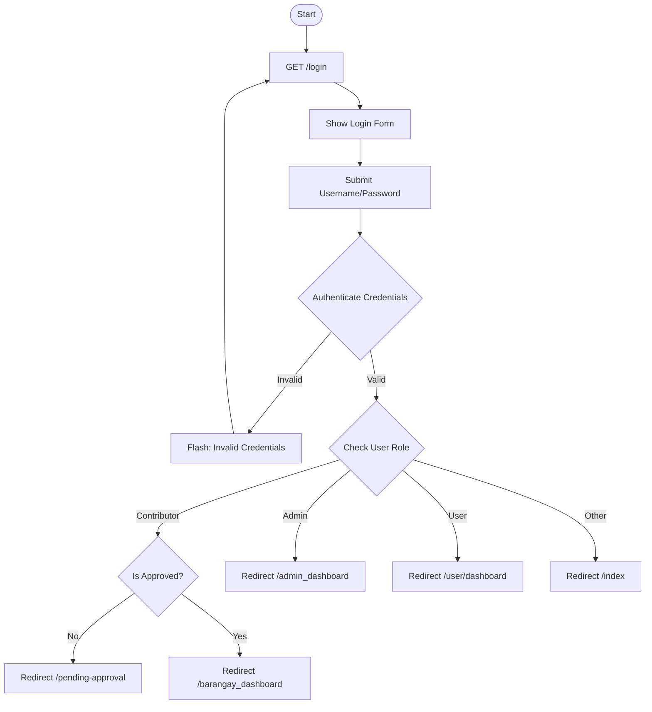
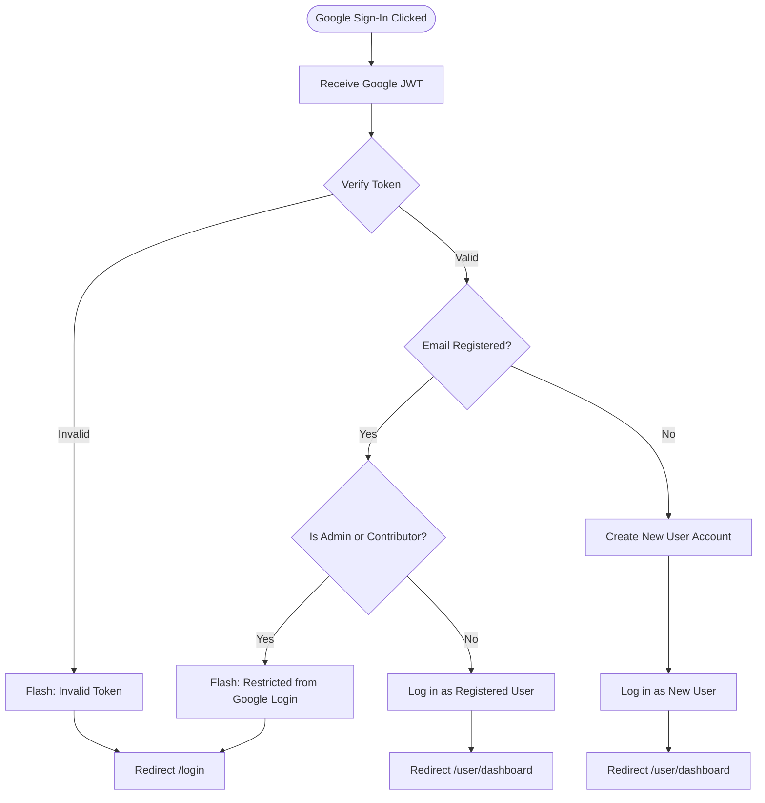
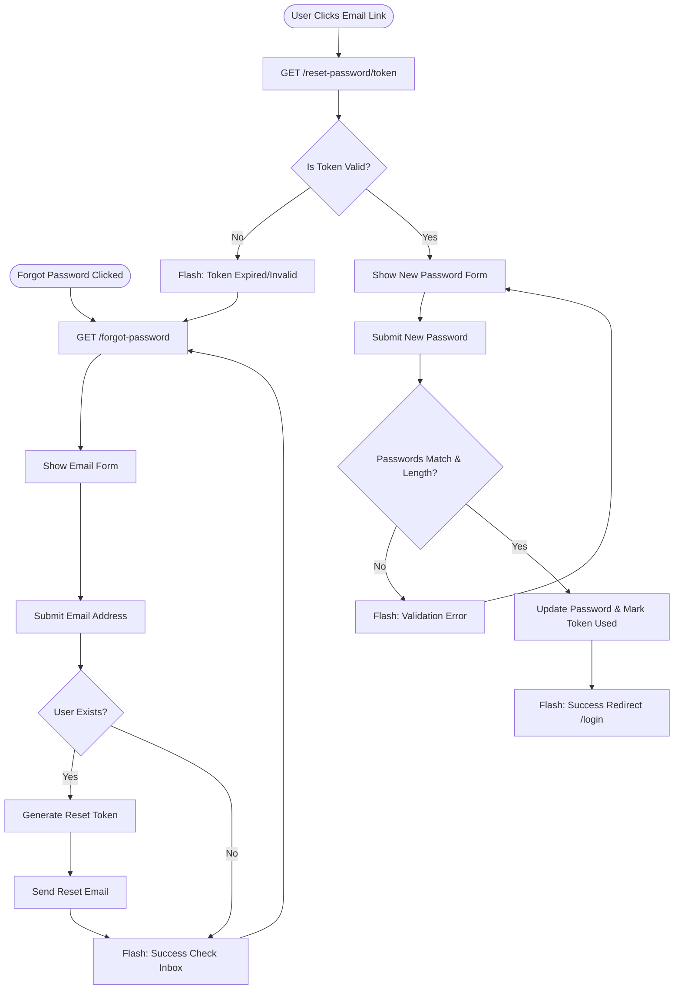
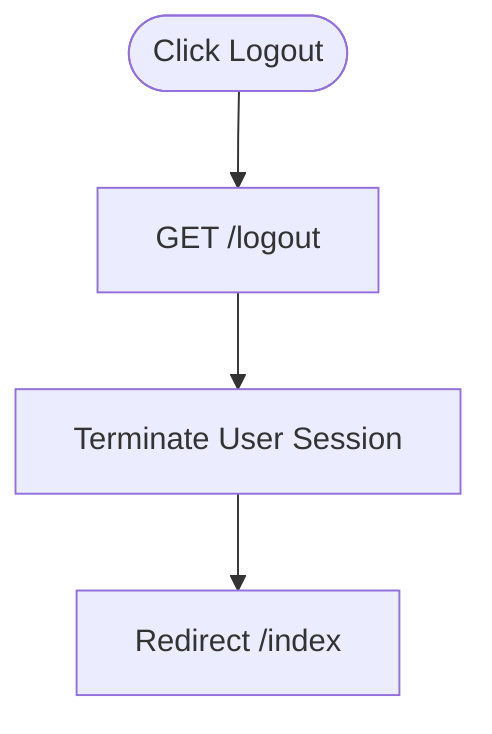

# User Login Flowchart

This document provides a visual representation of the authentication flows in the Interactive Digital Cultural Map system, based on the implementation in `routes/auth.py`.

## 1. Standard Login Flow

## 2. Google OAuth Login Flow

## 3. Password Reset Flow

## 4. Logout Flow

