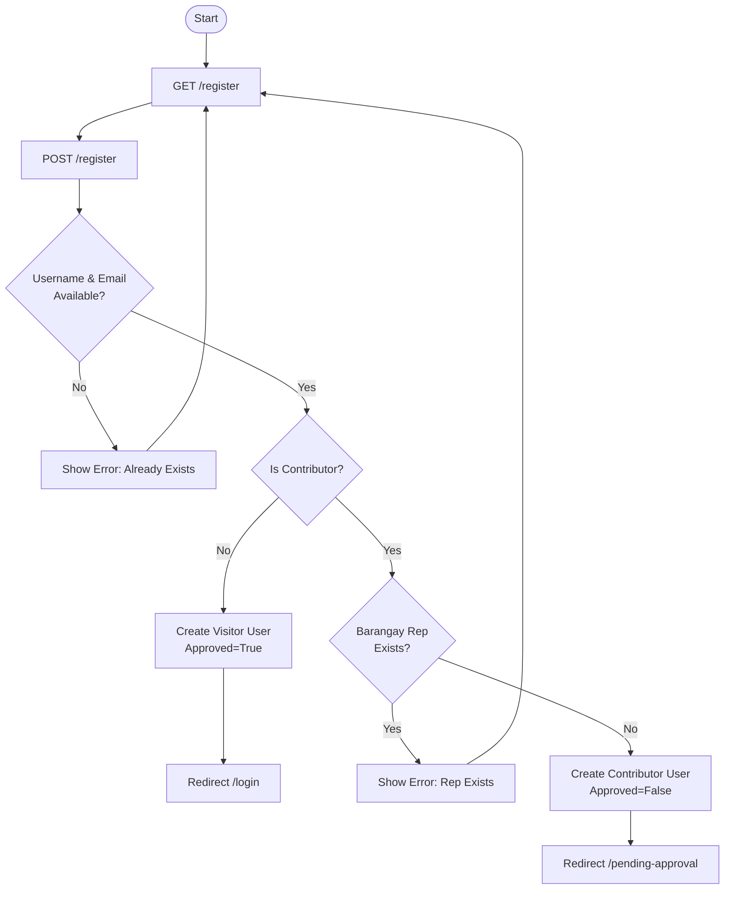

# User Registration Flowchart

This flowchart documents the user registration process, including role validation and barangay representative checks.

## Mermaid Diagram

## Description
1.  **Start**: User initiates registration.
2.  **Availability Check**: System ensures the username and email are not already in use.
3.  **Role Branch**: 
    - **Visitors** are automatically approved and redirected to the login page.
    - **Contributors** must select a barangay.
4.  **Representative Check**: A barangay can only have one approved representative. If one already exists, registration for that role/barangay is denied.
5.  **Pending Approval**: New contributors are created in a "pending" state and redirected to an information page.
