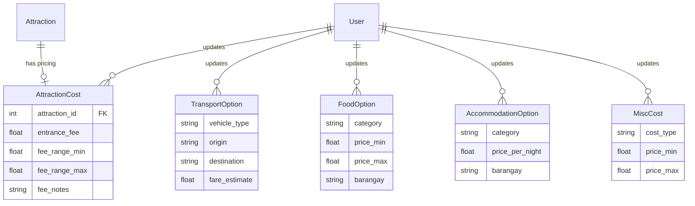

# PLAN: Trip Cost Estimator System

> **Scope Document** for the Interactive Digital Cultural Map — Mangatarem, Pangasinan  
> **Purpose:** Capstone defense feature — a new **Trip Cost Estimator** page  
> **Status:** 📋 Plan Only (no code yet)

---

## 1. Problem Statement

Tourists visiting Mangatarem have **no way to estimate trip costs** before traveling. The system currently shows attractions, events, barangays, and routes — but provides **zero pricing information** (entrance fees, transport, food, accommodation, tour guides, souvenirs).

### Goal

Add a **Trip Cost Estimator** page that lets users:
1. Select attractions they want to visit
2. See itemized cost breakdowns (entrance, transport, food, accommodation, tour guide, souvenirs)
3. Get a **total estimated trip budget**

Pricing data is managed by **admins and barangay contributors**.

---

## 2. System Scope

### 2.1 What's IN Scope

| Feature | Description |
|---------|-------------|
| **Attraction Pricing** | Entrance/admission fees per attraction (free, range, or fixed) |
| **Transport Estimates** | Estimated tricycle/jeepney fares between attractions and from town center |
| **Food & Dining** | Price ranges for meals (budget, mid-range, local delicacies) |
| **Accommodation** | Lodging options with nightly rates (budget, mid-range) |
| **Tour Guide Fees** | Optional tour guide rates (per day/half-day) |
| **Souvenir Estimates** | Average souvenir price ranges per barangay/area |
| **Trip Planner UI** | Public page where users select attractions → see cost summary |
| **Admin/Contributor CRUD** | Admin and contributors can add, edit, delete pricing data |
| **Cost Summary Export** | Print-friendly / shareable trip budget summary |

### 2.2 What's OUT of Scope

| Excluded | Reason |
|----------|--------|
| Online booking / payments | Beyond capstone scope |
| Real-time fare APIs | No APIs available for local transport |
| Hotel reservation system | Just cost estimates, not booking |
| Multi-day itinerary scheduler | Keep it simple — cost estimator only |
| Currency conversion | All prices in PHP |

---

## 3. Database Schema (New Models)

### 3.1 `AttractionCost` — Entrance fees per attraction

```python
class AttractionCost(db.Model):
    id              = db.Column(db.Integer, primary_key=True)
    attraction_id   = db.Column(db.Integer, db.ForeignKey('attraction.id'), nullable=False, unique=True)
    entrance_fee    = db.Column(db.Float, default=0.0)       # Fixed fee in PHP (0 = free)
    fee_range_min   = db.Column(db.Float, nullable=True)      # Min range (if variable pricing)
    fee_range_max   = db.Column(db.Float, nullable=True)      # Max range
    fee_notes       = db.Column(db.String(200), nullable=True) # e.g. "Free for students", "₱50 weekends"
    updated_by      = db.Column(db.Integer, db.ForeignKey('user.id'), nullable=True)
    updated_at      = db.Column(db.DateTime, default=datetime.utcnow, onupdate=datetime.utcnow)
```

### 3.2 `TransportOption` — Local transport fare estimates

```python
class TransportOption(db.Model):
    id              = db.Column(db.Integer, primary_key=True)
    name            = db.Column(db.String(100), nullable=False)  # e.g. "Tricycle - Town Center to Manleluag"
    vehicle_type    = db.Column(db.String(50), nullable=False)   # 'tricycle', 'jeepney', 'van', 'bus'
    origin          = db.Column(db.String(100), nullable=False)  # Starting point
    destination     = db.Column(db.String(100), nullable=False)  # End point
    fare_estimate   = db.Column(db.Float, nullable=False)        # Estimated fare in PHP
    fare_notes      = db.Column(db.String(200), nullable=True)   # e.g. "Special trip ₱150"
    updated_by      = db.Column(db.Integer, db.ForeignKey('user.id'), nullable=True)
    updated_at      = db.Column(db.DateTime, default=datetime.utcnow, onupdate=datetime.utcnow)
```

### 3.3 `FoodOption` — Dining cost estimates

```python
class FoodOption(db.Model):
    id              = db.Column(db.Integer, primary_key=True)
    name            = db.Column(db.String(100), nullable=False)  # e.g. "Local Carenderia"
    category        = db.Column(db.String(50), nullable=False)   # 'budget', 'mid-range', 'local-delicacy'
    price_min       = db.Column(db.Float, nullable=False)        # Per meal minimum
    price_max       = db.Column(db.Float, nullable=False)        # Per meal maximum
    barangay        = db.Column(db.String(100), nullable=True)   # Location (optional)
    description     = db.Column(db.String(200), nullable=True)
    updated_by      = db.Column(db.Integer, db.ForeignKey('user.id'), nullable=True)
    updated_at      = db.Column(db.DateTime, default=datetime.utcnow, onupdate=datetime.utcnow)
```

### 3.4 `AccommodationOption` — Lodging cost estimates

```python
class AccommodationOption(db.Model):
    id              = db.Column(db.Integer, primary_key=True)
    name            = db.Column(db.String(100), nullable=False)  # e.g. "Mangatarem Homestay"
    category        = db.Column(db.String(50), nullable=False)   # 'budget', 'mid-range', 'resort'
    price_per_night = db.Column(db.Float, nullable=False)
    barangay        = db.Column(db.String(100), nullable=True)
    description     = db.Column(db.String(200), nullable=True)
    contact         = db.Column(db.String(100), nullable=True)   # Phone / FB page
    updated_by      = db.Column(db.Integer, db.ForeignKey('user.id'), nullable=True)
    updated_at      = db.Column(db.DateTime, default=datetime.utcnow, onupdate=datetime.utcnow)
```

### 3.5 `MiscCost` — Tour guides, souvenirs, other costs

```python
class MiscCost(db.Model):
    id              = db.Column(db.Integer, primary_key=True)
    name            = db.Column(db.String(100), nullable=False)  # e.g. "Tour Guide - Half Day"
    cost_type       = db.Column(db.String(50), nullable=False)   # 'tour_guide', 'souvenir', 'other'
    price_min       = db.Column(db.Float, nullable=False)
    price_max       = db.Column(db.Float, nullable=True)
    description     = db.Column(db.String(200), nullable=True)
    barangay        = db.Column(db.String(100), nullable=True)
    updated_by      = db.Column(db.Integer, db.ForeignKey('user.id'), nullable=True)
    updated_at      = db.Column(db.DateTime, default=datetime.utcnow, onupdate=datetime.utcnow)
```

### Entity-Relationship Summary



---

## 4. Routes (New Endpoints)

### 4.1 Public Routes (in `routes/public.py`)

| Method | Path | Description |
|--------|------|-------------|
| `GET` | `/trip-cost` | Trip Cost Estimator page |
| `GET` | `/api/trip-costs` | JSON API — returns all pricing data for JS frontend |

### 4.2 Admin/Contributor Routes (in `routes/admin.py` or new `routes/costs.py`)

| Method | Path | Description |
|--------|------|-------------|
| `GET` | `/admin/costs` | Cost management dashboard |
| `POST` | `/admin/costs/attraction` | Add/update attraction entrance fee |
| `POST` | `/admin/costs/transport` | Add transport option |
| `POST` | `/admin/costs/food` | Add food option |
| `POST` | `/admin/costs/accommodation` | Add accommodation option |
| `POST` | `/admin/costs/misc` | Add misc cost (tour guide, souvenir) |
| `POST` | `/admin/costs/<type>/<id>/edit` | Edit any cost entry |
| `POST` | `/admin/costs/<type>/<id>/delete` | Delete any cost entry |

### 4.3 Barangay Contributor Routes (in `routes/barangay.py`)

| Method | Path | Description |
|--------|------|-------------|
| `GET` | `/barangay-admin/costs` | Contributor's cost management (filtered to their barangay) |
| `POST` | `/barangay-admin/costs/...` | Same CRUD as admin, but scoped to their barangay |

---

## 5. UI/UX — Trip Cost Estimator Page

### 5.1 Page Layout (`templates/pagez/trip_cost.html`)

```
┌─────────────────────────────────────────────┐
│           TRIP COST ESTIMATOR               │
│   "Plan your budget for Mangatarem"         │
├─────────────────────────────────────────────┤
│                                             │
│  ┌─ STEP 1: SELECT ATTRACTIONS ──────────┐  │
│  │  [ ] Manleluag Spring (FREE)          │  │
│  │  [ ] Timmanguyob Falls (₱50)          │  │
│  │  [ ] St. Raymund Church (FREE)        │  │
│  │  [ ] Daang Kalikasan (₱30)            │  │
│  └───────────────────────────────────────┘  │
│                                             │
│  ┌─ STEP 2: TRANSPORT ──────────────────┐  │
│  │  Vehicle: [Tricycle ▼]                │  │
│  │  From: [Town Center ▼]               │  │
│  │  Estimated fare: ₱80                  │  │
│  └───────────────────────────────────────┘  │
│                                             │
│  ┌─ STEP 3: FOOD & DINING ─────────────┐  │
│  │  Meals per day: [3 ▼]                │  │
│  │  Budget level: [Budget ▼]            │  │
│  │  Estimated: ₱150-300/day             │  │
│  └───────────────────────────────────────┘  │
│                                             │
│  ┌─ STEP 4: ACCOMMODATION (Optional) ──┐  │
│  │  Nights: [1 ▼]                       │  │
│  │  Type: [Budget ▼]                    │  │
│  │  Estimated: ₱500-800/night           │  │
│  └───────────────────────────────────────┘  │
│                                             │
│  ┌─ STEP 5: EXTRAS (Optional) ─────────┐  │
│  │  [ ] Tour Guide (₱500-1000/day)      │  │
│  │  [ ] Souvenirs (₱100-500)            │  │
│  └───────────────────────────────────────┘  │
│                                             │
│  ╔═══════════════════════════════════════╗  │
│  ║   ESTIMATED TOTAL: ₱810 - ₱2,680     ║  │
│  ║                                       ║  │
│  ║   Entrance Fees:    ₱80               ║  │
│  ║   Transport:        ₱80               ║  │
│  ║   Food (1 day):     ₱150 - ₱300       ║  │
│  ║   Accommodation:    ₱500 - ₱800       ║  │
│  ║   Extras:           ₱0 - ₱1,500      ║  │
│  ║                                       ║  │
│  ║   [🖨 Print Summary] [📤 Share]      ║  │
│  ╚═══════════════════════════════════════╝  │
│                                             │
└─────────────────────────────────────────────┘
```

### 5.2 Key UX Features

- **Real-time calculation** — JS updates total as user selects options (no page reload)
- **Price ranges** — show min-max when prices vary
- **Group size** — multiply per-person costs by number of travelers
- **Print-friendly** — clean receipt-style layout for printing
- **Responsive** — works on mobile (tourists browse on phones)

### 5.3 Admin Cost Management Page (`templates/admin/costs.html`)

Simple tabbed interface:
- **Tab 1:** Attraction Fees — list + add/edit forms
- **Tab 2:** Transport — list + add/edit
- **Tab 3:** Food — list + add/edit
- **Tab 4:** Accommodation — list + add/edit
- **Tab 5:** Misc (Tour Guide, Souvenirs) — list + add/edit

---

## 6. Navigation Integration

Add **"Trip Cost"** link to the main navbar (between "Routes" and "Gallery" or after "Routes"):

```html
<!-- In base.html navbar -->
<a href="/trip-cost">Trip Cost</a>
```

---

## 7. Task Breakdown

### Phase 1: Database (Backend)
- [ ] Add 5 new models to `models.py`
- [ ] Create database migration
- [ ] Add corresponding SQL to `supabase_schema.sql`

### Phase 2: Admin CRUD (Backend + Templates)
- [ ] Add admin cost management routes
- [ ] Create admin cost management template
- [ ] Add contributor cost management (barangay-scoped)
- [ ] Add contributor cost management template

### Phase 3: Public API (Backend)
- [ ] Create `/api/trip-costs` endpoint (JSON)
- [ ] Create `/trip-cost` route

### Phase 4: Trip Cost Estimator Page (Frontend)
- [ ] Create `templates/pagez/trip_cost.html`
- [ ] Implement JS cost calculator logic
- [ ] Add print/share functionality
- [ ] Add responsive design

### Phase 5: Integration
- [ ] Add navbar link
- [ ] Update sitemap
- [ ] Add page view tracking
- [ ] Seed sample pricing data

### Phase 6: Verification
- [ ] Test admin CRUD operations
- [ ] Test contributor CRUD (scoped to barangay)
- [ ] Test public estimator page calculations
- [ ] Test responsive layout (mobile)
- [ ] Test print summary output

---

## 8. File Changes Summary

| Action | File | Description |
|--------|------|-------------|
| MODIFY | `models.py` | Add 5 new models |
| MODIFY | `supabase_schema.sql` | Add 5 new tables |
| MODIFY | `routes/admin.py` | Add cost CRUD routes |
| MODIFY | `routes/barangay.py` | Add contributor cost routes |
| MODIFY | `routes/public.py` | Add `/trip-cost` route |
| MODIFY | `routes/api.py` | Add `/api/trip-costs` endpoint |
| NEW | `templates/pagez/trip_cost.html` | Trip Cost Estimator page |
| NEW | `templates/admin/costs.html` | Admin cost management page |
| NEW | `templates/barangay/costs.html` | Contributor cost management page |
| MODIFY | `templates/base.html` | Add navbar link |
| MODIFY | `templates/sitemap.xml` | Add trip-cost page |

---

## 9. Agent Assignments

| Phase | Agent | Skills |
|-------|-------|--------|
| Phase 1 | `backend-specialist` | database-design, flask |
| Phase 2 | `backend-specialist` + `frontend-specialist` | flask, frontend-design |
| Phase 3 | `backend-specialist` | api-patterns, flask |
| Phase 4 | `frontend-specialist` | frontend-design, tailwind-patterns |
| Phase 5-6 | `orchestrator` | testing-patterns |

---

> **Next Steps:**
> - Review this plan
> - Run `/create` or ask me to start implementation
> - Or modify the plan manually
