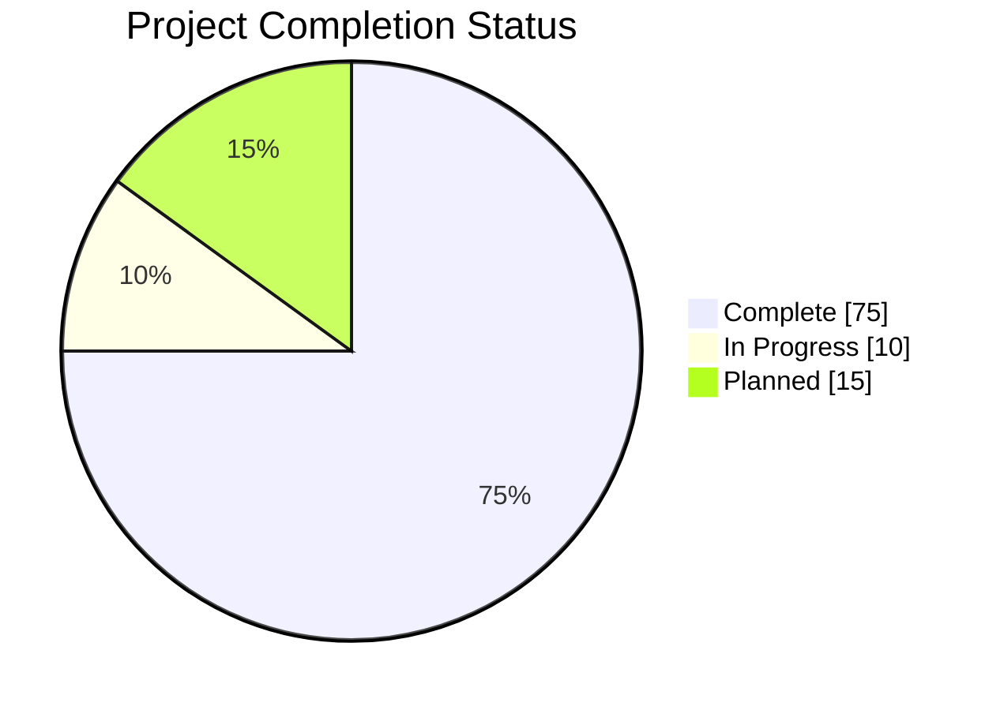
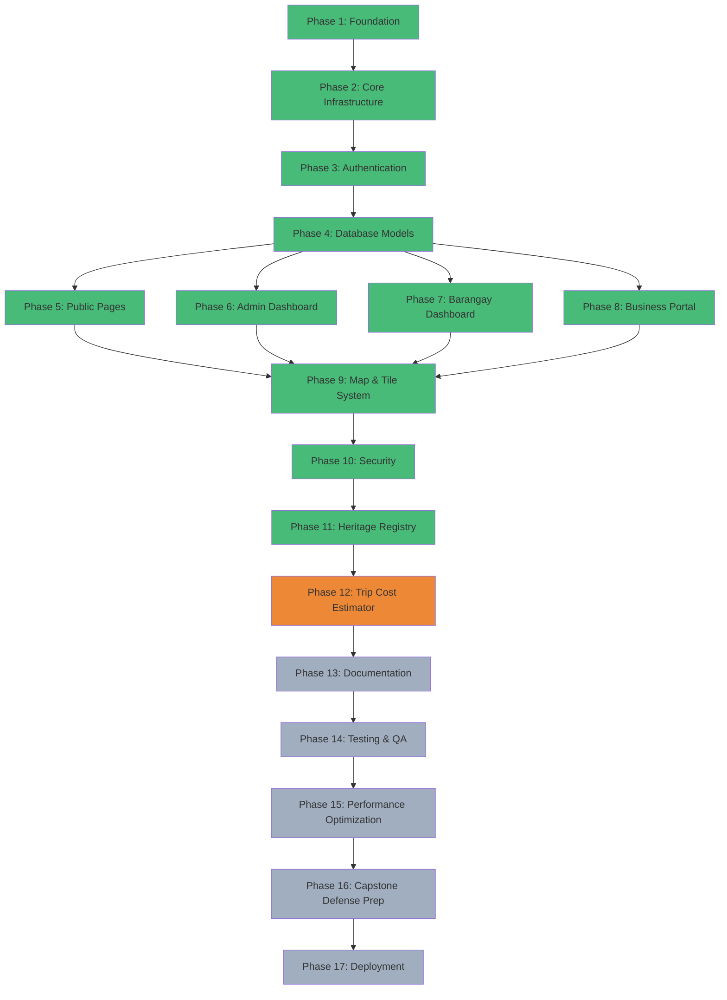
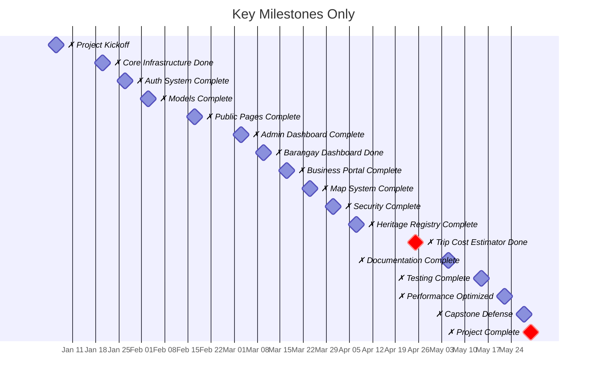

# Project Timeline - Mermaid.js Gantt Chart

**Project:** Interactive Digital Cultural Map and Local Tourism Information System for Mangatarem, Pangasinan  
**Timeline:** January 6, 2026 - May 30, 2026  
**Overall Progress:** 75% Complete

---

## Gantt Chart

```mermaid
gantt
    title Project Timeline - Cultural Map & Tourism System
    dateFormat  YYYY-MM-DD
    axisFormat  %b %d
    excludes    weekends

    section Phase 1: Foundation
    Project Setup              :done, p1, 2026-01-06, 7d
    Requirements Analysis      :done, p2, after p1, 5d
    Architecture Design        :done, p3, after p2, 3d
    ✗ Project Kickoff          :milestone, m1, 2026-01-06, 0d

    section Phase 2: Core Infrastructure
    Database Schema Design     :done, p4, 2026-01-13, 4d
    Flask App Factory          :done, p5, after p4, 3d
    Configuration Management   :done, p6, after p5, 2d
    Extensions Setup           :done, p7, after p6, 2d
    ✗ Core Infrastructure Done :milestone, m2, 2026-01-20, 0d

    section Phase 3: Authentication
    User Registration/Login    :done, p8, 2026-01-20, 5d
    Role-Based Access Control  :done, p9, after p8, 3d
    Password Reset Flow        :done, p10, after p9, 2d
    Google OAuth Integration   :done, p11, after p10, 3d
    ✗ Auth System Complete     :milestone, m3, 2026-01-27, 0d

    section Phase 4: Database Models
    Core Models (20+)          :done, p12, 2026-01-27, 4d
    Heritage Models (7 forms)  :done, p13, after p12, 3d
    Migration Scripts          :done, p14, after p13, 2d
    Data Seeding               :done, p15, after p14, 2d
    ✗ Models Complete          :milestone, m4, 2026-02-03, 0d

    section Phase 5: Public Pages
    Home Page                  :done, p16, 2026-02-03, 2d
    Attraction Pages           :done, p17, after p16, 3d
    Event Listing              :done, p18, after p17, 2d
    Gallery                    :done, p19, after p18, 2d
    Search & Filter            :done, p20, after p19, 3d
    Barangay Profiles          :done, p21, after p20, 2d
    ✗ Public Pages Complete    :milestone, m5, 2026-02-17, 0d

    section Phase 6: Admin Dashboard
    Admin Overview             :done, p22, 2026-02-17, 3d
    Content Management         :done, p23, after p22, 4d
    Approval Workflows         :done, p24, after p23, 3d
    User Management            :done, p25, after p24, 2d
    Analytics Dashboard        :done, p26, after p25, 3d
    ✗ Admin Dashboard Complete :milestone, m6, 2026-03-03, 0d

    section Phase 7: Barangay Dashboard
    Barangay Overview          :done, p27, 2026-03-03, 2d
    Attraction Submission      :done, p28, after p27, 3d
    Event Submission           :done, p29, after p28, 2d
    Gallery Upload             :done, p30, after p29, 2d
    Profile Management         :done, p31, after p30, 3d
    ✗ Barangay Dashboard Done  :milestone, m7, 2026-03-10, 0d

    section Phase 8: Business Portal
    Business Registration      :done, p32, 2026-03-10, 2d
    Establishment CRUD         :done, p33, after p32, 4d
    Room Management            :done, p34, after p33, 2d
    Menu Item Management       :done, p35, after p34, 2d
    Review System              :done, p36, after p35, 3d
    ✗ Business Portal Complete :milestone, m8, 2026-03-17, 0d

    section Phase 9: Map & Tile System
    Mapbox Integration         :done, p37, 2026-03-17, 2d
    MVT Tile Generation        :done, p38, after p37, 3d
    Tile Caching (Redis)       :done, p39, after p38, 2d
    Layer Management           :done, p40, after p39, 3d
    ✗ Map System Complete      :milestone, m9, 2026-03-24, 0d

    section Phase 10: Security
    CSRF Protection            :done, p41, 2026-03-24, 2d
    Rate Limiting              :done, p42, after p41, 2d
    Input Sanitization         :done, p43, after p42, 3d
    SQL Injection Prevention   :done, p44, after p43, 2d
    Audit Logging              :done, p45, after p44, 2d
    ✗ Security Complete        :milestone, m10, 2026-03-31, 0d

    section Phase 11: Heritage Registry
    Form 01: Natural Heritage  :done, p46, 2026-03-31, 1d
    Form 02: Built Heritage    :done, p47, after p46, 1d
    Form 03: Movable Heritage  :done, p48, after p47, 1d
    Form 04: Intangible Heritage :done, p49, after p48, 1d
    Form 05: Personality Profile :done, p50, after p49, 1d
    Form 06: Cultural Institution :done, p51, after p50, 1d
    Form 07: LGU Culture Program :done, p52, after p51, 1d
    Heritage API Endpoints     :done, p53, after p52, 2d
    ✗ Heritage Registry Complete :milestone, m11, 2026-04-07, 0d

    section Phase 12: Trip Cost Estimator (IN PROGRESS)
    Cost Models Design         :active, p54, 2026-04-07, 2d
    Admin Cost Management      :active, p55, after p54, 4d
    Public Estimator UI        :p56, after p55, 4d
    Calculator JavaScript      :p57, after p56, 4d
    API Endpoints              :p58, after p54, 2d
    Testing & Validation       :p59, after p57, 2d
    ✗ Trip Cost Estimator Done :milestone, m12, 2026-04-25, 0d

    section Phase 13: Documentation
    DFD Diagram Updates        :p60, 2026-04-26, 2d
    ERD Diagram Updates        :p61, after p60, 2d
    API Reference Update       :p62, 2026-04-28, 3d
    User Manual Update         :p63, after p62, 2d
    Admin Guide Update         :p64, after p63, 2d
    Process Map Diagram        :p65, 2026-05-01, 2d
    ✗ Documentation Complete   :milestone, m13, 2026-05-05, 0d

    section Phase 14: Testing & QA
    Unit Tests (Models)        :p66, 2026-05-06, 4d
    API Integration Tests      :p67, after p66, 4d
    E2E Tests (User Flows)     :p68, after p67, 6d
    Security Audit             :p69, 2026-05-08, 4d
    Performance Testing        :p70, after p69, 4d
    Bug Fixes                  :p71, after p68, 3d
    ✗ Testing Complete         :milestone, m14, 2026-05-15, 0d

    section Phase 15: Performance Optimization
    Query Optimization         :p72, 2026-05-16, 3d
    Caching Strategy           :p73, after p72, 3d
    Asset Optimization         :p74, after p73, 2d
    Lighthouse Audit           :p75, after p74, 2d
    Implement Fixes            :p76, after p75, 4d
    ✗ Performance Optimized    :milestone, m15, 2026-05-22, 0d

    section Phase 16: Capstone Defense Prep
    Capstone Chapters          :p77, 2026-05-23, 6d
    Presentation Slides        :p78, after p77, 3d
    Demo Preparation           :p79, after p78, 3d
    Printable Documentation    :p80, 2026-05-24, 3d
    Rehearsal & Refinement     :p81, after p79, 3d
    ✗ Capstone Defense         :milestone, m16, 2026-05-28, 0d

    section Phase 17: Deployment
    Vercel Deployment          :p82, 2026-05-28, 2d
    Production DB Setup        :p83, after p82, 2d
    Domain Configuration       :p84, after p83, 1d
    Final QA                   :p85, after p84, 2d
    ✗ Project Complete         :milestone, m17, 2026-05-30, 0d
```

---

## Progress Overview



---

## Phase Dependencies



---

## Milestone Timeline



---

## How to Render

### Option 1: GitHub/GitLab
- Mermaid diagrams render automatically in `.md` files on GitHub/GitLab

### Option 2: VS Code
1. Install extension: **Markdown Preview Mermaid Support**
2. Open this file and preview with `Ctrl+Shift+V` (Windows) or `Cmd+Shift+V` (Mac)

### Option 3: Online Renderer
1. Go to [Mermaid Live Editor](https://mermaid.live/)
2. Copy-paste any mermaid code block
3. Export as PNG, SVG, or PDF

### Option 4: Command Line
```bash
# Install mmdc (Mermaid CLI)
npm install -g @mermaid-js/mermaid-cli

# Convert to PNG/SVG/PDF
mmdc -i PROJECT_TIMELINE_MERMAID.md -o gantt-chart.png
```

---

*Generated: April 15, 2026*
