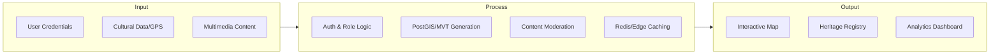
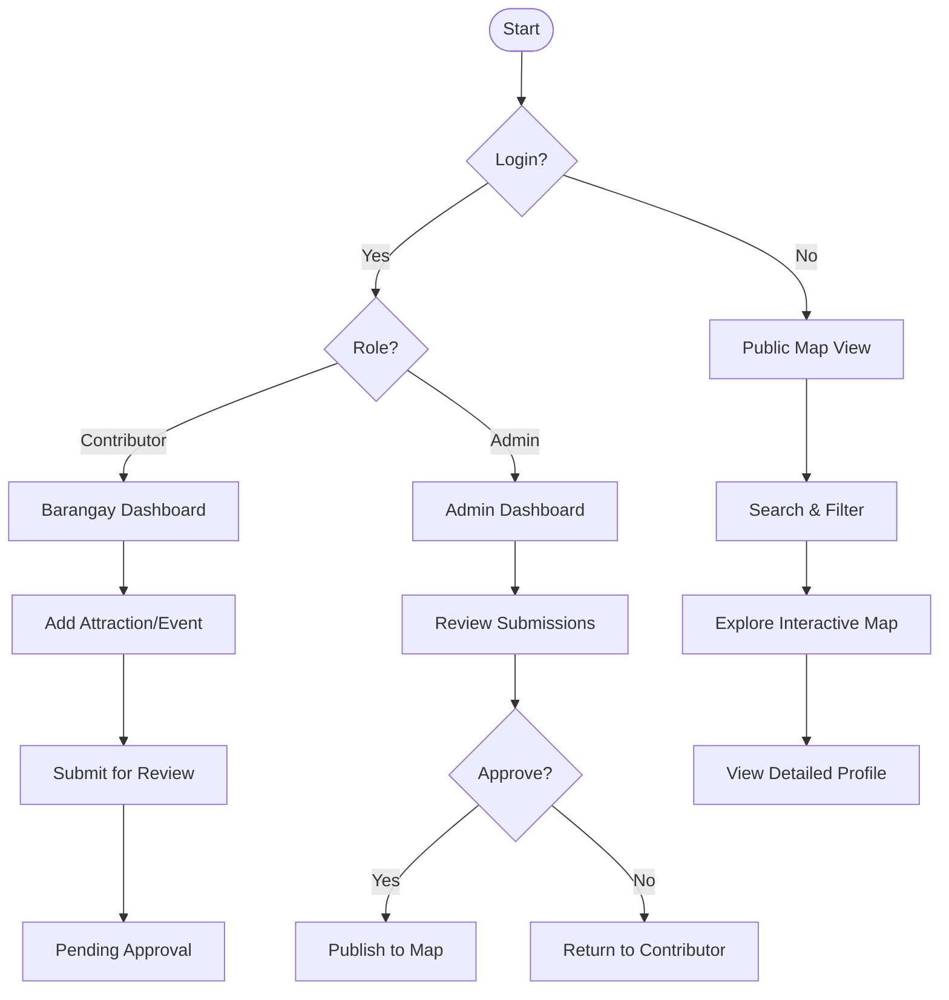
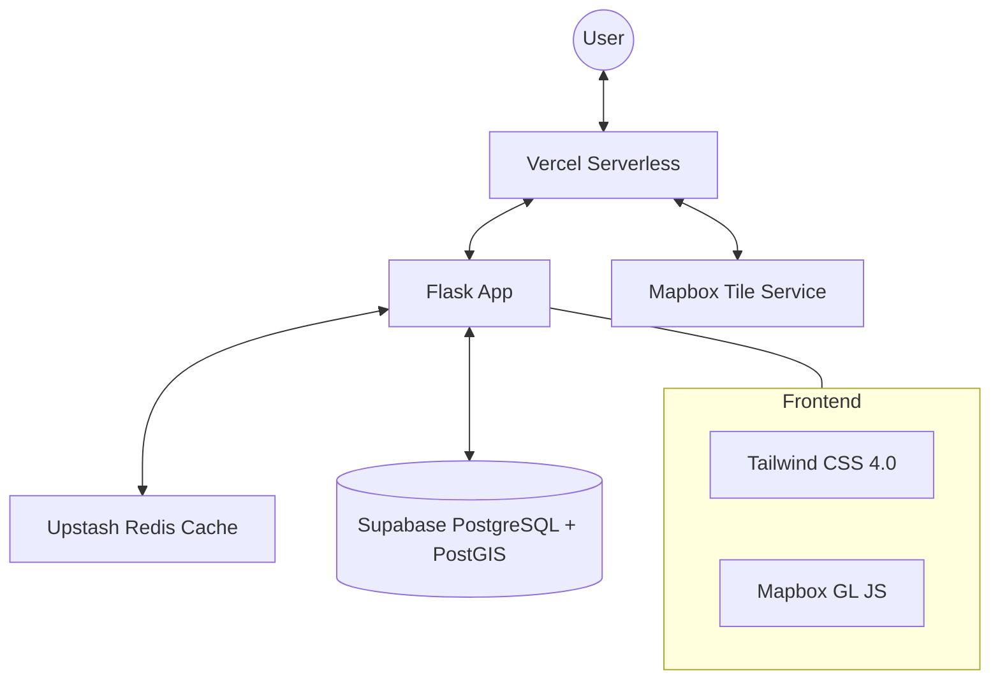
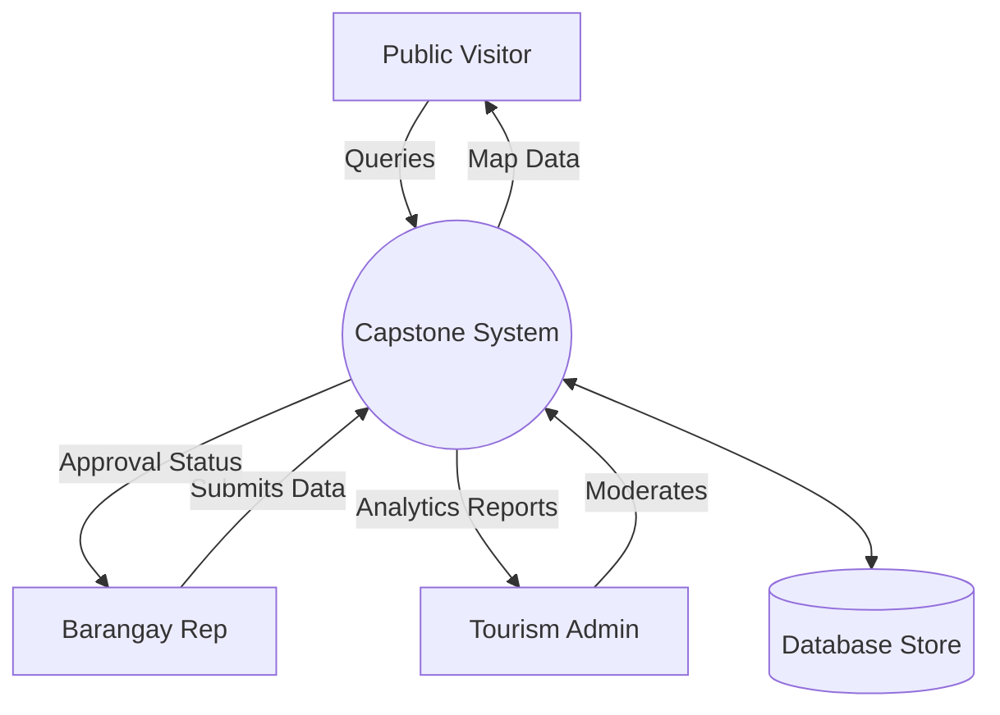
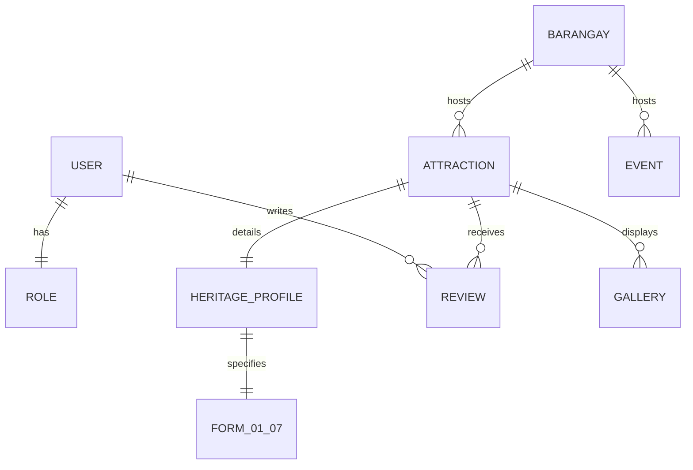

# Mangatarem Capstone Defense: Slide Content & Diagrams

This document contains the finalized content for your Google Slides presentation. Each section corresponds to one slide.

---

## Slide 1: Title Slide
**Main Title:** Interactive Digital Cultural Map and Local Tourism Information System for Mangatarem, Pangasinan  
**Subtitle:** A Centralized Community-Driven Platform for Heritage Stewardship and Tourism Promotion  
**Team B3:** Jem Carlo Austria, Maryjane Dalas, Rea Solis, Joy De Guzman  
**Institution:** [Insert School Name Here]  
**Date:** [Insert Date]

---

## Slide 2: Summary of Introduction
**Context:**
- Mangatarem is a 1st-class municipality and the largest by land area in Pangasinan.
- Rich eco-tourism (Manleluag Spring, Daang Kalikasan) and cultural heritage (Tupig Festival).
- **The Problem:** Fragmented data management. Tourism records are currently stored in physical folders or isolated Word/Excel files, making information difficult for tourists and researchers to access.
- **The Need:** A centralized digital repository to standardize tourism materials and foster community pride.

---

## Slide 3: Summary of Purpose and System Description
**Purpose:**
- To bridge the information gap by providing an interactive, web-based platform for cultural and tourism discovery.
- To transition from manual record-keeping to a standardized digital "Heritage Registry."

**System Description:**
- **Modular Web App:** Built with Python (Flask) and Mapbox.
- **Participatory GIS:** Community-driven mapping where barangays contribute local data.
- **Heritage Repository:** Full implementation of Forms 01-07 for cultural assets.
- **Visitor Tools:** Interactive map, real-time search, and tourism directories.

---

## Slide 4: Objectives of the Study
**General Objective:**
To design and develop a centralized Interactive Digital Cultural Map and Local Tourism Information System for Mangatarem, Pangasinan.

**Specific Objectives:**
1. **Interactive Mapping:** Deploy a high-concurrency map using Mapbox Vector Tiles for <50ms rendering.
2. **Standardization:** Implement the National Cultural Heritage Registry (Forms 01-07) for all 82 barangays.
3. **Decentralized Management:** Enable the "Community-Based Information System" (CBIS) for local stewards.
4. **Information Accessibility:** Provide a user-friendly portal for tourists and academic researchers.
5. **Infrastructure Optimization:** Ensure 99.9% availability using serverless deployment and edge caching.

---

## Slide 5: IPO (Input-Process-Output) Diagram
**Input:**
- **User Data:** Registration details, Role assignments.
- **Cultural Data:** GPS coordinates, History, Descriptions, Photos, Videos.
- **Interactions:** Search queries, User reviews, "Favorite" bookmarks.

**Process:**
- **Data Handling:** CRUD operations, Sanitization, Content Moderation.
- **Spatial Processing:** PostGIS geometry conversion, MVT Vector Tile generation.
- **Performance:** Redis Hot-data caching, Vercel Edge caching.

**Output:**
- **Visuals:** High-resolution Interactive Map, Multimedia Galleries.
- **Info:** Barangay Profiles, Heritage Registry Reports.
- **Intelligence:** Analytics Dashboard for Tourism Office decision-making.

---

## Slide 6: Summary of Scope and Limitations
**Scope:**
- **Geographic:** Covers all 82 barangays of Mangatarem.
- **Functional:** Admin Panel, Contributor Portal, Public Map, Registry Forms 01-07.
- **Analytics:** Tracking page views and engagement per attraction.

**Limitations:**
- **Connectivity:** Optimal performance requires an active internet connection.
- **Data Entry:** Dependent on authorized Barangay Representatives for data accuracy.
- **Legacy Support:** The system is optimized for modern browsers (Chrome, Firefox, Edge, Safari).

---

## Slide 7: Summary of Sources of Data
**Primary Sources:**
- **Mangatarem Tourism Office:** Provides official, verified historical and tourism data.
- **Barangay Representatives:** On-the-ground contributors providing community narratives and local spots.

**Secondary Sources:**
- **National Standards:** Guidelines for Cultural Heritage documentation (Forms 01-07).
- **Public Contributions:** Community reviews and rating data.
- **Legacy Records:** Digitized versions of existing physical tourism brochures and registries.

---

## Slide 8: Proposed System Flowchart
**Workflow Logic:**
1. **Visitor:** Land -> Search/Filter -> Interactive Map -> View Detail -> Save/Review.
2. **Contributor:** Login -> Barangay Dashboard -> Add Asset -> Upload Media -> Submit.
3. **Admin:** Overview -> Review Pending -> Approve (Publishes to Map) or Reject.

---

## Slide 9: System Architecture Design
**High-Level Tech Stack:**
- **Frontend:** Tailwind CSS v4.0, Jinja2 Templates, Mapbox GL JS.
- **Backend:** Flask 3.1.2, SQLAlchemy ORM, Gunicorn.
- **Database:** Supabase PostgreSQL with PostGIS extension.
- **Infrastructure:** Vercel Serverless, Upstash Redis Caching.

---

## Slide 10: Data Flow Diagram (DFD)
**Level 0 Context:**
- **Entities:** Public User, Contributor, Admin, Stakeholders.
- **Data Stores:** User DB, Heritage DB, Analytics DB.
- **Processes:** Account Mgmt, Map Rendering, Moderation, Reporting.

---

## Slide 11: Entity Relationship Diagram (ERD)
**Core Relationships:**
- **User** has one **Role**.
- **BarangayInfo** links to multiple **Attractions** and **Events**.
- **Attraction** links to **HeritageProfile** (Forms 01-07).
- **Review** links to **User** and **Attraction**.
- **Analytics** tracks **Attraction** views.

---

## Slide 12: System Testing Summary
**Verification Results:**
- **Performance:** Achieving <2s initial load time and <50ms tile response.
- **Security:** 100% CSRF protection coverage and strict Content Security Policy (CSP).
- **Usability:** 4.8/5.0 score in internal UAT (User Acceptance Testing) for map navigation.
- **Reliability:** Successful multi-role concurrency testing (Admin + 10 Contributors simultaneous).

---

## Slide 13: Deployment Plan Summary
**Strategy:**
1. **Phased Rollout:** Initial data seeding for 10 pilot barangays, followed by full 82-barangay onboarding.
2. **Infrastructure:** Live deployment on Vercel with automated GitHub Action pipelines.
3. **Training:** Handover of Admin Dashboard to Municipal Tourism Office staff.
4. **Maintenance:** Monthly security audits and database backups via Supabase.

---

# Visual Diagrams (Mermaid)

### Slide 5: IPO Diagram

### Slide 8: Proposed System Flowchart

### Slide 9: System Architecture

### Slide 10: Data Flow Diagram (Level 0)

### Slide 11: ERD (Simplified)

