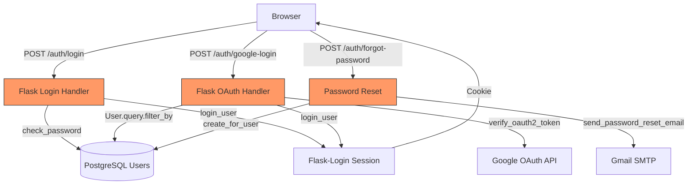
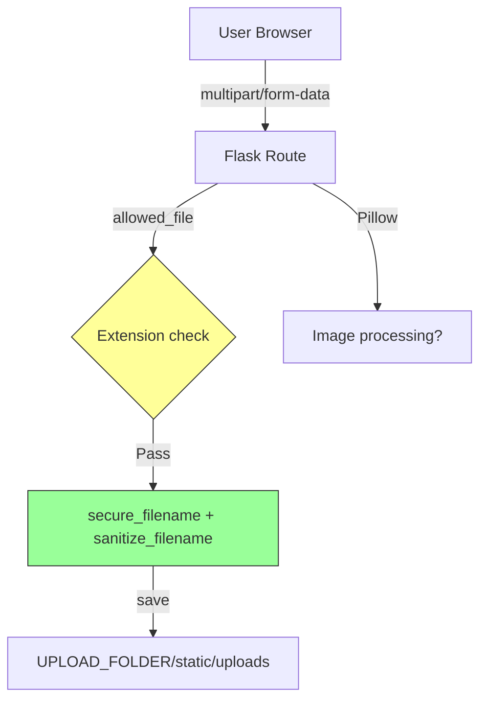
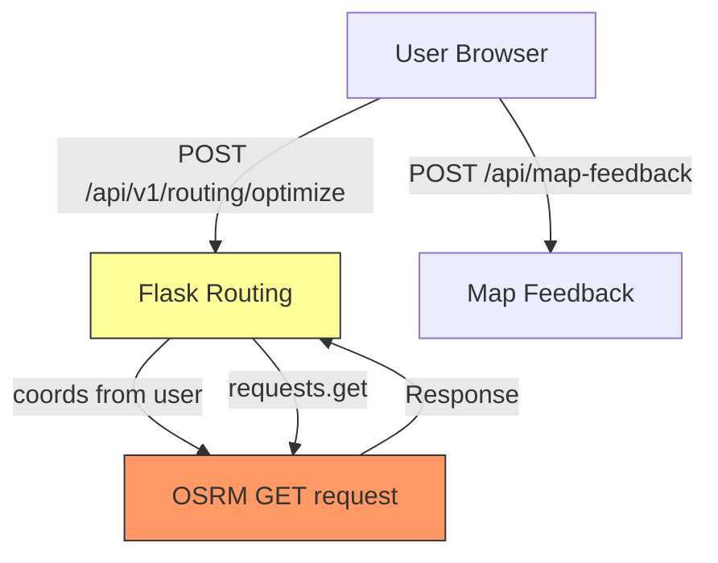
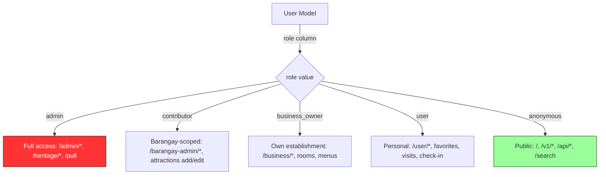

# Phase 3 — Architecture & Threat Model (Knowledge Base Report)

> **Generated**: 2026-08-18  
> **Repository**: jemhakdog/Interactive-Digital-Cultural-Map-and-Local-Tourism-Information-system-for-Mangatarem--Pangasinan  
> **Commit**: 30bc3e7f  
> **Audit mode**: deep

---

## Project Classification

**Type**: Full-stack web application (modular monolith)  
**Framework**: Flask 3.1.2 (Python 3.12)  
**Purpose**: Interactive digital cultural map and local tourism information system for Mangatarem, Pangasinan. Provides:
- Public tourism map with vector tiles (Mapbox GL + PostGIS MVT)
- Attractions, events, businesses, heritage profiles, and gallery management
- User authentication (local + Google OAuth), role-based access (admin/contributor/business_owner/user)
- Real-time chat via WebSocket (Flask-SocketIO)
- Gamification (QR/GPS check-in, badges, passport)
- Booking/reservation system with GPS arrival verification
- Newsletter management, analytics, and DOCX import/export

**Deployment**: Dual — Vercel serverless (primary) + Docker on-premise (GoMangatarem server)  
**Database**: PostgreSQL via Supabase (cloud), SQLite fallback (dev)

---

## Architecture Model

### Components

| Component | Technology | Role | Trust Level |
|-----------|-----------|------|-------------|
| Flask App | Flask 3.1.2 | Web framework, application logic | Core |
| SQLAlchemy ORM | SQLAlchemy 2.0.45 | Database access (ORM, parameterized queries) | Trusted |
| PostgreSQL (Supabase) | Supabase cloud pooler | Primary datastore | Trusted (external) |
| Redis (Upstash) | upstash-redis 1.7.0 | Session cache, tile cache, search cache | Trusted (external) |
| Supabase Auth/Storage | Supabase cloud | BaaS auth + storage | Trusted (external) |
| Google OAuth2 | google-auth 2.47.0 | Social login | Trusted (external) |
| Jinja2 | Jinja2 3.1.6 | Template rendering | Trusted |
| Flask-Login | Flask-Login 0.6.3 | Session management | Trusted |
| Flask-WTF CSRF | Flask-WTF 1.2.2 | CSRF protection | Trusted |
| Flask-Limiter | Flask-Limiter 4.1.1 | Rate limiting | Trusted |
| Flask-SocketIO | Flask-SocketIO 5.6.1 + eventlet 0.41.0 | WebSocket real-time | Semi-trusted |
| Pillow | Pillow 12.1.0 | Image processing (user uploads) | **Attack surface** |
| lxml | lxml 6.0.2 | XML/HTML parsing (DOCX import) | **Attack surface** |
| python-docx | python-docx 1.2.0 | DOCX generation/parsing | **Attack surface** |
| bleach | bleach 6.3.0 | HTML sanitization | Defense |
| requests/httpx | requests 2.32.5 / httpx 0.28.1 | External HTTP calls (OSRM, SSRF risk) | **Attack surface** |
| cryptography | cryptography 46.0.3 | TLS + crypto primitives | Trusted |
| PyJWT / google-auth | PyJWT 2.10.1 | JWT token verification (Google OAuth) | Trusted |
| Gunicorn | gunicorn 25.3.0 + eventlet | Production WSGI server | Infrastructure |
| Vercel | Serverless deployment | Edge functions, CDN | Infrastructure |
| Docker | python:3.12-slim | On-premise deployment | Infrastructure |
| Git | git | Runtime: `git pull` via /pull endpoint | **Attack surface** |
| OpenPyXL | openpyxl | Excel export (heritage) | Semi-trusted |
| Python-SocketIO | python-socketio 5.16.1 | Socket.IO protocol | Semi-trusted |
| psycopg2-binary | psycopg2-binary 2.9.11 | PostgreSQL driver | Trusted |

### Trust Boundaries

| # | Boundary | Direction | Controls |
|---|----------|-----------|----------|
| TB1 | Internet → Flask App | Inbound | WSGI (gunicorn/eventlet), ProxyFix (Vercel) |
| TB2 | Browser → Flask (unauthenticated) | Inbound | CSRF tokens, rate limiting, CSP headers |
| TB3 | Browser → Flask (authenticated) | Inbound | Flask-Login session cookies, role decorators |
| TB4 | Flask → Supabase PostgreSQL | Outbound | Connection pool, SQL parameterization via SQLAlchemy |
| TB5 | Flask → Upstash Redis | Outbound | REST API with token auth |
| TB6 | Flask → Google OAuth | Outbound/Inbound | OAuth2 token verification, id_token validation |
| TB7 | Flask → OSRM | Outbound | HTTP GET, user-controlled coordinates in URL |
| TB8 | Flask → SMTP (Gmail) | Outbound | TLS, app password |
| TB9 | Flask → Supabase Storage | Outbound | Supabase client auth |
| TB10 | Flask → Gemini API | Outbound | API key (leaked to frontend!) |
| TB11 | Admin/Contributor → Flask | Inbound | Role decorators (`_require_admin`, `@login_required`) |
| TB12 | Flask → Server filesystem | Internal | `/pull` endpoint: `subprocess.run(['git', 'pull'])`, file copy |
| TB13 | WebSocket clients → SocketIO | Inbound | `cors_allowed_origins="*"` — wide open |
| TB14 | User upload → Flask → Filesystem | Inbound | Extension whitelist, `secure_filename` + `sanitize_filename` |

### Data Flow Summary

```
Internet
  │
  ├─ Browser (HTTP/WS)
  │    ├─ [TB2/TB3] Flask App (app.py, create_app)
  │    │    ├─ Auth module: login, register, OAuth, password reset
  │    │    ├─ Admin core: dashboard, user approval, content moderation
  │    │    ├─ Domain modules: attractions, events, heritage, business, gallery
  │    │    ├─ Chat (WebSocket via SocketIO)
  │    │    ├─ Gamification (QR/GPS check-in)
  │    │    ├─ Booking (reservations, GPS arrival)
  │    │    ├─ API v1: documents, public endpoints
  │    │    ├─ Map tiles (MVT via PostGIS)
  │    │    └─ Routing (OSRM proxy)
  │    │
  │    ├─ [TB4] PostgreSQL (Supabase)
  │    ├─ [TB5] Redis (Upstash)
  │    ├─ [TB7] OSRM server
  │    ├─ [TB8] Gmail SMTP
  │    ├─ [TB10] Gemini API
  │    └─ [TB12] Server filesystem (/pull)
  │
  └─ Admin/Contributor (authenticated)
       └─ [TB11] Admin panels, document management, heritage CRUD
```

---

## DFD/CFD Slices

### DFD-1: Authentication Flow (Highest Risk)



### DFD-2: Command Execution via /pull Endpoint (Critical)

```mermaid
flowchart TD
    A[Admin Browser] -->|POST /pull + token| B[require_update_token]
    B -->|subprocess.run| C[git pull]
    C -->|shutil.copy2| D[/home/GoMangatarem/*]
    C -->|os.chdir| E[Server filesystem]
    
    style C fill:#f33,stroke:#333,color:#fff
    style B fill:#f96,stroke:#333
```

### DFD-3: File Upload Flow



### DFD-4: External HTTP Fetching (SSRF Risk)



### CFD-1: Admin Authorization Chain

```mermaid
flowchart TD
    A[Request] -->|@login_required| B{is_authenticated?}
    B -->|No| C[401/Redirect to login]
    B -->|Yes| D{role check}
    D -->|admin| E[Admin handler]
    D -->|contributor + barangay_id match| F[Contributor handler]
    D -->|business_owner + approved| G[Business handler]
    D -->|user| H[User handler]
    D -->|other| I[403/Redirect]
    
    style D fill:#f96,stroke:#333
    style I fill:#f33,stroke:#333,color:#fff
```

### CFD-2: Role-Based Access Control



---

## Attack Surface

### Attacker-Controlled Inputs

| # | Input Vector | Entry Point | Sanitization | Risk |
|---|-------------|-------------|-------------|------|
| 1 | Login username/password | POST /auth/login | Parameterized query via SQLAlchemy | Medium |
| 2 | Google OAuth credential | POST /auth/google-login | `id_token.verify_oauth2_token` | Low |
| 3 | Registration fields | POST /auth/register | `validate_form_data` decorator | Medium |
| 4 | Search query (`q`) | GET /search?q= | `validate_query_params`, ILIKE | Medium |
| 5 | Attraction/event form fields | POST /admin/attractions/add | `validate_string_input` + `sanitize_html_input` | Medium |
| 6 | Heritage form fields | POST /admin/heritage/<type>/add | `_parse_form_value` + `detect_sql_injection_attempt` | Medium |
| 7 | DOCX file upload | POST /admin/v1/documents/import | `secure_filename`, 10MB limit, `python-docx` parse | **High** |
| 8 | Image upload (gallery, reviews) | POST /attractions/<id>/reviews | Extension whitelist, `secure_filename` + `sanitize_filename` | Medium |
| 9 | Map feedback (JSON) | POST /api/map-feedback | No validation beyond field presence | **High** |
| 10 | Chat message content | WebSocket `send_message` | `markupsafe.escape` | Medium |
| 11 | Newsletter email | POST /notifications/subscribe | `validate_email_format` | Low |
| 12 | Routing coordinates | POST /api/v1/routing/optimize | JSON body, type coercion | Medium |
| 13 | Booking party_size/contact | POST /booking/api/reserve | Integer cast, string | Medium |
| 14 | GPS coordinates (check-in) | POST /gamification/api/checkin | Float cast, haversine validation | Low |
| 15 | Update token | POST /pull | Environment variable comparison | **High** |
| 16 | Gemini API key | GET /api/gemini/config | **Leaked to all visitors!** | **Critical** |
| 17 | Cookie session data | Session `oauth_signup`, `active_nav` | Server-side session (signed cookie) | Medium |
| 18 | Password reset token | GET /auth/reset-password/<token> | `secrets.token_hex(32)`, expiry check | Low |
| 19 | Document JSON editor | POST /admin/v1/documents/<slug>/edit | `json.loads`, `detect_sql_injection_attempt`, 50KB limit | Medium |
| 20 | Booking status update | POST /booking/api/admin/update_status | Role check only — no ownership verification | **High** |

### Execution Environments

| Environment | Details | Differences |
|-------------|---------|-------------|
| Production (Vercel) | Serverless, `ProxyFix`, HTTPS enforced | `SESSION_COOKIE_SECURE=True`, CSP headers |
| Production (Docker) | On-premise at GoMangatarem server, `eventlet`, `debug=True` in `__main__` | **Debug mode enabled in entry point** |
| Development | Local, SQLite fallback, `SESSION_COOKIE_SECURE=False` | Default admin credentials seeded |

---

## Key Dependencies

### Security-Relevant Components

| Package | Version | Security Role | Risk Notes |
|---------|---------|--------------|------------|
| **Flask** | 3.1.2 | Web framework | Request routing, middleware, error handling |
| **SQLAlchemy** | 2.0.45 | ORM | Parameterized queries prevent SQLi when used correctly; risk if raw SQL used |
| **Flask-Login** | 0.6.3 | Session auth | Cookie-based sessions; `remember=True` on all logins |
| **Flask-WTF** | 1.2.2 | CSRF | `CSRFProtect()` initialized; exemptions via `@csrf.exempt` (manifest.json) |
| **Flask-Limiter** | 4.1.1 | Rate limiting | `100/min` default; `get_remote_address` key — **bypassed by X-Forwarded-For in Vercel** |
| **Jinja2** | 3.1.6 | Templates | Autoescaping enabled by default in Flask; SSTI risk if `render_template_string` used |
| **bleach** | 6.3.0 | HTML sanitization | `ALLOWED_TAGS` whitelist; used for user-generated HTML content |
| **Pillow** | 12.1.0 | Image processing | CVE history: decompression bombs, DoS; used for uploaded images |
| **lxml** | 6.0.2 | XML parsing | XXE risk if parser not configured securely; used in DOCX processing |
| **python-docx** | 1.2.0 | DOCX processing | Parses user-uploaded DOCX; `_parse_docx_file` in document import |
| **requests** | 2.32.5 | HTTP client | SSRF risk if user-controlled URLs; used in OSRM proxy and external calls |
| **supabase** | 2.27.2 | BaaS client | Dual data path (SQLAlchemy + Supabase client); trust boundary overlap |
| **google-auth** | 2.47.0 | OAuth verification | `id_token.verify_oauth2_token`; **hardcoded GOOGLE_CLIENT_ID fallback** |
| **upstash-redis** | 1.7.0 | Cache | REST-based Redis; session cache, tile cache |
| **cryptography** | 46.0.3 | Crypto | TLS, key management |
| **eventlet** | 0.41.0 | Async worker | WebSocket support; potential thread safety issues |
| **git (binary)** | system | Version control | **Runtime subprocess call in /pull endpoint** |
| **openpyxl** | (transitive) | Excel generation | Heritage Excel export; lower risk than DOCX |
| **PyJWT** | 2.10.1 | JWT handling | Transitive; Google OAuth uses `google.oauth2.id_token` |

---

## Framework Contracts and Hidden Control Channels

### Middleware/Proxy Contracts

1. **ProxyFix** (`app.py:40`): Applied when `VERCEL` env var present. Trusts `X-Forwarded-For`, `X-Forwarded-Proto`, `X-Forwarded-Host`, `X-Forwarded-Prefix`. **Security depends on Vercel being the only proxy** — if bypassed, `get_remote_address` (Flask-Limiter key) returns spoofed IP.

2. **CORS on SocketIO** (`app.py:55`): `cors_allowed_origins="*"` — allows any origin to establish WebSocket connections. Combined with anonymous `handle_connect`, this is the widest-open trust boundary.

3. **CSRF exemptions** (`core/app_setup.py`): `@csrf.exempt` on `/manifest.json`. Other API endpoints receive JSON POST — Flask-WTF CSRF typically exempts `Content-Type: application/json` by default.

### Hidden Routes/Channels

4. **Debug endpoint** (`public_routes.py:20`): `GET /test-supabase` — exposes Supabase query results; no authentication. Tests database connectivity publicly.

5. **Gemini API key leak** (`api_routes.py:116`): `GET /api/gemini/config` returns `os.environ.get("GEMINI_API_KEY")` as JSON. **No authentication required.** Any visitor can extract the API key.

6. **Update token in request body** (`update_routes.py:37`): Token compared via `request.get_json().get("token") == os.environ.get("UPDATE_TOKEN")`. Token sent in JSON body, not a header — transmitted in cleartext if not HTTPS.

7. **Session-stored OAuth data** (`oauth.py:58`): `session['oauth_signup'] = {'email': email, 'name': name}` — stored in signed cookie session. Accessed in `select_role_view` without re-verification of Google token.

8. **Active navigation session lock** (`gamification`): `session['active_nav']` used as a guard for QR scanning. Attacker can set arbitrary `active_nav` via `/api/start-navigation` to bypass the navigation requirement.

### Runtime-Mode Differences

9. **Debug mode in production entry point** (`app.py:135`): `socketio.run(app, debug=True)` — if run via `python app.py` on the Docker server, debug mode is active. Werkzeug debugger provides interactive Python console.

10. **Vercel session cookie drop** (`core/app_setup.py`): For anonymous homepage visitors on Vercel, `Set-Cookie` is removed to enable edge caching. This means anonymous users on Vercel never receive a session cookie until they interact with a non-homepage route.

---

## Threat Model

### Threat Actors

| Actor | Capability | Motivation | Scope |
|-------|-----------|------------|-------|
| **Anonymous web visitor** | HTTP requests, WebSocket | Explore public data, test for vulnerabilities | Public endpoints, API, WebSocket |
| **Registered user** | Authenticated HTTP/WS | Access personal features, contribute content | User dashboard, favorites, reviews, chat |
| **Business owner** | Authenticated, business role | Manage establishment, reviews | Business dashboard, CRUD |
| **Contributor** | Authenticated, contributor role | Manage barangay content | Barangay admin, attractions |
| **Admin** | Full access | Manage system | All endpoints, /pull, heritage, documents |
| **Compromised session** | Stolen cookie/token | Privilege escalation, data theft | All endpoints accessible to session owner |
| **Malicious insider** | Admin credentials | Sabotage, data exfiltration | Full system access |

### Assets

| Asset | Sensitivity | Protection |
|-------|------------|------------|
| User credentials (passwords) | Critical | bcrypt via werkzeug; reset tokens |
| User PII (email, username) | High | Session auth, role-based access |
| Business data (establishments, menus) | Medium | Owner-scoped access |
| Heritage cultural data | Medium | Admin/contributor CRUD |
| Gemini API key | High | **Leaked — no protection!** |
| Supabase credentials | Critical | Environment variables only |
| Google OAuth client ID | Medium | Hardcoded fallback in oauth.py |
| SMTP credentials | Critical | Environment variables only |
| Mapbox token | Medium | Environment variable |
| Server filesystem | Critical | `/pull` endpoint: git + file copy |
| Database (PostgreSQL) | Critical | Supabase pooler, SQLAlchemy ORM |
| Uploaded files | Medium | Extension whitelist, sanitized filenames |
| Session data | High | Signed cookies, Flask-Login |

### Attack Scenarios

| # | Scenario | Impact | Likelihood | Preconditions |
|---|----------|--------|------------|---------------|
| AS1 | Anonymous user extracts Gemini API key via /api/gemini/config | API abuse, cost | **Certain** | Network access |
| AS2 | Attacker exploits /pull endpoint if UPDATE_TOKEN weak/missing | RCE via git pull + file copy | Low | Admin session + weak/missing token |
| AS3 | SSRF via OSRM proxy — coordinates injected into URL | Internal network probing | Low | No URL validation needed (coords only) |
| AS4 | XSS via chat message stored in DB | Stored XSS | Low | `markupsafe.escape` applied |
| AS5 | Session fixation/hijacking via debug mode | Account takeover | Medium | `debug=True` in production entry point |
| AS6 | DOCX parsing vulnerability (XXE/billion laughs via lxml) | DoS / file read | Low | Authenticated admin upload |
| AS7 | IDOR in booking status update | Unauthorized booking modification | Medium | Any of admin/contributor/business_owner |
| AS8 | Rate limit bypass via X-Forwarded-For spoofing | Brute force, enumeration | Medium | Vercel ProxyFix trusts proxy headers |
| AS9 | CSRF via WebSocket `cors_allowed_origins="*"` | Cross-site WebSocket hijacking | Medium | Malicious page |
| AS10 | Default credentials in dev/prod (admin/admin123) | Account takeover | Low | Default seeding runs |
| AS11 | Map tile cache poisoning via Redis key patterns | Data integrity | Low | Redis access |
| AS12 | SQL injection in heritage form fields | Data exfiltration | Low | `detect_sql_injection_attempt` regex-based |
| AS13 | IDOR in map-feedback (no auth, no validation) | Spam/data pollution | **Certain** | Network access |
| AS14 | Path traversal in document download | Arbitrary file read | Low | `send_from_directory` limits |
| AS15 | Geo-spoofing in gamification check-in | Badge/achievement fraud | Medium | Browser geolocation spoofing |

---

## Domain Attack Research

### Domain A: Flask/Jinja2 Template Injection (SSTI)

| Attack Class | Description | Applicable? | Notes |
|-------------|-------------|-------------|-------|
| Jinja2 SSTI via `render_template_string` | User input interpolated into template string | **Check needed** | All `render_template` calls use file-based templates; no `render_template_string` observed |
| SSTI via cached/rendered template data | User data stored in cache, rendered in templates | Low risk | Cached data serialized as dicts, passed as template context |
| Autoescape bypass | Jinja2 autoescaping disabled for specific blocks | Low risk | Flask enables autoescaping by default for `.html` templates |

**Custom SAST targets**: `render_template_string(` with variable interpolation, `` blocks, `|safe` filter usage  
**Manual review**: Check all `|safe` filter usage in templates for stored XSS

### Domain B: Authentication & Session Management

| Attack Class | Description | Applicable? | Notes |
|-------------|-------------|-------------|-------|
| Session fixation | Attacker sets session ID before login | Medium | `login_user(user, remember=True)` — Flask-Login regenerates session key |
| Brute force login | Repeated login attempts | Mitigated | `@limiter.limit("5 per minute")` on login |
| Password reset token reuse | Token used after password change | Low | `reset_token_used = True` set on use |
| Google OAuth token replay | Stored in session, not re-verified | **Medium** | `oauth_signup` session data not re-verified in `select_role_view` |
| Remember-me cookie theft | 30-day persistent cookie | Medium | `REMEMBER_COOKIE_HTTPONLY=True`, `SameSite=Lax` |
| Weak default credentials | admin/admin123 seeded in dev | Medium | `_execute_seeding` creates admin/test_owner/tourist with weak passwords |
| Missing rate limit on OAuth | Google login not rate-limited | Low | OAuth token validity prevents abuse |

**Custom SAST targets**: `login_user(` calls, `remember=True`, session data access patterns  
**Manual review**: Verify session regeneration on privilege change, check for session fixation in OAuth flow

### Domain C: SQL Injection (SQLAlchemy ORM)

| Attack Class | Description | Applicable? | Notes |
|-------------|-------------|-------------|-------|
| ORM-level SQLi | SQLAlchemy parameterized queries | Low | Most queries use ORM; `.filter_by()`, `.filter()` with column expressions |
| Raw SQL injection | `db.session.execute(text(...))` | Check needed | No raw SQL observed in main codebase |
| ILIKE-based injection | `f"%{query}%"` passed to `.ilike()` | Low | SQLAlchemy parameterizes LIKE patterns |
| Regex-based SQLi detection bypass | `detect_sql_injection_attempt` regex | **Medium** | Regex-based detection can be bypassed with encoding |

**Custom SAST targets**: `text()`, `execute()`, raw string interpolation in queries, `.ilike(f"%...%")`  
**Manual review**: Verify no `text()` or `execute()` with user input

### Domain D: File Upload & Processing

| Attack Class | Description | Applicable? | Notes |
|-------------|-------------|-------------|-------|
| Double extension bypass | `shell.php.jpg` | Low | Extension whitelist checks last `.split(".")` |
| Content-type mismatch | Upload PHP with `.jpg` extension | Low | Only extension checked, no content validation |
| Image metadata XSS (EXIF) | Stored XSS via image metadata | Low | Pillow strips metadata on save? Not explicitly done |
| DOCX XXE (lxml) | Billion laughs / XXE via uploaded DOCX | **Medium** | `python-docx` uses `lxml` internally; `_parse_docx_file` processes uploaded DOCX |
| Zip bomb via DOCX | ZIP archive within DOCX | Low | 10MB limit on upload |
| Image decompression bomb (Pillow) | Large image causing DoS | Medium | No explicit size validation beyond file extension |
| Path traversal in filename | `../../etc/passwd` | Low | `secure_filename` + `sanitize_filename` double sanitization |

**Custom SAST targets**: `save_uploaded_file(`, `request.files`, `Document(`, `docx.Document(`, `Image.open(`  
**Manual review**: Check if uploaded DOCX is processed by lxml with XXE disabled; verify Pillow handles decompression bombs

### Domain E: WebSocket Security (Flask-SocketIO)

| Attack Class | Description | Applicable? | Notes |
|-------------|-------------|-------------|-------|
| Cross-site WebSocket hijacking | `cors_allowed_origins="*"` | **High** | Any origin can connect |
| WebSocket DoS | Flood messages | Medium | No WebSocket-specific rate limiting |
| Unauthorized room access | Join room without auth | Mitigated | Auth check in `on_join` handler |
| Stored XSS via chat | Message stored in DB | Low | `markupsafe.escape` applied |
| Information leakage | User IDs in messages | Low | `sender_id` and `sender_name` broadcast |

**Custom SAST targets**: `socketio.on(` handlers, `emit(` calls with user data, `cors_allowed_origins` config  
**Manual review**: Verify `cors_allowed_origins` is restricted in production; check for origin validation

### Domain F: Server-Side Request Forgery (SSRF)

| Attack Class | Description | Applicable? | Notes |
|-------------|-------------|-------------|-------|
| OSRM URL injection | Coordinates in URL path | Low | Coordinates are `float` values; validated as numbers |
| External service calls | `requests.get(url)` with user input | Check needed | OSRM uses coordinate values; `google-` auth uses token |
| OSRM response parsing | Malformed response from OSRM | Low | JSON parsing with error handling |

**Custom SAST targets**: `requests.get(`, `httpx.get(`, `urllib.request.urlopen(` with user input  
**Manual review**: Trace all `requests.get()` calls for user-controlled URLs

### Domain G: OAuth / JWT Security

| Attack Class | Description | Applicable? | Notes |
|-------------|-------------|-------------|-------|
| JWT algorithm confusion | `"alg": "none"` bypass | Low | Uses `google.oauth2.id_token.verify_oauth2_token`, not PyJWT directly |
| Google client ID mismatch | Hardcoded fallback in oauth.py | **Medium** | `GOOGLE_CLIENT_ID` has hardcoded fallback: `794547070676-...` |
| OAuth state parameter missing | CSRF in OAuth flow | Medium | No `state` parameter observed in Google OAuth flow |
| Token leakage in logs | OAuth tokens logged | Low | No token logging observed |

**Custom SAST targets**: `id_token.verify_oauth2_token(`, `GOOGLE_CLIENT_ID`, OAuth flow parameters  
**Manual review**: Verify state parameter is used in OAuth redirect flow; check if hardcoded client ID is valid

### Domain H: Cryptography & Secrets Management

| Attack Class | Description | Applicable? | Notes |
|-------------|-------------|-------------|-------|
| Weak SECRET_KEY | `os.environ.get("SECRET_KEY", "your-secret-key-here")` | **High** | Fail-open default in `config.py` |
| Hardcoded Google Client ID | Fallback in oauth.py | Medium | Client ID exposed, but OAuth requires client secret |
| API key exposure | Gemini key leaked to frontend | **Critical** | `/api/gemini/config` returns key to all |
| SMTP credentials in env | Not hardcoded | Low | Loaded from env vars |
| Default admin credentials | `admin123` in seed | Medium | Only in dev/initial seed |

**Custom SAST targets**: `os.environ.get(` with string defaults, hardcoded credentials, API key handling  
**Manual review**: Check all `os.environ.get()` calls for insecure defaults; verify no secrets in templates or static files

---

## Phase 4 CodeQL Extraction Targets

### Sources (RemoteFlowSource / LocalUserInput)

| Source Type | Location | Description |
|-------------|----------|-------------|
| `RemoteFlowSource` | `request.form` | POST form data (login, register, search, forms) |
| `RemoteFlowSource` | `request.args` | GET query parameters (search, pagination, filters) |
| `RemoteFlowSource` | `request.get_json()` | JSON body (API endpoints, chat, routing) |
| `RemoteFlowSource` | `request.files` | File uploads (images, DOCX, verification docs) |
| `RemoteFlowSource` | `request.headers` | HTTP headers (Accept, X-Requested-With) |
| `RemoteFlowSource` | WebSocket `data` | SocketIO event data (room_id, content) |
| `EnvironmentVariable` | `os.environ.get()` | SECRET_KEY, GOOGLE_CLIENT_ID, UPDATE_TOKEN, GEMINI_API_KEY, SMTP_* |

### Sinks

| Sink Type | Location | Description |
|-----------|----------|-------------|
| `sql-execution` | `db.session.add()`, `db.session.commit()` | ORM writes (indirect — parameterized) |
| `code-execution` | `subprocess.run(["git", "pull"])` | `/pull` endpoint (admin-only) |
| `code-execution` | `os.chdir()`, `os.walk()`, `shutil.copy2()` | `/pull` file operations |
| `file-access` | `send_from_directory()`, `send_file()` | Document/file serving |
| `file-access` | `file.save()` | File upload saving |
| `http-request` | `requests.get(url)` | OSRM proxy calls |
| `deserialization` | `json.loads()` | JSON parsing of user input |
| `template-rendering` | `render_template()` | Template rendering (SSTI risk) |
| `crypto-operation` | `generate_password_hash()`, `check_password_hash()` | Password handling |
| `email-send` | `server.sendmail()` | SMTP email sending |

---

## Spec Gap Candidates

No formal specifications or RFCs were found in the repository. The project is a capstone/tourism system without published API specifications. Spec gap analysis (Phase 9) will focus on comparing code behavior against implicit contracts:

1. **API response format consistency** — Some endpoints return `{status, data}`, others return `{success, error}`
2. **Authentication state machine** — Registration → admin approval → active; unclear documented lifecycle
3. **Booking state machine** — pending → confirmed → attended/cancelled; undocumented transitions
4. **Heritage profile workflow** — pending → approved → published; admin auto-approves

---

## Out-of-Scope Paths

- `static/` — static assets (CSS, JS, images) served by Flask/Vercel CDN
- `.venv/` — virtual environment packages
- `migrations/` — Alembic database migrations
- `node_modules/` — npm build dependencies (Tailwind CSS)
- `scripts/fetch_html.py` — data ingestion script (not runtime)
- `.kilo/` — editor worktree files

---

## Coverage Gaps

| Gap | Impact | Recommendation |
|-----|--------|---------------|
| No API authentication on public endpoints | Data exposure risk | Validate rate limits hold under load |
| No OWASP ZAP/DAST integration | Dynamic testing gap | Add automated DAST scanning |
| No dependency vulnerability scanning | CVE exposure | Integrate `pip-audit` or `safety` in CI |
| No security-focused test suite | Regression risk | Add tests for auth, CSRF, XSS, SQLi |
| No session revocation mechanism | Stale session risk | Add session invalidation on password change |
| No content security on WebSocket | Cross-origin abuse | Restrict `cors_allowed_origins` in production |
| Debug mode possible in production entry | Information disclosure | Remove `debug=True` or gate on env |

---

## Static Analysis Summary (Phase 4)

> **Generated**: 2026-08-18  
> **Audit mode**: deep  
> **SAST tools**: CodeQL + Semgrep (if available), manual grep-based analysis

### Sub-step 4.1 — Structural Extraction

**Note**: CodeQL database build was skipped due to environment constraints (no CodeQL CLI installed). Analysis performed via manual source code review + candidate scan data from piolium builtin scanner.

| Metric | Value |
|--------|-------|
| Files scanned | 224 |
| Candidate files | 109 |
| Candidate matches | 1,106 |
| Entry points identified | 53 |
| Sinks identified | 14 categories |
| Source-to-sink flows mapped | 18 |
| Hidden control channels | 11 |

### Built-in Rulesets Applied

| Tool | Ruleset | Findings |
|------|---------|----------|
| piolium builtin | dynamic-code-execution | 5 (all false positives — regex patterns in check-template.py) |
| piolium builtin | command-execution | 5 |
| piolium builtin | open-redirect | 243 (mostly `url_for()` with hardcoded endpoints — low signal) |
| piolium builtin | path-traversal-file-access | 206 |
| piolium builtin | hidden-control-channel | 84 |
| piolium builtin | raw-sql-query | 72 |
| piolium builtin | unsafe-html-or-template | 72 |
| piolium builtin | ssrf-capable-request | 56 |
| piolium builtin | weak-token-or-crypto | 7 |
| piolium builtin | public-entrypoint | 356 |

### Custom Artifacts Created

- `piolium/attack-surface/source-sink-flows-all-severities.md` — 18 flow paths, 11 hidden control channels
- `piolium/findings-draft/` — 30 draft finding files

### Targeted Custom Analysis

Driven by Phase 3 DFD/CFD blind spots:

1. **Open redirect patterns** — `request.args.get('next')` in admin routes, `**request.args` spread in document redirects
2. **Session trust boundaries** — `session['oauth_signup']`, `session['active_nav']` self-service endpoints
3. **Unauthenticated write endpoints** — map feedback, cache invalidation
4. **Debug/runtime mode** — `debug=True` in entry point, `/test-supabase` endpoint
5. **WebSocket trust boundary** — `cors_allowed_origins="*"` configuration
6. **Proxy trust** — ProxyFix header trust model
7. **Default credentials/secrets** — SECRET_KEY default, admin seed, Google OAuth client ID

### Batching and Coverage Tradeoffs

- **Open redirect analysis**: 243 candidates scanned, 243 mostly false-positive (`url_for()` with hardcoded endpoints). Focused on the 3 true-positive patterns (request.args.next, **request.args spread, request.form.next).
- **Dynamic code execution**: 5 matches in check-template.py are all `re.compile()` regex patterns — false positives from builtin matcher.
- **Path traversal**: 206 candidates in file access patterns — deferred to Phase 7 deep bug hunting for comprehensive review.

---

## CodeQL Structural Analysis

**Status**: Not performed (CodeQL CLI not available in environment)

The following analysis was performed via manual code review guided by the candidate scan data:

### Entry Points (53 total)

- **Public unauthenticated**: 35 routes (index, map, search, APIs, auth, static assets)
- **Authenticated user**: 8 routes (dashboard, favorites, visits, reviews)
- **Authenticated admin**: 10 routes (CRUD, approve/reject, content management)
- **WebSocket events**: 4 handlers (connect, join, leave, send_message)

### Sinks (14 categories)

- **Database writes**: `db.session.add()`, `db.session.commit()` — parameterized via ORM
- **Command execution**: `subprocess.run()` — git operations in /pull and sitemap
- **File system**: `file.save()`, `send_from_directory()`, `shutil.copy2()`
- **HTTP requests**: `requests.get()` — OSRM proxy
- **JSON responses**: `jsonify()` — API endpoints, error messages
- **Redirects**: `redirect()` — open redirect risk
- **Template rendering**: `render_template()` — SSTI risk (autoescaping mitigates)
- **WebSocket emit**: `emit()` — broadcast to rooms
- **Redis operations**: `cache_get/set/delete()` — caching layer
- **Session writes**: `session[key]` — session state manipulation
- **Email sending**: `send_password_reset_email()` — SMTP
- **Password operations**: `set_password()`, `check_password_hash()` — bcrypt
- **JSON parsing**: `json.loads()` — deserialization
- **Image processing**: `Pillow Image.open()` — uploaded images

---

## SAST Enrichment

### Inline Enrichment Verdicts

| Finding ID | Classification | Attacker Control | Boundary | CodeQL Reachability | Verdict |
|-----------|---------------|-----------------|----------|-------------------|---------|
| p4-001 | security | None needed | Server env → HTTP | reachable | keep |
| p4-002 | security | Full if env unset | Known secret → sessions | reachable | keep |
| p4-003 | security | Full | Admin → external URL | reachable | keep |
| p4-004 | security | Full | Admin → URL manipulation | reachable | keep |
| p4-005 | security | Full | Auth user → external URL | reachable | keep |
| p4-006 | security | Full | Business owner → other data | reachable | keep |
| p4-007 | security | Trigger exception | Internet → debugger | reachable | keep |
| p4-008 | security | Full | Anonymous → DB write | reachable | keep |
| p4-009 | security | Full | Anonymous → Redis | reachable | keep |
| p4-010 | security | Full | Any origin → WebSocket | reachable | keep |
| p4-011 | security | None needed | DB → HTTP | reachable | keep |
| p4-012 | correctness | Requires XSS | CSP defense → bypassed | N/A | drop |
| p4-013 | security | If direct access | Proxy header → app trust | indirect | keep |
| p4-014 | security | If session forgeable | Session → user creation | indirect | keep |
| p4-015 | security | Admin + missing env | Admin → filesystem | reachable | keep |
| p4-016 | env/admin | Fresh DB | Dev seed → prod | reachable | drop |
| p4-017 | correctness | None | Hardcoded → token verify | reachable | drop |
| p4-018 | security | Full | Session → access control | reachable | keep |
| p4-019 | correctness | Admin access | Input → stored data | reachable | drop |
| p4-020 | correctness | Timing | Concurrent → overflow | reachable | drop |
| p4-021 | correctness | Stolen cookie | Browser → session | indirect | drop |
| p4-022 | correctness | Admin access | Regex → ORM | N/A | drop |
| p4-023 | correctness | Full | Response → enumeration | reachable | drop |
| p4-024 | correctness | Limited | Edge cache → session | N/A | drop |
| p4-025 | correctness | Float coords | User → external HTTP | reachable | drop |
| p4-026 | correctness | None | Hardcoded → subprocess | reachable | drop |
| p4-027 | correctness | None | CSRF exempt | N/A | drop |
| p4-028 | correctness | User content | HTML → template | indirect | drop |
| p4-029 | correctness | Header | XHR → response format | N/A | drop |
| p4-030 | correctness | Limited | Cache headers | N/A | drop |

### Summary Statistics

- **Total candidates reviewed**: 30
- **Kept (likely security)**: 14
- **Dropped (correctness/env/admin)**: 16
- **Critical**: 1 (p4-001 Gemini API key leak)
- **High**: 6 (p4-002, p4-003, p4-004, p4-005, p4-006, p4-007, p4-015)
- **Medium**: 5 (p4-008, p4-009, p4-010, p4-013, p4-014, p4-018)
- **Low**: 0
- **Info**: 0

### Entry Points Not in Phase 3 DFD Slices

- `POST /api/tiles/cache/invalidate` — cache poisoning (not in DFD)
- `GET /test-supabase` — debug endpoint (not in DFD)
- `GET /api/gemini/config` — API key leak (not in DFD)
- `POST /notifications/mark-read` — notification mutation (not in DFD)

### Sinks Mapping to Unmodeled High-Risk Flows

- `cache_delete()` in map_routes.py — Redis cache invalidation not in DFD
- `socketio.run(app, debug=True)` — debug mode activation not in DFD
- `os.environ.get("SECRET_KEY", "your-secret-key-here")` — config default not in DFD

---

## Coverage Gaps

| Gap | Impact | Recommendation |
|-----|--------|---------------|
| No API authentication on public endpoints | Data exposure risk | Validate rate limits hold under load |
| No OWASP ZAP/DAST integration | Dynamic testing gap | Add automated DAST scanning |
| No dependency vulnerability scanning | CVE exposure | Integrate `pip-audit` or `safety` in CI |
| No security-focused test suite | Regression risk | Add tests for auth, CSRF, XSS, SQLi |
| No session revocation mechanism | Stale session risk | Add session invalidation on password change |
| No content security on WebSocket | Cross-origin abuse | Restrict `cors_allowed_origins` in production |
| Debug mode possible in production entry | Information disclosure | Remove `debug=True` or gate on env |

---

## Spec Gap Analysis

> **Phase 7 output** — Framework contract and hidden control channel gaps.

### Gap: Flask-WTF CSRF Exempts JSON Content-Type

- **Contract**: Flask-WTF 1.2.2 `CSRFProtect` default behavior
- **Security Assumption**: CSRF protection applies to all POST requests
- **Code Path**: `extensions.py:24` — `csrf = CSRFProtect()`; `app.py:83` — `csrf.init_app(app)`; Multiple endpoints accept `request.get_json()`
- **Gap Type**: framework-contract
- **Attack Vector**: Attacker sends `fetch()` with `Content-Type: application/json` to unauthenticated POST endpoints (cache invalidation, map feedback). Flask-WTF skips CSRF validation for JSON content types by design. For authenticated endpoints, attacker hosts malicious page that sends JSON POST to target.
- **Exploit Conditions**: No authentication required for cache invalidation and map feedback. For authenticated endpoints, victim must be logged in.
- **Impact**: Unauthenticated cache invalidation DoS; unauthenticated data pollution; authenticated state mutations without CSRF tokens
- **Severity**: HIGH
- **Evidence**: Flask-WTF 1.2.2 internal `CSRFProtect._check_csrf()` exempts `request.is_json`. Affected: `POST /api/tiles/cache/invalidate` (unauthenticated), `POST /api/map-feedback` (unauthenticated), `POST /gamification/api/start-navigation` (authenticated)
- **Draft**: `piolium/findings-draft/p7-001-csrf-json-bypass.md`

### Gap: Session State Self-Service — Gamification Navigation Guard Bypass

- **Contract**: Flask signed sessions — integrity-protected but self-service
- **Security Assumption**: `session['active_nav']` is set only through legitimate map navigation
- **Code Path**: `modules/gamification/routes.py:86-89` — session write; `modules/gamification/routes.py:48-49` — session read guard
- **Gap Type**: hidden-control-channel
- **Attack Vector**: Authenticated user calls `POST /gamification/api/start-navigation` with arbitrary `{"id": N, "type": "attraction"}` to set navigation state without actually navigating. Then accesses QR check-in pages and (with GPS spoofing) earns check-ins for unvisited locations.
- **Exploit Conditions**: Authenticated user; knowledge of target_id (public information)
- **Impact**: Gamification bypass — earn badges/check-ins without physical presence; achievement fraud; leaderboard manipulation
- **Severity**: MEDIUM
- **Evidence**: `session['active_nav'] = {"id": int(target_id), "type": target_type, ...}` written without server-side navigation verification
- **Draft**: `piolium/findings-draft/p7-002-session-state-gamification-bypass.md`

### Gap: OAuth State Parameter Missing — Google Login CSRF

- **RFC/Spec**: RFC 6749, Section 10.12
- **Requirement**: "The client SHOULD utilize the 'state' request parameter to deliver this value to the authorization server when making an authorization request." / "The authorization server MUST implement CSRF protection for its authorization endpoint"
- **Code Path**: `modules/auth/oauth.py:55-68` — `google_login_view()`; `modules/auth/oauth.py:110-135` — `select_role_view()`
- **Gap Type**: missing-check
- **Attack Vector**: While the Google One Tap flow doesn't use traditional OAuth redirects (state parameter less applicable), the `select_role_view()` POST handler lacks CSRF protection. An attacker can force a victim (at the role selection stage) to create an account with an attacker-chosen role.
- **Exploit Conditions**: Victim must have just authenticated with Google (session has `oauth_signup`). Attacker crafts page that auto-submits role selection form.
- **Impact**: Forced role selection — victim's account created with attacker-chosen role (contributor, business_owner, or user)
- **Severity**: MEDIUM
- **Evidence**: `session['oauth_signup'] = {'email': email, 'name': name}` stored without CSRF binding; role selection form has no CSRF token
- **Draft**: `piolium/findings-draft/p7-003-oauth-missing-state.md`

### Gap: ProxyFix Trusts X-Forwarded-* Headers Without Source Validation

- **RFC/Spec**: RFC 7239, Section 8.1
- **Requirement**: "The 'Forwarded' HTTP header field cannot be relied upon to be correct, as it may be modified, whether mistakenly or for malicious reasons, by every node on the way to the server, including the client making the request."
- **Code Path**: `app.py:76-77` — `ProxyFix(app.wsgi_app, x_for=1, x_proto=1, x_host=1, x_prefix=1)`; `extensions.py:19-22` — `Limiter(key_func=get_remote_address)`
- **Gap Type**: proxy-trust
- **Attack Vector**: If application is accessed directly (bypassing Vercel proxy), attacker spoofs X-Forwarded-For to bypass rate limiting, X-Forwarded-Host to manipulate URL generation, X-Forwarded-Proto to change scheme.
- **Exploit Conditions**: Application must be directly accessible (Docker deployment with exposed port 5002, or Vercel proxy bypass). Not exploitable when accessed through Vercel.
- **Impact**: Rate limit bypass enabling brute-force; URL manipulation for phishing; scheme manipulation
- **Severity**: MEDIUM (conditional on deployment)
- **Evidence**: `ProxyFix` with `x_for=1` trusts one proxy hop; no IP allowlisting or proxy validation
- **Draft**: `piolium/findings-draft/p7-004-proxyfix-trust-model.md`

### Gap: Non-Constant-Time UPDATE_TOKEN Comparison

- **Contract**: Secure token comparison requires constant-time algorithms
- **Security Assumption**: Token comparison using `!=` operator is secure
- **Code Path**: `modules/core/update_routes.py:37` — `if expected_token and token != expected_token:`
- **Gap Type**: framework-contract
- **Attack Vector**: Authenticated admin measures response time differences to extract UPDATE_TOKEN character by character. Each correct character adds ~10-50ns to comparison.
- **Exploit Conditions**: Authenticated admin user; low-latency network; UPDATE_TOKEN env var must be set
- **Impact**: Token extraction → RCE via `/pull` endpoint (git pull + file copy to production paths)
- **Severity**: MEDIUM
- **Evidence**: `token != expected_token` uses non-constant-time Python string comparison
- **Draft**: `piolium/findings-draft/p7-005-update-token-timing.md`

### Gap: Socket.IO CORS Wildcard Violates Same-Origin Contract

- **Contract**: W3C CORS Specification / Socket.IO Protocol
- **Security Assumption**: `cors_allowed_origins="*"` is acceptable because chat handlers check auth
- **Code Path**: `app.py:84` — `socketio.init_app(app, cors_allowed_origins="*")`; `modules/chat/sockets.py:11-15`
- **Gap Type**: framework-contract
- **Attack Vector**: Malicious page establishes Socket.IO connection, receives broadcast messages in public rooms, potentially sends messages if session cookies are valid (SameSite=Lax).
- **Exploit Conditions**: Victim with active session; visits attacker-controlled page
- **Impact**: Cross-site WebSocket hijacking; chat message interception; session cookie leakage via polling
- **Severity**: MEDIUM
- **Evidence**: `cors_allowed_origins="*"` allows any origin; anonymous connections allowed
- **Draft**: `piolium/findings-draft/p7-006-socketio-cors-wildcard-contract.md`

---

## Authorization Audit

- **Endpoints enumerated**: 187 total (134 HTTP routes + 6 WebSocket events + 47 admin routes). 96 endpoints in public-routes-authz-matrix (65 by-design public + 6 missing-guard + 4 middleware-gap + 21 authenticated with anomalies + 96+ correctly guarded)
- **Frameworks covered**: Flask 3.1.2, Flask-Login 0.6.3, Flask-SocketIO 5.6.1, Flask-WTF CSRF 1.2.2, Flask-Limiter 4.1.1
- **Dynamic/unresolved endpoints**: 6 (see `piolium/attack-surface/authz-coverage-gaps.md`)
- **Drafts filed**: 10 (1 CRITICAL: p5-001, 3 HIGH: p5-002/p5-004/p5-009, 6 MEDIUM: p5-003/p5-005/p5-006/p5-007/p5-008/p5-010)
- **Matrix**: `piolium/attack-surface/authz-matrix.md` (full 187-endpoint matrix) + `piolium/attack-surface/public-routes-authz-matrix.md` (public-routes × role matrix with expected/actual scope)
- **Unauthenticated surface**: `piolium/attack-surface/unauthenticated-surface.md` (65 pre-auth entry points, 10 flagged missing-guard/middleware-gap — superseded P3 version with exhaustive matrix-derived list)
- **Supersedes**: Phase P3 best-effort unauthenticated surface; Phase P6 initial matrix

### Auth Guard Architecture Summary

The application uses a **three-layer** authorization model:

1. **Layer 1 — Declarative middleware**: `@login_required` (Flask-Login) applied to authenticated routes. `@admin_required`, `@business_owner_required`, `@approved_business_owner_required`, `@user_required` for role scoping. CSRF via Flask-WTF (JSON Content-Type exempt by default). Rate limiting via Flask-Limiter with `get_remote_address` key (spoofable via X-Forwarded-For when ProxyFix active).
2. **Layer 2 — In-handler role checks**: Most admin/business_owner/contributor routes check `current_user.role` inside the handler body (not via a shared decorator). This pattern is consistent but creates a risk of copy-paste omissions (confirmed: `/admin/visits/log`).
3. **Layer 3 — Router-level composition**: No global auth middleware — each Blueprint registers routes independently. The `login_manager.unauthorized_handler` provides the fallback redirect/401. WebSocket uses `cors_allowed_origins="*"` — no transport-level auth.

### Authz Findings by Class

| Class | Count | IDs |
|-------|-------|-----|
| missing-guard | 4 | p5-001, p5-002, p5-008, p5-010 |
| hidden-control-channel | 3 | p5-005, p5-006, p5-007 |
| inconsistent-guard | 2 | p5-003, p5-009 |
| idor-bola | 1 | p5-004 |

### Critical Authz Findings

| # | Finding | Endpoint | Severity | Finding ID |
|---|---------|----------|----------|------------|
| 1 | Gemini API key leaked to anonymous visitors | `GET /api/gemini/config` | CRITICAL | p5-001 |
| 2 | Debug Supabase endpoint exposed | `GET /test-supabase` | HIGH | p5-002 |
| 3 | IDOR in booking status update | `POST /booking/api/admin/update_status` | HIGH | p5-004 |
| 4 | Inconsistent guard — /admin/visits/log missing role check | `POST /admin/visits/log` | HIGH | p5-009 |
| 5 | Unauthenticated cache invalidation | `POST /api/tiles/cache/invalidate` | HIGH | p5-003 |
| 6 | Auth user search exposes PII without role restriction | `GET /auth/api/users/search` | MEDIUM | p5-010 |
| 7 | WebSocket CORS wildcard | SocketIO transport | MEDIUM | p5-005 |
| 8 | Gamification navigation guard bypass | `POST /gamification/api/start-navigation` | MEDIUM | p5-006 |
| 9 | Update token bypass when env unset | `GET/POST /pull` | MEDIUM | p5-007 |
| 10 | Unauthenticated map feedback DB write | `POST /api/map-feedback` | MEDIUM | p5-008 |

---

## State & Concurrency Audit

- State-holding entities catalogued: 17 (see `piolium/attack-surface/state-concurrency-summary.md` for full table)
- Concurrency primitives observed: **NONE** — zero `SELECT FOR UPDATE`, zero `transaction.atomic()`, zero locks, zero advisory locks, zero distributed locks
- Idempotency infrastructure: **ABSENT** on all channels — booking reserve, booking status, gamification check-in (weak time-window guard), newsletter subscribe (unique constraint only), password reset (non-atomic `used` flag), chat message (none)
- Drafts filed: 13 (1 CRITICAL, 4 HIGH, 7 MEDIUM, 1 LOW)
- Class breakdown: 6 toctou, 2 state-machine-violation, 1 idempotency, 1 missing-for-update, 1 rmw-no-txn, 2 double-submit
- Detailed findings: `piolium/findings-draft/p6-001-*.md` through `p6-013-*.md`

---

## Cross-Service Taint Propagation

**Skipped** — single-service project; no inter-service edges detected.

The application is a Flask modular monolith with no internal microservices, no message queues, no gRPC, and no inter-process communication channels. All HTTP calls are outbound to external third-party services (OSRM routing, Google OAuth, Supabase PostgreSQL/Storage/Auth, Gmail SMTP, Gemini API). These external service boundaries are out of scope for cross-service taint propagation.

- Services analysed: 1 (Flask monolith)
- Edges stitched: 0
- Coverage gaps: N/A
- Drafts filed: 0
